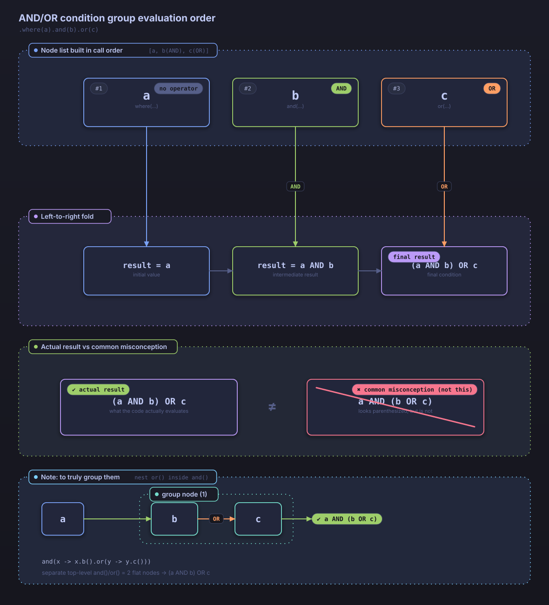

# Advanced Features

This document covers advanced features of Searchable JPA.

## When You Need to Extend a Different Base Class

The service examples in this document and in the Basic Usage guide all extend `DefaultSearchableService`. Sometimes, however, a service class already extends a different base class and cannot also extend `DefaultSearchableService`. In that case, combine the `SearchableServiceSupport` interface with `SearchableServiceDelegate` to implement the same search functionality through composition instead of inheritance.

`SearchableServiceDelegate` is a standalone class that encapsulates every method implementation of `SearchableService`, and `SearchableServiceSupport` is a mixin interface that provides default methods delegating to it. `DefaultSearchableService` itself is a `SearchableServiceSupport` implementation that internally delegates to a `SearchableServiceDelegate`.

```java
@Service
public class PostService extends SomeOtherBaseClass
        implements SearchableServiceSupport<Post, Long> {

    private final SearchableServiceDelegate<Post, Long> searchableDelegate;

    public PostService(PostRepository repository, EntityManager entityManager) {
        this.searchableDelegate = new SearchableServiceDelegate<>(repository, entityManager, Post.class);
    }

    @Override
    public SearchableServiceDelegate<Post, Long> getSearchableDelegate() {
        return searchableDelegate;
    }
}
```

`repository` must implement both `JpaRepository` and `JpaSpecificationExecutor`. If it does not satisfy this requirement, constructing `SearchableServiceDelegate` throws an exception.

You call `PostService` the same way you call a service that extends `DefaultSearchableService`.

```java
Page<Post> result = postService.findAllWithSearch(condition);
long updatedCount = postService.updateWithSearch(condition, updateData);
```

You can also create a `SearchableServiceDelegate` instance directly and call its methods without implementing the interface.

## Projection Support

Use interface-based projections to fetch only a subset of an entity's fields.

### Interface-Based Projections

```java
public interface PostSummary {
    String getTitle();
    String getAuthorName();
    LocalDateTime getCreatedAt();

    // Computed field (SpEL expressions supported)
    @Value("#{target.title + ' by ' + target.authorName}")
    String getDisplayName();
}
```

### Using a Projection

```java
@GetMapping("/summaries")
public Page<PostSummary> getPostSummaries(
    @RequestParam @SearchableParams(PostSearchDTO.class) Map<String, String> params
) {
    SearchCondition<PostSearchDTO> condition =
        new SearchableParamsParser<>(PostSearchDTO.class).convert(params);
    return postService.findAllWithSearch(condition, PostSummary.class);
}
```

### Dynamic Projections

```java
@GetMapping("/dynamic-summaries")
public Page<?> getDynamicSummaries(
    @RequestParam @SearchableParams(PostSearchDTO.class) Map<String, String> params,
    @RequestParam(defaultValue = "summary") String projection
) {
    SearchCondition<PostSearchDTO> condition =
        new SearchableParamsParser<>(PostSearchDTO.class).convert(params);

    switch (projection) {
        case "summary":
            return postService.findAllWithSearch(condition, PostSummary.class);
        case "detail":
            return postService.findAllWithSearch(condition, PostDetailProjection.class);
        default:
            return postService.findAllWithSearch(condition);
    }
}
```

### Limitations

- **Interfaces only**: The current implementation supports interface-based projections only.
- **Class-based projections**: Projections based on DTO classes are not yet supported.
- **Computed fields**: SpEL expressions via the `@Value` annotation are supported.

## Batch Update

Update multiple entities that match a search condition in a single call.

### Update DTO

```java
public class PostUpdateDTO {
    private PostStatus status;
    private String title;
    private Integer viewCount;
    private LocalDateTime lastModified;
    
    // getters and setters
}
```

### Executing a Batch Update

Spring MVC reads the request body only once, so a search condition and the update values cannot each be bound from a separate `@RequestBody` parameter. Wrap both values in a single request DTO instead.

```java
public class BatchUpdateRequest {
    private SearchCondition<PostSearchDTO> searchCondition;
    private PostUpdateDTO updateData;
    // getters and setters
}
```

```java
@PutMapping("/batch-update")
public ResponseEntity<Long> batchUpdate(@RequestBody BatchUpdateRequest request) {
    long updatedCount = postService.updateWithSearch(request.getSearchCondition(), request.getUpdateData());
    return ResponseEntity.ok(updatedCount);
}
```

### Conditional Batch Update

```java
@Service
public class PostService extends DefaultSearchableService<Post, Long> {
    
    @Transactional
    public long updatePostStatus(PostStatus fromStatus, PostStatus toStatus) {
        SearchCondition<PostSearchDTO> condition = SearchConditionBuilder
            .create(PostSearchDTO.class)
            .where(group -> group.equals("status", fromStatus))
            .build();
            
        PostUpdateDTO updateData = new PostUpdateDTO();
        updateData.setStatus(toStatus);
        updateData.setLastModified(LocalDateTime.now());
        
        return updateWithSearch(condition, updateData);
    }
}
```

### Usage Example

```bash
# Bulk-update the status of posts matching a condition
PUT /api/posts/batch-update
Content-Type: application/json

{
  "searchCondition": {
    "conditions": [
      {
        "operator": "and",
        "field": "status",
        "searchOperator": "equals",
        "value": "DRAFT"
      },
      {
        "operator": "and",
        "field": "createdAt",
        "searchOperator": "lessThan",
        "value": "2024-01-01T00:00:00"
      }
    ]
  },
  "updateData": {
    "status": "ARCHIVED",
    "lastModified": "2024-01-15T10:30:00"
  }
}
```

## Batch Delete

Delete multiple entities that match a search condition in a single call.

### Basic Batch Delete

```java
@DeleteMapping("/batch-delete")
public ResponseEntity<Long> batchDelete(
    @RequestBody SearchCondition<PostSearchDTO> searchCondition
) {
    long deletedCount = postService.deleteWithSearch(searchCondition);
    return ResponseEntity.ok(deletedCount);
}
```

### Safe Batch Delete

```java
@Service
public class PostService extends DefaultSearchableService<Post, Long> {
    
    @Transactional
    public long safeDeleteOldDrafts(int daysOld) {
        LocalDateTime cutoffDate = LocalDateTime.now().minusDays(daysOld);
        
        SearchCondition<PostSearchDTO> condition = SearchConditionBuilder
            .create(PostSearchDTO.class)
            .where(group -> group
                .equals("status", PostStatus.DRAFT)
                .and(a -> a.lessThan("createdAt", cutoffDate))
            )
            .build();
            
        // Check the count before deleting
        Page<Post> toDelete = findAllWithSearch(condition);
        log.info("Deleting {} old draft posts", toDelete.getTotalElements());
        
        return deleteWithSearch(condition);
    }
}
```

## Dynamic Sorting

Specify sort conditions dynamically alongside search conditions.

### Multi-Field Sorting

```bash
# Status ascending, created date descending, ID ascending
GET /api/posts/search?sort=status.asc,createdAt.desc,id.asc
```

### Dynamic Sorting via JSON

```json
{
  "conditions": [
    {
      "operator": "and",
      "field": "status",
      "searchOperator": "equals",
      "value": "PUBLISHED"
    }
  ],
  "sort": {
    "orders": [
      {
        "field": "priority",
        "direction": "desc"
      },
      {
        "field": "createdAt",
        "direction": "asc"
      },
      {
        "field": "id",
        "direction": "asc"
      }
    ]
  }
}
```

### Programmatic Sorting

```java
@Service
public class PostService extends DefaultSearchableService<Post, Long> {
    
    public Page<Post> findPostsWithDynamicSort(String status, String sortField, String sortDirection) {
        SearchConditionBuilder<PostSearchDTO> builder = SearchConditionBuilder
            .create(PostSearchDTO.class);
            
        if (status != null) {
            builder = builder.where(group -> group.equals("status", PostStatus.valueOf(status)));
        }
        
        // Add dynamic sorting
        if (sortField != null && sortDirection != null) {
            builder = builder.sort(sort -> {
                if ("ASC".equalsIgnoreCase(sortDirection)) {
                    sort.asc(sortField);
                } else {
                    sort.desc(sortField);
                }
            });
        }
        
        SearchCondition<PostSearchDTO> condition = builder.build();
        return findAllWithSearch(condition);
    }
}
```

## Nested Field Search

Search on fields of related entities.

### Deeply Nested Field Search

```java
public class PostSearchDTO {
    // Two levels of nesting
    @SearchableField(entityField = "author.profile.department", operators = {EQUALS, CONTAINS})
    private String authorDepartment;
    
    // Three levels of nesting
    @SearchableField(entityField = "author.profile.company.name", operators = {CONTAINS})
    private String companyName;
    
    // Nesting through a collection
    @SearchableField(entityField = "comments.author.name", operators = {CONTAINS})
    private String commentAuthorName;
}
```

### Conditional Search on Nested Fields

```java
@GetMapping("/advanced-search")
public Page<Post> advancedSearch(
    @RequestParam(required = false) String authorDepartment,
    @RequestParam(required = false) String companyName,
    @RequestParam(required = false) String commentAuthorName
) {
    SearchConditionBuilder<PostSearchDTO> builder = SearchConditionBuilder
        .create(PostSearchDTO.class);
        
    if (authorDepartment != null) {
        builder = builder.where(group -> group.contains("authorDepartment", authorDepartment));
    }
    
    if (companyName != null) {
        builder = builder.and(group -> group.contains("companyName", companyName));
    }
    
    if (commentAuthorName != null) {
        builder = builder.and(group -> group.contains("commentAuthorName", commentAuthorName));
    }
    
    SearchCondition<PostSearchDTO> condition = builder.build();
    return postService.findAllWithSearch(condition);
}
```

## Extending Existing Search Conditions

Add new conditions on top of an existing `SearchCondition` object. This leaves the original object untouched, so you can reuse or extend a search condition without mutating it.

### The from() Factory Method

`SearchConditionBuilder.from()` copies an existing search condition and adds new conditions to the copy.

```java
// Create a base search condition
SearchCondition<PostSearchDTO> baseCondition = SearchConditionBuilder
    .create(PostSearchDTO.class)
    .where(w -> w.equals("status", PostStatus.PUBLISHED))
    .sort(s -> s.desc("createdAt"))
    .page(0)
    .size(10)
    .build();

// Add a new condition on top of the existing one
SearchCondition<PostSearchDTO> extendedCondition = SearchConditionBuilder
    .from(baseCondition, PostSearchDTO.class)
    .and(a -> a.greaterThan("viewCount", 100))
    .build();

// baseCondition is left unchanged (immutability preserved)
```

### AND/OR Condition Combination Order

`where()`, `and()`, and `or()` on `SearchConditionBuilder` stack condition nodes in call order. The final `Predicate` is built by folding this list of nodes from left to right: each node combines with the result accumulated so far using its own operator (AND/OR). The first node in the list carries no operator.

```java
SearchCondition<PostSearchDTO> condition = SearchConditionBuilder
    .create(PostSearchDTO.class)
    .where(w -> w.equals("status", "PUBLISHED"))     // a
    .and(a -> a.equals("authorId", currentUserId))    // b (AND)
    .or(o -> o.equals("visibility", "PUBLIC"))         // c (OR)
    .build();
```

This call produces the node list `[a, b(AND), c(OR)]` and folds it in the following order.

```
result = a
result = result AND b
result = result OR c
```

The final condition is `(a AND b) OR c`, not `a AND (b OR c)`. To group `b` and `c` together and express `a AND (b OR c)`, do not place `or()` at the top level as a separate call — nest it inside a single `and()` call instead.

```java
SearchCondition<PostSearchDTO> condition = SearchConditionBuilder
    .create(PostSearchDTO.class)
    .where(w -> w.equals("status", "PUBLISHED"))              // a
    .and(a -> a
        .equals("authorId", currentUserId)                     // b
        .or(o -> o.equals("visibility", "PUBLIC"))              // c, nested inside and()
    )
    .build();
```

Nesting it this way groups `b` and `c` into a single unit, producing `a AND (b OR c)`.



*Figure. How the calls `.where(a).and(b).or(c)` stack into the node list `[a, b(AND), c(OR)]` and fold left to right into `(a AND b) OR c`.*

### Practical Use Cases

#### 1. Adding a Tenant Filter

In a multi-tenant environment, add a tenant filter on top of a base search condition.

```java
@Service
public class PostService extends DefaultSearchableService<Post, Long> {

    public Page<Post> searchWithTenantFilter(
            SearchCondition<PostSearchDTO> baseCondition,
            Long tenantId
    ) {
        SearchCondition<PostSearchDTO> tenantCondition = SearchConditionBuilder
            .from(baseCondition, PostSearchDTO.class)
            .and(a -> a.equals("tenantId", tenantId))
            .build();

        return findAllWithSearch(tenantCondition);
    }
}
```

#### 2. Adding a Permission-Based Filter

Extend a search condition dynamically based on the user's permissions.

```java
@Service
public class PostService extends DefaultSearchableService<Post, Long> {

    public Page<Post> searchWithSecurityFilter(
            SearchCondition<PostSearchDTO> baseCondition,
            User currentUser
    ) {
        SearchConditionBuilder<PostSearchDTO> builder = SearchConditionBuilder
            .from(baseCondition, PostSearchDTO.class);

        // Non-admins are excluded from other users' private posts (their own posts remain visible regardless of visibility)
        if (!currentUser.isAdmin()) {
            builder = builder.and(a -> a
                .notEquals("visibility", "PRIVATE")
                .or(o -> o.equals("authorId", currentUser.getId()))
            );
        }

        return findAllWithSearch(builder.build());
    }
}
```

#### 3. Extending Conditions in the Controller

Add server-side conditions to a client request.

```java
@RestController
@RequestMapping("/api/posts")
public class PostController {

    private final PostService postService;

    @PostMapping("/search")
    public Page<Post> search(
            @RequestBody SearchCondition<PostSearchDTO> clientCondition,
            @AuthenticationPrincipal User currentUser
    ) {
        // Add server-side filters on top of the client's condition
        SearchCondition<PostSearchDTO> serverCondition = SearchConditionBuilder
            .from(clientCondition, PostSearchDTO.class)
            .and(a -> a.notEquals("status", PostStatus.DELETED))
            .and(a -> a.in("departmentId", currentUser.getAccessibleDepartments()))
            .build();

        return postService.findAllWithSearch(serverCondition);
    }
}
```

### Overriding Sort and Paging

Change the sort order or paging of an existing condition.

```java
// Existing condition
SearchCondition<PostSearchDTO> original = SearchConditionBuilder
    .create(PostSearchDTO.class)
    .where(w -> w.equals("status", PostStatus.PUBLISHED))
    .sort(s -> s.asc("title"))
    .page(0)
    .size(10)
    .build();

// Change the sort order
SearchCondition<PostSearchDTO> withNewSort = SearchConditionBuilder
    .from(original, PostSearchDTO.class)
    .sort(s -> s.desc("createdAt"))  // Override the sort
    .build();

// Change the paging
SearchCondition<PostSearchDTO> withNewPage = SearchConditionBuilder
    .from(original, PostSearchDTO.class)
    .page(5)   // Override the page
    .size(20)  // Override the size
    .build();
```

### Notes

- **Immutability**: `from()` always creates a new `SearchCondition` object. The original object is never modified.
- **DTO class required**: You must pass the DTO class explicitly to `from()`, since it is used to run validation at `build()` time.
- **Validation timing**: All conditions — both the original ones and any newly added ones — are validated together when `build()` is called.

## Internationalization

`MessageUtils` looks up the library's internal validation error messages. Its bundled resource bundles (`messages/message.properties`, `messages/message_ko.properties`) hold the locale-specific text, and the request locale comes from `LocaleContextHolder`.

### Looking Up Built-in Library Messages

```java
import dev.simplecore.searchable.core.i18n.MessageUtils;

String message = MessageUtils.getMessage("validator.field.not.found", new Object[]{"title", "PostSearchDTO"});
// locale=ko: "필드 title를 PostSearchDTO에서 찾을 수 없습니다"
// locale=en (default): "Field title not found in PostSearchDTO"
```

### Registering Custom Messages

Spring Boot auto-configuration does not initialize `MessageUtils`. If `getMessage()` runs before `init()` is called, it locks onto a default `MessageSource` that only sees the library's built-in bundle. To add application messages, call `MessageUtils.init(...)` yourself at startup to register a `MessageSource`.

```java
@Configuration
public class MessageConfig {

    @PostConstruct
    public void initMessageUtils() {
        ResourceBundleMessageSource messageSource = new ResourceBundleMessageSource();
        messageSource.setBasenames("messages/message", "messages/custom-message");
        messageSource.setDefaultEncoding("UTF-8");
        messageSource.setFallbackToSystemLocale(false);
        MessageUtils.init(messageSource);
    }
}
```

`messages/message` is the default bundle the library provides, and `messages/custom-message` is the bundle your application adds. Registering both bundles together lets you look up both the library's built-in keys and your custom keys through `MessageUtils.getMessage(...)`.

```properties
# messages/custom-message_ko.properties
post.validation.title.required=제목은 필수입니다

# messages/custom-message_en.properties
post.validation.title.required=Title is required
```

```java
@Service
public class PostService extends DefaultSearchableService<Post, Long> {

    public void validateAndSave(Post post) {
        if (post.getTitle() == null || post.getTitle().trim().isEmpty()) {
            throw new IllegalArgumentException(
                MessageUtils.getMessage("post.validation.title.required")
            );
        }

        save(post);
    }
}
```

## Composite Key Support

For details on composite key entities, see:

- [Two-Phase Query Optimization - Composite Key Support](two-phase-query-optimization.md#composite-key-support)
- [Installation Guide - Composite Key Entity Configuration](installation.md#composite-key-entity-configuration)

### Simple Usage Example

```java
// @IdClass approach
@Service
public class IdClassService extends DefaultSearchableService<TestIdClassEntity, TestIdClassEntity.CompositeKey> {
    // Composite key optimization applies automatically
}

// @EmbeddedId approach
@Service
public class EmbeddedIdService extends DefaultSearchableService<TestCompositeKeyEntity, TestCompositeKeyEntity.CompositeKey> {
    // Composite key optimization applies automatically
}
```
