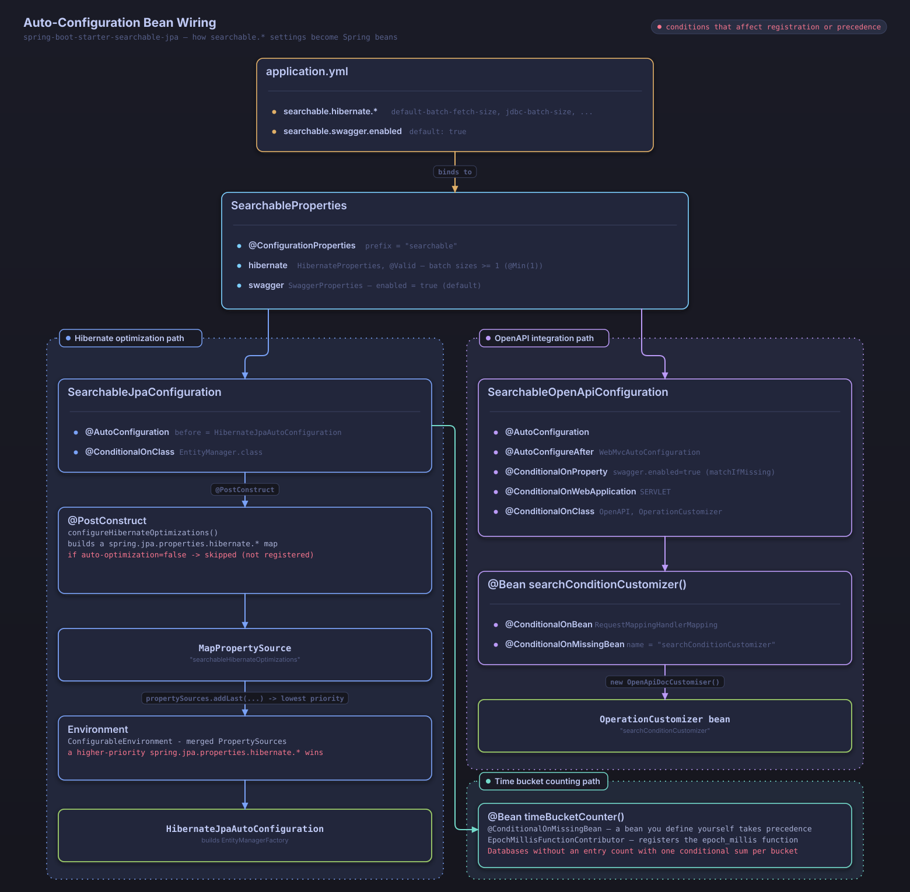

# Searchable JPA Auto-Configuration Guide

## **Automatic Hibernate Optimization**

The searchable-jpa library **automatically configures Hibernate optimization settings** to prevent N+1 problems and improve performance.

### **Optimizations Applied Automatically**

Adding the library as a dependency **automatically applies** the following settings:

```yaml
spring:
  jpa:
    properties:
      hibernate:
        # Prevent N+1 problems
        default_batch_fetch_size: 100
        
        # Batch processing optimization
        jdbc:
          batch_size: 1000
          batch_versioned_data: true
        
        # Insert/update ordering optimization
        order_inserts: true
        order_updates: true
        
        # Query optimization
        query:
          in_clause_parameter_padding: true

        # Connection optimization
        connection:
          provider_disables_autocommit: true
```

### **Customizing the Settings**

You can override the defaults as needed:

```yaml
searchable:
  hibernate:
    # Enable/disable automatic optimization (default: true)
    auto-optimization: true

    # Batch fetch size (default: 100)
    default-batch-fetch-size: 150

    # JDBC batch size (default: 1000)
    jdbc-batch-size: 500

    # Batch processing for versioned data (default: true)
    batch-versioned-data: true

    # Insert ordering optimization (default: true)
    order-inserts: true

    # Update ordering optimization (default: true)
    order-updates: true

    # IN clause parameter padding (default: true)
    in-clause-parameter-padding: true
```

### **Disabling Automatic Optimization**

To disable automatic optimization entirely:

```yaml
searchable:
  hibernate:
    auto-optimization: false
```

Or specify only the individual settings you want to override:

```yaml
# Manual settings take precedence over auto-configuration
spring:
  jpa:
    properties:
      hibernate:
        default_batch_fetch_size: 200  # This value is used instead of the auto-configured one
```

### **Performance Impact**

#### **Before (no auto-configuration)**
```sql
-- N+1 problem occurs
SELECT * FROM user_account WHERE id = ?  -- 1 query
SELECT * FROM position WHERE id = ?      -- N queries (one per user)
SELECT * FROM organization WHERE id = ?  -- N queries (one per user)
```

#### **After (auto-configuration applied)**
```sql
-- Optimized through batch loading
SELECT * FROM user_account WHERE id IN (?, ?, ?, ...)     -- 1 query
SELECT * FROM position WHERE id IN (?, ?, ?, ...)         -- 1 query (batched)
SELECT * FROM organization WHERE id IN (?, ?, ?, ...)     -- 1 query (batched)
```

### **Key Benefits**

#### 1. **Developer Convenience**
- No separate configuration required
- Optimization settings apply automatically
- Prevents performance problems caused by oversight

#### 2. **Immediate Performance Gains**
- Automatically prevents N+1 problems
- Optimized batch processing
- Improved query plan caching

#### 3. **Flexible Customization**
- Override individual settings when needed
- Tune optimizations per project
- Supports selective, incremental disabling

### **Usage Examples**

#### **Basic Usage (Automatic Optimization)**
```java
// Optimization is applied automatically as soon as the dependency is added
@Service
public class UserService extends DefaultSearchableService<User, Long> {

    public UserService(UserRepository repository, EntityManager entityManager) {
        super(repository, entityManager);
    }

    public Page<User> searchUsers(SearchCondition<UserSearchDTO> condition) {
        // Batch loading is applied automatically
        return findAllWithSearch(condition);
    }
}
```

#### **Using Custom Settings**
```yaml
# application.yml
searchable:
  hibernate:
    auto-optimization: true
    default-batch-fetch-size: 200  # Larger batch size
    jdbc-batch-size: 2000          # Larger JDBC batch
```

### **Checking the Applied Configuration**

The process of applying automatic optimization is logged at the TRACE level. To see it, set `logging.level.dev.simplecore.searchable=TRACE`.

```
TRACE SearchableJpaConfiguration - Configuring automatic Hibernate optimizations for searchable-jpa...
TRACE SearchableJpaConfiguration - Applied Hibernate optimizations:
TRACE SearchableJpaConfiguration -   - default_batch_fetch_size: 100
TRACE SearchableJpaConfiguration -   - jdbc.batch_size: 1000
TRACE SearchableJpaConfiguration -   - order_inserts: true
TRACE SearchableJpaConfiguration -   - order_updates: true
TRACE SearchableJpaConfiguration -   - in_clause_parameter_padding: true
TRACE SearchableJpaConfiguration - These settings help prevent N+1 problems and improve performance automatically.
```

When automatic optimization is disabled (`searchable.hibernate.auto-optimization=false`), the following log line appears at the INFO level.

```
INFO  SearchableJpaConfiguration - Searchable Hibernate auto-optimization is disabled
```

### **Notes**

1. **Conflicts with Existing Settings**
   - If `spring.jpa.properties.hibernate.*` settings already exist, they take precedence.
   - Auto-configuration only applies to settings that have not been explicitly configured.

2. **Memory Usage**
   - A larger `default_batch_fetch_size` can increase memory usage.
   - Tune it to match your application's characteristics.

3. **Database Compatibility**
   - Some settings are effective only on specific databases.
   - Verify the impact with performance testing.

## Default Auto-Configuration

### What Gets Configured Automatically

1. **Hibernate Optimization Settings**
   - Batch fetch size configuration to prevent N+1 problems
   - JDBC batch size optimization
   - Query plan caching optimization

2. **OpenAPI/Swagger Integration**
   - Automatic recognition of the SearchableParams annotation
   - Automatic API documentation generation



*How `searchable.*` settings in application.yml bind to SearchableProperties, which SearchableJpaConfiguration and SearchableOpenApiConfiguration then read to conditionally register beans*

## Configuration Properties

### application.yml Configuration

```yaml
searchable:
  # Swagger/OpenAPI settings
  swagger:
    enabled: true  # Default: true, enables OpenAPI/Swagger integration

  # Hibernate optimization settings
  hibernate:
    auto-optimization: true  # Default: true, enables automatic Hibernate optimization
    default-batch-fetch-size: 100  # Default: 100, batch fetch size
    jdbc-batch-size: 1000  # Default: 1000, JDBC batch size
    batch-versioned-data: true  # Default: true, batch processing for versioned data
    order-inserts: true  # Default: true, insert ordering optimization
    order-updates: true  # Default: true, update ordering optimization
    in-clause-parameter-padding: true  # Default: true, IN clause parameter padding
```

### application.properties Configuration

```properties
# Swagger/OpenAPI settings
searchable.swagger.enabled=true

# Hibernate optimization settings
searchable.hibernate.auto-optimization=true
searchable.hibernate.default-batch-fetch-size=100
searchable.hibernate.jdbc-batch-size=1000
searchable.hibernate.batch-versioned-data=true
searchable.hibernate.order-inserts=true
searchable.hibernate.order-updates=true
searchable.hibernate.in-clause-parameter-padding=true
```

## Detailed Settings Reference

### Hibernate Optimization Settings

#### auto-optimization
- **Default**: `true`
- **Description**: Enables automatic Hibernate optimization settings.
- **Effect**: Applies a range of optimizations automatically to prevent N+1 problems.

#### default-batch-fetch-size
- **Default**: `100`
- **Description**: Batch fetch size for lazy loading.
- **Effect**: Fetches associated entities in batches to prevent N+1 problems.
- **Constraint**: Must be 1 or greater. Specifying a value below 1 causes application startup to fail.

#### jdbc-batch-size
- **Default**: `1000`
- **Description**: JDBC batch size for bulk operations.
- **Effect**: Improves the performance of bulk INSERT/UPDATE operations.
- **Constraint**: Must be 1 or greater. Specifying a value below 1 causes application startup to fail.

#### batch-versioned-data
- **Default**: `true`
- **Description**: Enables batching of versioned data for optimistic locking.
- **Effect**: Improves batch operation performance for entities with version management.

#### order-inserts
- **Default**: `true`
- **Description**: Optimizes the ordering of INSERT statements.
- **Effect**: Prevents foreign key constraint violations and improves performance.

#### order-updates
- **Default**: `true`
- **Description**: Optimizes the ordering of UPDATE statements.
- **Effect**: Reduces the likelihood of deadlocks and improves performance.

#### in-clause-parameter-padding
- **Default**: `true`
- **Description**: Enables IN clause parameter padding.
- **Effect**: Improves performance by making query plan caching more effective.

### Swagger Settings

#### swagger.enabled
- **Default**: `true`
- **Description**: Enables OpenAPI/Swagger integration.
- **Effect**: Automatically generates documentation for APIs annotated with `@SearchableParams`.
- **Conditions**:
  - The web application type is SERVLET.
  - The OpenAPI and OperationCustomizer classes are on the classpath.
  - The `searchConditionCustomizer` bean is created only after the `RequestMappingHandlerMapping` bean is registered (it runs in the order defined by `@AutoConfigureAfter(WebMvcAutoConfiguration.class)`).

## Disabling Auto-Configuration

You can disable specific pieces of auto-configuration as follows:

### Disabling Hibernate Optimization Auto-Configuration

Excluding only `SearchableJpaConfiguration` turns off Hibernate optimization auto-configuration. `SearchableOpenApiConfiguration`, which handles OpenAPI integration, is a separate auto-configuration class and remains active.

```java
@SpringBootApplication(exclude = SearchableJpaConfiguration.class)
public class Application {
    public static void main(String[] args) {
        SpringApplication.run(Application.class, args);
    }
}
```

To disable both auto-configurations, list them together in `exclude`.

```java
@SpringBootApplication(exclude = {SearchableJpaConfiguration.class, SearchableOpenApiConfiguration.class})
public class Application {
    public static void main(String[] args) {
        SpringApplication.run(Application.class, args);
    }
}
```

### Disabling Only a Specific Feature

```yaml
searchable:
  swagger:
    enabled: false  # Disable Swagger integration
  hibernate:
    auto-optimization: false  # Disable Hibernate optimization
```

## Custom Configuration

To replace the auto-registered OpenAPI customizer, define your own bean under the same name (`searchConditionCustomizer`). `SearchableOpenApiConfiguration` is annotated with `@ConditionalOnMissingBean(name = "searchConditionCustomizer")`, so when you define this bean yourself, it is registered instead of the default `OpenApiDocCustomiser`.

```java
@Configuration
public class SearchableCustomConfiguration {

    @Bean(name = "searchConditionCustomizer")
    public OperationCustomizer searchConditionCustomizer() {
        return new CustomSearchConditionCustomizer();
    }
}
```

Write `CustomSearchConditionCustomizer` either by implementing `OperationCustomizer` directly, or by wrapping `OpenApiDocCustomiser` and overriding only the parts you need.

## Verifying the Configuration

To confirm that the settings were applied correctly at application startup, check the logs. The log lines below are at the TRACE level, so you must set `logging.level.dev.simplecore.searchable=TRACE` to see them.

```
TRACE d.s.s.a.SearchableJpaConfiguration - SearchableJpaConfiguration is being initialized
TRACE d.s.s.a.SearchableJpaConfiguration - Configuring automatic Hibernate optimizations for searchable-jpa...
TRACE d.s.s.a.SearchableJpaConfiguration - Applied Hibernate optimizations:
TRACE d.s.s.a.SearchableJpaConfiguration -   - default_batch_fetch_size: 100
TRACE d.s.s.a.SearchableJpaConfiguration -   - jdbc.batch_size: 1000
TRACE d.s.s.a.SearchableJpaConfiguration -   - order_inserts: true
TRACE d.s.s.a.SearchableJpaConfiguration -   - order_updates: true
TRACE d.s.s.a.SearchableJpaConfiguration -   - in_clause_parameter_padding: true
TRACE d.s.s.a.SearchableJpaConfiguration - These settings help prevent N+1 problems and improve performance automatically.
TRACE d.s.s.a.SearchableJpaConfiguration - To disable auto-optimization, set: searchable.hibernate.auto-optimization=false
```

## Troubleshooting

### Auto-Configuration Is Not Applied

1. **Check the dependency**: Confirm that `spring-boot-starter-searchable-jpa` was added correctly.
2. **Check auto-configuration registration**: Spring Boot 3.x loads auto-configurations through the SPI mechanism, reading them from `META-INF/spring/org.springframework.boot.autoconfigure.AutoConfiguration.imports` rather than through component scanning. As long as `spring-boot-starter-searchable-jpa` is on the classpath, it registers automatically regardless of where your `@SpringBootApplication` class's package is located.
3. **Check the configuration file**: Verify that the settings in `application.yml` or `application.properties` are correct.

### Performance Problems

1. **Adjust batch sizes**: Tune `default-batch-fetch-size` and `jdbc-batch-size` for your environment.
2. **Check the optimization setting**: Confirm that `auto-optimization` is enabled.
3. **Apply database-specific optimizations**: Apply settings tailored to the database you use.

For related topics, see [Two-Phase Query Optimization](./two-phase-query-optimization.md) and [OpenAPI Integration](./openapi-integration.md).
