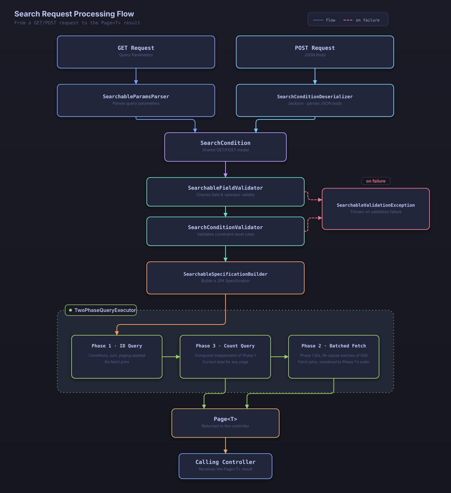

# Basic Usage

This document walks through the basic usage of Searchable JPA step by step.

## 1. Define the Entity

Start by defining the JPA entity you want to search.

```java
@Entity
@Table(name = "posts")
public class Post {
    @Id
    @GeneratedValue(strategy = GenerationType.IDENTITY)
    private Long id;
    
    private String title;
    
    @Column(length = 10000)
    private String content;
    
    @Enumerated(EnumType.STRING)
    private PostStatus status;
    
    @Column(name = "view_count")
    private Long viewCount;
    
    @Column(name = "created_at")
    private LocalDateTime createdAt;
    
    @ManyToOne(fetch = FetchType.LAZY)
    @JoinColumn(name = "author_id")
    private Author author;
    
    // getters, setters...
}
```

```java
@Entity
@Table(name = "authors")
public class Author {
    @Id
    @GeneratedValue(strategy = GenerationType.IDENTITY)
    private Long id;
    
    private String name;
    private String email;
    
    // getters, setters...
}
```

## 2. Define the Search DTO

Write a DTO class that declares the search conditions, using the `@SearchableField` annotation.

```java
public class PostSearchDTO {
    
    @SearchableField(operators = {EQUALS}, sortable = true)
    private Long id;
    
    @SearchableField(operators = {EQUALS, CONTAINS, STARTS_WITH, ENDS_WITH}, sortable = true)
    private String title;
    
    // Post body - may be empty while the post is a draft, so a NULL check is needed
    @SearchableField(operators = {CONTAINS, IS_NULL, IS_NOT_NULL})
    private String content;
    
    @SearchableField(operators = {EQUALS, NOT_EQUALS, IN, NOT_IN})
    private PostStatus status;
    
    @SearchableField(operators = {GREATER_THAN, LESS_THAN, BETWEEN}, sortable = true)
    private Long viewCount;
    
    @SearchableField(operators = {GREATER_THAN, LESS_THAN, BETWEEN}, sortable = true)
    private LocalDateTime createdAt;
    
    // Nested field search - accesses a field on the associated entity
    @SearchableField(entityField = "author.name", operators = {EQUALS, CONTAINS})
    private String authorName;
    
    @SearchableField(entityField = "author.email", operators = {EQUALS, CONTAINS, ENDS_WITH})
    private String authorEmail;
    
    // getters, setters...
}
```

### `@SearchableField` Annotation Attributes

- **entityField**: The actual field name on the entity (used when it differs from the DTO field name)
- **operators**: The array of search operators to allow
- **sortable**: Whether the field can be sorted (default: `false`)

## 3. Define the Repository

Define a standard JPA Repository. **It must extend `JpaSpecificationExecutor`.**

```java
@Repository
public interface PostRepository extends JpaRepository<Post, Long>, JpaSpecificationExecutor<Post> {
    // Extending JpaSpecificationExecutor is required
    // Add further methods here if you need them
}
```

## 4. Define the Service

Implement the search service by extending `DefaultSearchableService`.

```java
@Service
public class PostService extends DefaultSearchableService<Post, Long> {
    
    public PostService(PostRepository repository, EntityManager entityManager) {
        super(repository, entityManager);
    }
    
    // Basic search methods are provided automatically:
    // findAllWithSearch, findOneWithSearch, countWithSearch, etc.
}
```

### When You Need to Extend a Different Class

If your service already extends another class and can't extend `DefaultSearchableService` directly, combine the `SearchableServiceSupport` interface with `SearchableServiceDelegate` to get the same functionality.

```java
public class PostService extends SomeOtherBaseClass
        implements SearchableServiceSupport<Post, Long> {
    
    private final SearchableServiceDelegate<Post, Long> searchableDelegate;
    
    public PostService(PostRepository repository, EntityManager entityManager) {
        this.searchableDelegate = new SearchableServiceDelegate<>(repository, entityManager, Post.class);
    }
    
    @Override
    public SearchableServiceDelegate<Post, Long> getSearchableDelegate() {
        return searchableDelegate;
    }
}
```

The delegate returned by `getSearchableDelegate()` is what actually implements every `SearchableService` method, including `findAllWithSearch`, `findOneWithSearch`, and `countWithSearch`. If your class hierarchy has no such constraint, extending `DefaultSearchableService` directly is simpler.

## 5. Implement the Controller

### GET-based Search (Query Parameters)

```java
@RestController
@RequestMapping("/api/posts")
public class PostController {
    
    private final PostService postService;
    
    public PostController(PostService postService) {
        this.postService = postService;
    }
    
    @GetMapping("/search")
    public Page<Post> searchPosts(
        @RequestParam Map<String, String> params
    ) {
        SearchCondition<PostSearchDTO> condition =
            new SearchableParamsParser<>(PostSearchDTO.class).convert(params);
        return postService.findAllWithSearch(condition);
    }
}
```

#### GET Request Examples

```bash
# Search for posts whose title contains "Spring"
GET /api/posts/search?title.contains=Spring

# Posts with status PUBLISHED and view count of 100 or more
GET /api/posts/search?status.equals=PUBLISHED&viewCount.greaterThan=100

# Search by author name and sort by title
GET /api/posts/search?authorName.contains=John&sort=title.asc

# With pagination
GET /api/posts/search?title.contains=Java&page=0&size=10
```

### POST-based Search (JSON Body)

```java
@PostMapping("/search")
public Page<Post> searchPosts(
    @RequestBody SearchCondition<PostSearchDTO> searchCondition
) {
    return postService.findAllWithSearch(searchCondition);
}
```

#### POST Request Example

```json
{
  "conditions": [
    {
      "operator": "and",
      "field": "title",
      "searchOperator": "contains",
      "value": "Spring"
    },
    {
      "operator": "and",
      "field": "status",
      "searchOperator": "equals",
      "value": "PUBLISHED"
    },
    {
      "operator": "and",
      "field": "viewCount",
      "searchOperator": "greaterThan",
      "value": 100
    }
  ],
  "sort": {
    "orders": [
      {
        "field": "createdAt",
        "direction": "desc"
      }
    ]
  },
  "page": 0,
  "size": 10
}
```

### Search Request Processing Flow

For GET requests, `SearchableParamsParser` converts the query parameters into a `SearchCondition`; for POST requests, the Jackson `SearchConditionDeserializer` converts the JSON body the same way. `SearchableFieldValidator` and `SearchConditionValidator` then validate the fields, operators, and sort conditions, and `SearchableSpecificationBuilder` assembles the result into a JPA `Specification`. Finally, `TwoPhaseQueryExecutor` runs the ID query (Phase 1), the count query (Phase 3), and the batched fetch (Phase 2), in that order, and returns the resulting `Page<T>` to the controller.



*How a GET or POST search request flows through validation and the two-phase query to produce a `Page<T>` result*

## 6. Using the Basic Search Operators

### String Search

```bash
# Exact match
title.equals=Spring Boot

# Contains
title.contains=Spring

# Starts with
title.startsWith=Spring

# Ends with
title.endsWith=Boot
```

### Numeric/Date Comparison

```bash
# Greater than
viewCount.greaterThan=100

# Less than
viewCount.lessThan=1000

# Range (BETWEEN)
viewCount.between=100,1000

# Date range
createdAt.between=2024-01-01T00:00:00,2024-12-31T23:59:59
```

### NULL Checks

```bash
# NULL value
content.isNull

# NOT NULL value
content.isNotNull
```

### IN Operator

```bash
# One of several values
status.in=PUBLISHED,DRAFT

# Not among several values
status.notIn=DELETED,ARCHIVED
```

## 7. Sorting

### Single-Field Sorting

```bash
GET /api/posts/search?sort=title.asc
GET /api/posts/search?sort=createdAt.desc
```

### Multi-Field Sorting

```bash
GET /api/posts/search?sort=viewCount.desc,createdAt.desc
```

### Sorting via JSON

```json
{
  "sort": {
    "orders": [
      {
        "field": "viewCount",
        "direction": "desc"
      },
      {
        "field": "createdAt",
        "direction": "desc"
      }
    ]
  }
}
```

## 8. Pagination

```bash
# First page, 10 items per page
GET /api/posts/search?page=0&size=10

# Second page, 20 items per page
GET /api/posts/search?page=1&size=20
```

## 9. Practical Examples

### Combined Search Conditions

```bash
# Posts whose title contains "Spring", with status PUBLISHED,
# and a view count of 100 or more, sorted by most recent
GET /api/posts/search?title.contains=Spring&status.equals=PUBLISHED&viewCount.greaterThan=100&sort=createdAt.desc&page=0&size=10
```

### Nested Field Search

```bash
# Posts whose author name contains "John"
GET /api/posts/search?authorName.contains=John

# Posts whose author email is on a specific domain
GET /api/posts/search?authorEmail.endsWith=@company.com
```

## Next Steps

Once you're comfortable with the basics, check out these documents:

- [Advanced Features](advanced-features.md) - Complex search conditions and nested queries
- [Search Operators](search-operators.md) - Detailed reference for every search operator
- [OpenAPI Integration](openapi-integration.md) - Automatic Swagger documentation generation
