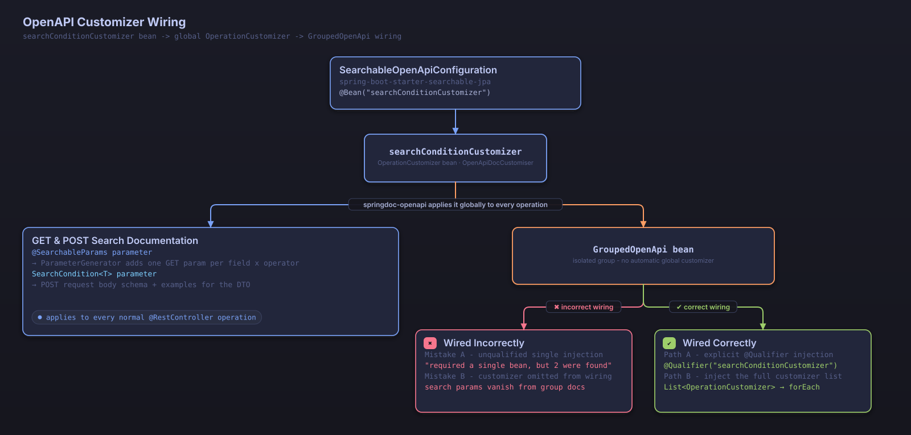

# OpenAPI Integration

Searchable JPA supports OpenAPI 3.0 and Swagger UI. It automatically generates documentation for the search API and provides an interactive API testing environment.

## Setup

### 1. Add the Dependency

```gradle
dependencies {
    // Searchable JPA starter (includes OpenAPI support)
    implementation 'dev.simplecore.searchable:spring-boot-starter-searchable-jpa:${version}'

    // SpringDoc OpenAPI (for Spring Boot 3.x)
    implementation 'org.springdoc:springdoc-openapi-starter-webmvc-ui:2.5.0'
}
```

### 2. Configure OpenAPI

```java
@Configuration
public class OpenApiConfig {
    
    @Bean
    public OpenAPI customOpenAPI() {
        return new OpenAPI()
            .info(new Info()
                .title("Post Search API")
                .version("1.0")
                .description("Post search API built with Searchable JPA")
            )
            .servers(List.of(
                new Server().url("http://localhost:8080").description("Development server"),
                new Server().url("https://api.example.com").description("Production server")
            ));
    }
}
```

### 3. Enable Auto-Configuration

```yaml
# application.yml
springdoc:
  api-docs:
    enabled: true
    path: /api-docs
  swagger-ui:
    enabled: true
    path: /swagger-ui.html
    try-it-out-enabled: true
    operations-sorter: method
    tags-sorter: alpha
    
# Searchable JPA Swagger configuration
searchable:
  swagger:
    enabled: true
```

## The @SearchableParams Annotation

The `@SearchableParams` annotation automatically generates OpenAPI documentation for GET-based search parameters.

### Basic Usage

```java
@RestController
@RequestMapping("/api/posts")
public class PostController {
    
    @Operation(summary = "Search posts", description = "Searches posts using various conditions")
    @GetMapping("/search")
    public Page<Post> searchPosts(
        @RequestParam @SearchableParams(PostSearchDTO.class) Map<String, String> params
    ) {
        SearchCondition<PostSearchDTO> condition = 
            new SearchableParamsParser<>(PostSearchDTO.class).convert(params);
        return postService.findAllWithSearch(condition);
    }
}
```

### Generated Documentation

The code above automatically generates the following OpenAPI document:

```yaml
/api/posts/search:
  get:
    summary: Search posts
    description: Searches posts using various conditions
    parameters:
      - name: id.equals
        in: query
        description: Post id - equals
        required: false
        schema:
          type: integer
          format: int64
      - name: searchTitle.equals
        in: query
        description: Post title to search - equals
        required: false
        schema:
          type: string
      - name: searchTitle.contains
        in: query
        description: Post title to search - contains
        required: false
        schema:
          type: string
      - name: status.equals
        in: query
        description: Post status - equals
        required: false
        schema:
          $ref: '#/components/schemas/PostStatus'
      - name: status.in
        in: query
        description: Post status - in
        required: false
        schema:
          type: string
          description: Enter multiple values separated by comma
          enum: [PUBLISHED, DRAFT, DELETED]
      - name: viewCount.greaterThan
        in: query
        description: Number of views - greaterThan
        required: false
        schema:
          type: integer
          format: int64
      - name: createdAt.between
        in: query
        description: Post creation date and time - between
        required: false
        schema:
          type: string
          description: Enter two values separated by comma
      - name: sort
        in: query
        description: >-
          Sort fields (e.g., field.asc or field.desc).
          Available fields: searchTitle, viewCount, createdAt
        required: false
        explode: true
        schema:
          type: array
          items:
            type: string
      - name: page
        in: query
        description: Page number (0-based)
        required: false
        example: 0
        schema:
          type: integer
          format: int32
          minimum: 0
      - name: size
        in: query
        description: Items per page
        required: false
        example: 20
        schema:
          type: integer
          format: int32
          minimum: 1
components:
  schemas:
    PostStatus:
      type: string
      enum: [PUBLISHED, DRAFT, DELETED]
```

Each parameter description joins the field description and the operator name with a `-` (for example, `Post id - equals`). Enum-typed fields (`status`) are registered as a separate schema, and the parameter references that schema via `$ref`. The `sort` parameter uses `explode: true` so each sort value is passed as an individual parameter. Only `page` and `size` carry an `example` directly on the parameter; the other search field parameters have no example value.

Single-value operators on date/time fields carry an OpenAPI `format` matching the field type: `LocalDate` uses `date`, `LocalTime` uses `partial-time`, and `LocalDateTime`, `Instant`, `OffsetDateTime`, and `ZonedDateTime` use `date-time` (RFC 3339). This `format` helps frontend code generators pick an appropriate date/time picker. Multi-value operators such as IN and BETWEEN are represented as a comma-separated string.

## Advanced Documentation

### 1. Detailed Field Documentation

```java
public class PostSearchDTO {

    @Schema(description = "Post ID")
    @SearchableField(operators = {EQUALS})
    private Long id;

    @Schema(description = "Post title to search")
    @Size(max = 100, message = "Title must not exceed 100 characters")
    @SearchableField(operators = {EQUALS, CONTAINS, STARTS_WITH}, sortable = true)
    private String title;

    @Schema(description = "Post status")
    @SearchableField(operators = {EQUALS, NOT_EQUALS, IN, NOT_IN})
    private PostStatus status;

    @Schema(description = "View count range")
    @SearchableField(operators = {GREATER_THAN, LESS_THAN, BETWEEN})
    private Long viewCount;
}
```

> [!NOTE]
> Each field's GET search parameter schema is generated fresh, carrying over only the `description` from `@Schema`. `minimum`, `maxLength`, and `example` never appear in the generated parameter schema — `title`'s `@Size(max = 100)` is still enforced at runtime validation, but it has no effect on the generated parameter schema.
>
> `@Schema(allowableValues = ...)` and `implementation` are read only when the field type is `String`. For an actual enum-typed field like `status`, the generator reads the enum constants directly regardless of these attributes, so the allowed values for `PostStatus` are shown as `PUBLISHED`, `DRAFT`, and `DELETED`.

### 2. Generating Custom Examples

```java
@Configuration
public class CustomOpenApiConfig {

    @Bean
    public OpenAPI customOpenAPI() {
        return new OpenAPI()
            .info(new Info()
                .title("Searchable JPA API")
                .version("1.0.0")
                .description("Search API built with Searchable JPA"))
            .addServersItem(new Server().url("http://localhost:8080"));
    }

    // For additional customization
    @Bean
    public OperationCustomizer customOperationCustomizer() {
        return (operation, handlerMethod) -> {
            // Custom operation logic
            return operation;
        };
    }
}
```

> [!WARNING]
> Combining this configuration with `GroupedOpenApi` results in two `OperationCustomizer` beans: `searchConditionCustomizer` and `customOperationCustomizer`. If a `GroupedOpenApi` bean is written to auto-inject a single `OperationCustomizer`, it fails with "required a single bean, but 2 were found". See "GroupedOpenApi Considerations" below for the fix.

### 3. GroupedOpenApi Considerations

Because `GroupedOpenApi` creates isolated API groups, it does not automatically pick up globally registered `OperationCustomizer` beans. This includes the `searchConditionCustomizer` bean registered by `SearchableOpenApiConfiguration` — unless you wire it into `GroupedOpenApi` explicitly, the search parameter documentation silently disappears from that group.

1. **Inject with `@Qualifier`**

```java
@Bean
public GroupedOpenApi postApi(
        @Qualifier("searchConditionCustomizer") OperationCustomizer searchConditionCustomizer) {
    return GroupedOpenApi.builder()
            .group("post-api")
            .pathsToMatch("/api/posts/**")
            .addOperationCustomizer(searchConditionCustomizer)
            .build();
}
```

2. **Inject the full `List<OperationCustomizer>`**

```java
@Bean
public GroupedOpenApi postApi(List<OperationCustomizer> customizers) {
    GroupedOpenApi.Builder builder = GroupedOpenApi.builder()
            .group("post-api")
            .pathsToMatch("/api/posts/**");

    customizers.forEach(builder::addOperationCustomizer);

    return builder.build();
}
```

> [!WARNING]
> If multiple `OperationCustomizer` beans are registered and a `GroupedOpenApi` bean auto-injects a single `OperationCustomizer` parameter without `@Qualifier`, springdoc throws "required a single bean, but 2 were found". Resolve this by naming the bean you want with `@Qualifier("searchConditionCustomizer")`, or by injecting the full `List<OperationCustomizer>` instead.



*How the searchConditionCustomizer bean is registered and applied as springdoc's global OperationCustomizer, and why GroupedOpenApi needs it injected separately*

## Documenting POST-Based Search

### The SearchCondition Schema

```java
@RestController
public class PostController {
    
    @Operation(
        summary = "Search posts (POST)",
        description = "Searches posts using complex JSON search conditions"
    )
    @io.swagger.v3.oas.annotations.parameters.RequestBody(
        description = "Search condition",
        required = true,
        content = @Content(
            mediaType = "application/json",
            schema = @Schema(implementation = SearchCondition.class),
            examples = {
                @ExampleObject(
                    name = "Basic search",
                    summary = "Search by title and status",
                    value = """
                        {
                          "conditions": [
                            {
                              "operator": "and",
                              "field": "title",
                              "searchOperator": "contains",
                              "value": "Spring"
                            },
                            {
                              "operator": "and",
                              "field": "status",
                              "searchOperator": "equals",
                              "value": "PUBLISHED"
                            }
                          ],
                          "sort": {
                            "orders": [
                              {
                                "field": "createdAt",
                                "direction": "desc"
                              }
                            ]
                          },
                          "page": 0,
                          "size": 10
                        }
                        """
                ),
                @ExampleObject(
                    name = "Complex condition search",
                    summary = "Complex search including OR conditions",
                    value = """
                        {
                          "conditions": [
                            {
                              "operator": "and",
                              "conditions": [
                                {
                                  "field": "title",
                                  "searchOperator": "contains",
                                  "value": "Spring"
                                },
                                {
                                  "operator": "or",
                                  "field": "title",
                                  "searchOperator": "contains",
                                  "value": "Java"
                                }
                              ]
                            },
                            {
                              "operator": "and",
                              "field": "viewCount",
                              "searchOperator": "greaterThan",
                              "value": 100
                            }
                          ],
                          "sort": {
                            "orders": [
                              {
                                "field": "viewCount",
                                "direction": "desc"
                              },
                              {
                                "field": "createdAt",
                                "direction": "desc"
                              }
                            ]
                          },
                          "page": 0,
                          "size": 20
                        }
                        """
                )
            }
        )
    )
    @PostMapping("/search")
    public Page<Post> searchPosts(
        @RequestBody @Validated SearchCondition<PostSearchDTO> searchCondition
    ) {
        return postService.findAllWithSearch(searchCondition);
    }
}
```

## Documenting Response Schemas

### Paged Response

```java
@Schema(description = "Paged post search result")
public class PostPageResponse {
    
    @Schema(description = "List of posts")
    private List<Post> content;
    
    @Schema(description = "Page information")
    private PageInfo pageable;
    
    @Schema(description = "Total number of elements")
    private long totalElements;
    
    @Schema(description = "Total number of pages")
    private int totalPages;
    
    @Schema(description = "Whether the current page is the last page")
    private boolean last;
    
    @Schema(description = "Number of elements in the current page")
    private int numberOfElements;
}
```

Two-phase query optimization is an internal execution detail, so the response structure is identical to the standard paged response shown above. No separate response schema is required.

## Documenting Error Responses

```java
@Schema(description = "API error response")
public class ErrorResponse {
    
    @Schema(description = "Error code", example = "VALIDATION_ERROR")
    private String code;
    
    @Schema(description = "Error message", example = "The search condition is invalid")
    private String message;
    
    @Schema(description = "Detailed error information")
    private List<FieldError> errors;
    
    @Schema(description = "Request timestamp")
    private LocalDateTime timestamp;
}

@ApiResponses({
    @ApiResponse(
        responseCode = "200",
        description = "Search succeeded",
        content = @Content(schema = @Schema(implementation = PostPageResponse.class))
    ),
    @ApiResponse(
        responseCode = "400",
        description = "Bad request",
        content = @Content(schema = @Schema(implementation = ErrorResponse.class))
    ),
    @ApiResponse(
        responseCode = "500",
        description = "Server error",
        content = @Content(schema = @Schema(implementation = ErrorResponse.class))
    )
})
@PostMapping("/search")
public Page<Post> searchPosts(@RequestBody SearchCondition<PostSearchDTO> condition) {
    return postService.findAllWithSearch(condition);
}
```

## Tags and Grouping

```java
@RestController
@RequestMapping("/api/posts")
@Tag(name = "Post Search", description = "Post search related APIs")
public class PostController {
    
    @Operation(
        summary = "Search posts (GET)",
        description = "Searches posts using query parameters",
        tags = {"Post Search", "GET-based"}
    )
    @GetMapping("/search")
    public Page<Post> searchPostsGet(/* ... */) {
        // ...
    }
    
    @Operation(
        summary = "Search posts (POST)",
        description = "Searches posts using a JSON body",
        tags = {"Post Search", "POST-based"}
    )
    @PostMapping("/search")
    public Page<Post> searchPostsPost(/* ... */) {
        // ...
    }
}
```

Two-phase query optimization is applied automatically to every search query, so no separate endpoint is required.

## Documenting Security

```java
@SecurityRequirement(name = "bearerAuth")
@Operation(
    summary = "Admin post search",
    description = "Post search that requires administrator privileges"
)
@PreAuthorize("hasRole('ADMIN')")
@GetMapping("/admin/search")
public Page<Post> adminSearch(/* ... */) {
    // ...
}

// Define the security scheme in the OpenAPI configuration
@Bean
public OpenAPI secureOpenAPI() {
    return new OpenAPI()
        .components(new Components()
            .addSecuritySchemes("bearerAuth", 
                new SecurityScheme()
                    .type(SecurityScheme.Type.HTTP)
                    .scheme("bearer")
                    .bearerFormat("JWT")
            )
        );
}
```

## Practical Examples

### Testing in Swagger UI

1. **Basic search test**
   ```
   GET /api/posts/search?title.contains=Spring&status.equals=PUBLISHED&page=0&size=10
   ```

2. **Complex condition search test**
   ```json
   POST /api/posts/search
   {
     "conditions": [
       {
         "operator": "and",
         "field": "title",
         "searchOperator": "contains",
         "value": "Spring"
       },
       {
         "operator": "and",
         "field": "viewCount",
         "searchOperator": "greaterThan",
         "value": 100
       }
     ],
     "sort": {
       "orders": [
         {
           "field": "createdAt",
           "direction": "desc"
         }
       ]
     },
     "page": 0,
     "size": 10
   }
   ```

## Accessing the Documentation

- **Swagger UI**: `http://localhost:8080/swagger-ui.html`
- **OpenAPI JSON**: `http://localhost:8080/api-docs`
- **OpenAPI YAML**: `http://localhost:8080/api-docs.yaml`

## Production Considerations

### 1. Security Configuration

```yaml
# application-prod.yml
springdoc:
  api-docs:
    enabled: false  # Disable in production
  swagger-ui:
    enabled: false  # Disable in production
```

### 2. Documentation Optimization

```java
@Profile("!prod")
@Configuration
public class OpenApiConfig {
    // Enabled only in development/test environments
}
```

## Next Steps

- [API Reference](api-reference.md) - Full API documentation
- [FAQ](faq.md) - Frequently asked questions
