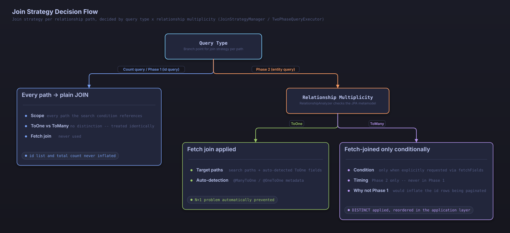

# JPA Relationship Mapping and Two-Phase Query Optimization

## Table of Contents

1. [Overview of JPA Relationship Mapping](#overview-of-jpa-relationship-mapping)
2. [N+1 Problem and Solution](#n-1-problem-and-solution)
3. [Characteristics by Relationship Mapping Type](#characteristics-by-relationship-mapping-type)
4. [Automatic Fetch Join for ToOne Relationships](#automatic-fetch-join-for-toone-relationships)
5. [Two-Phase Query Optimization System](#two-phase-query-optimization-system)
6. [Why Automatic Primary Key Sorting Is Necessary](#why-automatic-primary-key-sorting-is-necessary)
7. [Implementation Details](#implementation-details)
8. [Explicit Fetch Join (fetchFields)](#explicit-fetch-join-fetchfields)

## Automated Optimization Strategy

**searchable-jpa automatically selects an optimized strategy so that developers never run into performance problems.**

### Developer Experience First

```java
@RestController
public class PostController {
    
    @Autowired
    private SearchableService<Post> postService;
    
    @GetMapping("/posts")
    public Page<Post> getPosts(
            @RequestParam(required = false) String title,
            @RequestParam(required = false, defaultValue = "0") int page,
            @RequestParam(required = false, defaultValue = "10") int size) {

        SearchCondition<PostSearchDTO> condition = SearchConditionBuilder
            .create(PostSearchDTO.class)
            .where(w -> w.equals("title", title))
            .page(page)
            .size(size)
            .build();

        // Two-phase query optimization is applied automatically -- no need to worry about complex performance tuning
        return postService.findAllWithSearch(condition);
    }
}
```

### Automated Features

1. **Automatic primary key sorting**: prevents records from being skipped when sort values are duplicated
2. **Two-phase query optimization**: applied automatically to every query, guaranteeing consistent performance
3. **JOIN optimization**: ToOne relationships use a fetch join; ToMany relationships are handled by the two-phase query
4. **Prevention of in-memory paging**: automatically resolves the HHH000104 warning

### Internal Automation Logic

```java
public Page<T> findAllWithSearch(SearchCondition<?> searchCondition) {
    SearchableSpecificationBuilder<T> builder = createSpecificationBuilder(searchCondition);
    return builder.buildAndExecuteWithTwoPhaseOptimization(); // Applies two-phase optimization to every query
}
```

**Two-phase query optimization applied:**

```
Every search query
    ↓
Two-phase query optimization applied
    ↓
┌───────────────────────────────────────┐
│ Phase 1: retrieve IDs only            │ → retrieves the ID list using conditions, sorting, and paging
├───────────────────────────────────────┤
│ Phase 2: retrieve full entities       │ → runs an IN query against the retrieved IDs
├───────────────────────────────────────┤
│ Phase 3: count query                  │ → retrieves the exact total count
└───────────────────────────────────────┘
```

---

## Overview of JPA Relationship Mapping

JPA classifies relationships between entities into four types:

### OneToOne (One-to-One)
```java
@Entity
public class User {
    @OneToOne(mappedBy = "user", cascade = CascadeType.ALL)
    private UserProfile profile;
}

@Entity
public class UserProfile {
    @OneToOne
    @JoinColumn(name = "user_id")
    private User user;
}
```

### OneToMany (One-to-Many)
```java
@Entity
public class Post {
    @OneToMany(mappedBy = "post", cascade = CascadeType.ALL)
    private List<Comment> comments = new ArrayList<>();
}

@Entity
public class Comment {
    @ManyToOne
    @JoinColumn(name = "post_id")
    private Post post;
}
```

### ManyToOne (Many-to-One)
```java
@Entity
public class Comment {
    @ManyToOne
    @JoinColumn(name = "post_id")
    private Post post;
    
    @ManyToOne
    @JoinColumn(name = "author_id")
    private Author author;
}
```

### ManyToMany (Many-to-Many)
```java
@Entity
public class Post {
    @ManyToMany
    @JoinTable(
        name = "post_tag",
        joinColumns = @JoinColumn(name = "post_id"),
        inverseJoinColumns = @JoinColumn(name = "tag_id")
    )
    private Set<Tag> tags = new HashSet<>();
}

@Entity
public class Tag {
    @ManyToMany(mappedBy = "tags")
    private Set<Post> posts = new HashSet<>();
}
```

---

## N+1 Problem and Solution

### What Is the N+1 Problem?
The N+1 problem is a performance issue that occurs when related entities are loaded:

```java
// One query fetches the list of posts
List<Post> posts = postRepository.findAll();

// N additional queries fire, one per post, to fetch each Author
for (Post post : posts) {
    String authorName = post.getAuthor().getName(); // N queries!
}
```

### Automatic N+1 Prevention in searchable-jpa

searchable-jpa **automatically applies a JOIN** whenever a relationship field is used in a search condition or a sort:

```java
// This search condition automatically generates a JOIN
SearchCondition<PostSearchDTO> condition = SearchConditionBuilder
    .create(PostSearchDTO.class)
    .where(w -> w.contains("authorName", "John"))
    .sort(s -> s.asc("authorName"))
    .build();
```

**Resulting SQL:**
```sql
-- Phase 1: retrieve IDs only (a plain JOIN; sorting by a non-PK field, so GROUP BY plus an aggregate function stabilizes the order)
SELECT p.id, MIN(a.name) AS sort_key
FROM post p
LEFT JOIN author a ON p.author_id = a.id
WHERE LOWER(a.name) LIKE '%john%'
GROUP BY p.id
ORDER BY MIN(a.name) ASC, p.id ASC
LIMIT 10 OFFSET 0;

-- Phase 2: retrieve full entities (a fetch join, queried without ORDER BY, then reordered in the application layer by the phase 1 ID order)
SELECT p.*, a.*
FROM post p
LEFT JOIN author a ON p.author_id = a.id
WHERE p.id IN (1, 2, 3, 4, 5, 6, 7, 8, 9, 10);
```

Whenever the sort field is not the primary key, searchable-jpa always applies `GROUP BY <primary key>` together with a deterministic aggregate function (`MIN`/`LEAST` for ascending order, `MAX`/`GREATEST` for descending order). This keeps IDs from being duplicated or dropped at a page boundary even when the sort path passes through a relationship; [Two-Phase Query Optimization System](#two-phase-query-optimization-system) covers this mechanism in detail.

#### Automatic JOIN Handling Strategy

searchable-jpa uses an **automatically optimized JOIN strategy**:

**Core mechanism:**
```java
public Page<T> findAllWithSearch(SearchCondition<?> searchCondition) {
    // Two-phase optimization is applied automatically to every query
    SearchableSpecificationBuilder<T> builder = createSpecificationBuilder(searchCondition);
    return builder.buildAndExecuteWithTwoPhaseOptimization();
}
```

**Automatic optimization logic:**
```java
public Page<T> buildAndExecuteWithTwoPhaseOptimization() {
    PageRequest pageRequest = buildPageRequest();

    // Merge explicit fetchFields with auto-detected common ToOne fields
    Set<String> allFetchFields = new HashSet<>();
    allFetchFields.addAll(condition.getFetchFields());
    allFetchFields.addAll(getCachedCommonToOneFields());

    return twoPhaseQueryExecutor.executeWithTwoPhaseOptimization(pageRequest, allFetchFields);
}

public Page<T> executeWithTwoPhaseOptimization(PageRequest pageRequest, Set<String> fetchFields) {
    // Phase 1: get the IDs for the requested page
    List<Object> ids = executePhaseOneQuery(pageRequest);

    // Phase 3: total count is always computed independently of Phase 1,
    // so a page offset past the last page still reports the true total
    long totalCount = executeCountQuery();

    if (ids.isEmpty()) {
        return new PageImpl<>(Collections.emptyList(), pageRequest, totalCount);
    }

    // Phase 2: load full entities for the collected IDs and restore Phase 1 order
    List<T> entities = executePhaseTwoQuery(ids, fetchFields);
    return new PageImpl<>(entities, pageRequest, totalCount);
}
```

---

## Characteristics by Relationship Mapping Type

### OneToOne Relationships
**Automatic optimization:**
- Automatically prevents the N+1 problem (fetch join)
- Excellent performance

**Caution:**
- Watch for infinite loops in bidirectional relationships

### OneToMany Relationships
**Automatic optimization:**
- The automatic two-phase query resolves performance problems
- Automatically prevents in-memory paging problems

**Characteristics:**
- Handled safely by the two-phase query even when there are multiple OneToMany relationships

### ManyToOne Relationships
**Automatic optimization:**
- The safest option, with the best performance
- Prevents N+1 with an automatic fetch join

**Characteristics:**
- No special cautions apply (recommended)

### ManyToMany Relationships
**Automatic optimization:**
- Automatically resolves the HHH000104 warning
- The two-phase query prevents in-memory paging
- Automatically resolves the cartesian-product problem

**Additional optimization options:**
1. **Use a DTO projection** (better performance):
```java
@SearchableField(entityField = "tags.name")
private String tagNames; // Retrieves tag names as a single string
```

2. **Configure the batch size** (together with the two-phase query):
```yaml
spring:
  jpa:
    properties:
      hibernate:
        default_batch_fetch_size: 100
```

---

## Automatic Fetch Join for ToOne Relationships

### Automatic Detection of ToOne Relationships

`RelationshipAnalyzer` queries the JPA metamodel to automatically discover an entity's `@ManyToOne` and `@OneToOne` fields. Every ToOne relationship declared on the entity is detected as a target for N+1 prevention, regardless of whether the search condition actually references it:

```java
// Even though author and category do not appear in the search condition,
SearchCondition<PostSearchDTO> condition = SearchConditionBuilder
    .create(PostSearchDTO.class)
    .where(w -> w.contains("title", "Spring"))
    .build();

// @ManyToOne author and @ManyToOne category are still detected automatically
// and included as fetch-join targets when the query runs.
```

Nested ToOne paths reachable only through a `@ManyToMany` or `@OneToMany` collection (for example, `comments.author`) are detected as well. Because such a path passes through a ToMany relationship, though, it isn't fetch-joined immediately -- for the reasons explained below, it's instead handled in Phase 2 of the two-phase query.

### JOIN Strategy by Query Type

Even for the same relationship path, searchable-jpa applies a different JOIN strategy depending on the query's purpose (counting versus loading entities) and the relationship's cardinality (ToOne versus ToMany). For paths that perform a single-entity lookup, delete, or count without pagination, `JoinStrategyManager.applyJoins()` owns this strategy, and its logic can be summarized as follows (nested-path handling and exception fallbacks are omitted for simplicity):

```java
public void applyJoins(Root<T> root, Set<String> paths, boolean isCountQuery) {
    for (String path : paths) {
        boolean isToMany = relationshipAnalyzer.isToManyPath(root, path);

        if (isToMany) {
            // A ToMany relationship always uses a plain JOIN, whether it's a count
            // query or a retrieval query, to keep ID-based pagination from inflating row counts
            root.join(path, JoinType.LEFT);
        } else if (isCountQuery) {
            root.join(path, JoinType.LEFT);
        } else {
            // ToOne relationships use a fetch join in retrieval queries to prevent N+1
            root.fetch(path, JoinType.LEFT);
        }
    }

    if (!isCountQuery) {
        // Additionally fetch-joins auto-detected ToOne fields, even ones absent from the search condition
        for (String field : relationshipAnalyzer.detectCommonToOneFields()) {
            root.fetch(field, JoinType.LEFT);
        }
    }
}
```

In the paginated `findAllWithSearch` flow (the two-phase query), `TwoPhaseQueryExecutor` applies this same policy split across two phases.

- **Phase 1 (ID retrieval) and the count query**: apply a plain JOIN only to the paths the search condition references (`applyRegularJoinsOnly`). No fetch join is ever used, regardless of whether the relationship is ToOne or ToMany, so the ID list and the total count are never inflated by a relationship.
- **Phase 2 (entity loading)**: applies a fetch join over the union of the `fetchFields` named in the search condition and the auto-detected ToOne fields (`SpecificationQuerySupport.applyFetchJoins`). A top-level ToMany relationship is fetch-joined only when it's explicitly named in `fetchFields`, and it is never fetch-joined in Phase 1 -- doing so there would inflate the very ID rows that pagination operates on. That said, when an auto-detected nested ToOne field lies beyond a ToMany relationship, as with `comments.author`, the intermediate ToMany relationship on that path is also fetch-joined in Phase 2.
- Phase 2 queries always apply `query.distinct(true)`, collapsing the duplicate rows a fetch-joined collection produces for the same parent entity back down to a single row in the results.



*JOIN strategy decision flow, based on query type (count / Phase 1 / Phase 2) and relationship cardinality (ToOne / ToMany)*

**Effects:**
- ✔ Automatically prevents the N+1 problem for ToOne relationships
- ✔ Phase 1 and the count query use only plain JOINs, so no HHH000104 (in-memory paging) warning ever occurs
- ✔ Duplicate rows caused by ToMany relationships are collapsed with DISTINCT, so exactly one row is returned per entity

---

## Two-Phase Query Optimization System

### Advantages of the Two-Phase Query

**1. Consistent performance**
```sql
-- Phase 1: always a fast ID lookup (no JOIN, since the filter references no relationship;
-- sorted by the non-PK created_at column, so GROUP BY plus an aggregate function stabilizes the order)
SELECT p.id, MAX(p.created_at) AS sort_key
FROM posts p
WHERE p.status = 'PUBLISHED'
GROUP BY p.id
ORDER BY MAX(p.created_at) DESC, p.id ASC
LIMIT 10 OFFSET 100;

-- Phase 2: an efficient IN query (author is fetch-joined as an auto-detected ToOne relationship
-- even though it's absent from the filter; queried without ORDER BY, then reordered in the
-- application layer by the phase 1 ID order)
SELECT p.*, a.*
FROM posts p
LEFT JOIN author a ON p.author_id = a.id
WHERE p.id IN (101, 102, 103, 104, 105, 106, 107, 108, 109, 110);
```

**2. Memory efficiency**
- Phase 1 retrieves only the IDs it needs
- Phase 2 loads only the data actually required

**3. Composite key support**

Both `@IdClass` and `@EmbeddedId` are queried with the identical OR-of-AND condition. The only difference is whether each ID field is read through an `@EmbeddedId` property path or directly from an entity field; the resulting SQL has the same shape either way.

```sql
-- @IdClass approach
SELECT * FROM test_idclass_entity t
WHERE (t.tenant_id = 'tenant1' AND t.entity_id = 1)
   OR (t.tenant_id = 'tenant1' AND t.entity_id = 2);

-- @EmbeddedId approach (the same OR-of-AND shape)
SELECT * FROM test_composite_key_entity t
WHERE (t.tenant_id = 'tenant1' AND t.entity_id = 1)
   OR (t.tenant_id = 'tenant1' AND t.entity_id = 2);
```

### Stabilizing Sort Order: GROUP BY and Aggregate Functions

Whenever the sort field is not the primary key, searchable-jpa always applies `GROUP BY <primary key>` together with a deterministic aggregate function. This rule applies uniformly to every sort condition other than the primary key, regardless of whether the sort field passes through a relationship.

- Ascending sorts use `LEAST` (which behaves the same as `MIN` in this implementation), and descending sorts use `GREATEST` (the same as `MAX`), pinning each group down to a single sort value.
- Because of this mechanism, IDs are never duplicated or dropped at a page boundary, even when the sort path passes through a many-to-one, many-to-many, or one-to-many relationship.
- `TwoPhaseQueryExecutor` handles this for single-primary-key entities, and `CompositeKeyQueryExecutor` handles it the same way for composite-key entities (`@IdClass`, `@EmbeddedId`).

```sql
-- Sorting by author.name (a sort that passes through a ToOne relationship)
SELECT p.id, MIN(a.name) AS sort_key
FROM post p
LEFT JOIN author a ON p.author_id = a.id
GROUP BY p.id
ORDER BY MIN(a.name) ASC, p.id ASC;
```

---

## Why Automatic Primary Key Sorting Is Necessary

### The Problem: Duplicate Sort Values

```java
// Sorting by creation time alone
SearchCondition<PostSearchDTO> condition = SearchConditionBuilder
    .create(PostSearchDTO.class)
    .sort(s -> s.desc("createdAt"))
    .build();
```

**Problematic data:**
```
ID | CREATED_AT          | TITLE
1  | 2023-01-01 10:00:00 | Post A
2  | 2023-01-01 10:00:00 | Post B  // same timestamp!
3  | 2023-01-01 10:00:00 | Post C  // same timestamp!
4  | 2023-01-01 09:00:00 | Post D
```

The database provides no ordering guarantee among rows that share the same sort value, so the order of Post A/B/C can vary from one execution to the next.

**Page 1 query result (LIMIT 2 OFFSET 0):**
```
[Post A, Post B]
```

**Page 2 query (LIMIT 2 OFFSET 2):**
```sql
SELECT * FROM posts
ORDER BY created_at DESC LIMIT 2 OFFSET 2;
-- The order among rows sharing the same created_at value can come out differently on this run
```

**Page 2 result:**
```
[Post B, Post D] // Post B may be duplicated and Post C may be missing!
```

### The Solution: Automatic Primary Key Sorting

searchable-jpa **automatically appends the primary key as a secondary sort criterion**:

```java
// User input
.sort(s -> s.desc("createdAt"))

// Automatic conversion (handled internally)
.sort(s -> s.desc("createdAt"))
.sort(s -> s.asc("id"))  // added automatically!
```

**Resulting SQL:**
```sql
-- Phase 1: retrieve IDs (sorting by the non-PK created_at, so GROUP BY plus an aggregate function stabilizes the order)
SELECT p.id, MAX(p.created_at) AS sort_key
FROM posts p
GROUP BY p.id
ORDER BY MAX(p.created_at) DESC, p.id ASC
LIMIT 2 OFFSET 0;
-- Result: [1, 2]

-- Phase 2: retrieve full entities (queried without ORDER BY)
SELECT * FROM posts p WHERE p.id IN (1, 2);
-- Reordered in the application layer to match the phase 1 ID order ([1, 2]): [Post A(id=1), Post B(id=2)]
```

This way, **every record is retrieved in a consistent order, with none skipped**.

---

## Implementation Details

### Automatic Primary Key Detection

```java
/**
 * Ensures unique sorting by adding primary key field if not already present.
 * This is crucial for consistent pagination to work correctly.
 */
private List<Sort.Order> ensureUniqueSorting(List<Sort.Order> sortOrders) {
    try {
        String primaryKeyField = SearchableFieldUtils.getPrimaryKeyFieldName(entityManager, entityClass);

        if (primaryKeyField != null) {
            // Check if primary key field is already in sort orders
            boolean hasPrimaryKey = sortOrders.stream()
                    .anyMatch(order -> primaryKeyField.equals(order.getProperty()));

            if (!hasPrimaryKey) {
                // Add primary key field as the last sort criterion in ascending order
                sortOrders = new ArrayList<>(sortOrders);
                sortOrders.add(Sort.Order.by(primaryKeyField));

                log.trace("Automatically added primary key field '{}' to sort criteria for deterministic pagination ordering",
                        primaryKeyField);
            }
        } else {
            log.warn("Could not determine primary key field for entity {}. Pagination may not work correctly with duplicate sort values.",
                    entityClass.getSimpleName());
        }

        return sortOrders;

    } catch (Exception e) {
        log.warn("Failed to ensure unique sorting for entity {}: {}. Using original sort orders.",
                entityClass.getSimpleName(), e.getMessage());
        return sortOrders;
    }
}
```

### Two-Phase Query Execution Flow

```java
public Page<T> executeWithTwoPhaseOptimization(PageRequest pageRequest, Set<String> fetchFields) {
    // Phase 1: get the IDs for the requested page
    List<Object> ids = executePhaseOneQuery(pageRequest);

    // Phase 3: total count is always computed independently of Phase 1,
    // so a page offset past the last page still reports the true total
    long totalCount = executeCountQuery();

    if (ids.isEmpty()) {
        return new PageImpl<>(Collections.emptyList(), pageRequest, totalCount);
    }

    // Phase 2: load full entities for the collected IDs and restore Phase 1 order
    List<T> entities = executePhaseTwoQuery(ids, fetchFields);
    return new PageImpl<>(entities, pageRequest, totalCount);
}
```

### Batch Processing Optimization

```java
// Splits into batches of 500, leaving a safety margin below Oracle's IN-clause limit of 1000
private static final int MAX_IN_CLAUSE_SIZE = 500;

private List<T> executePhaseTwoQuery(List<Object> ids, Set<String> fetchFields) {
    if (ids.isEmpty()) {
        return Collections.emptyList();
    }

    List<T> loaded = new ArrayList<>();
    for (int i = 0; i < ids.size(); i += MAX_IN_CLAUSE_SIZE) {
        List<Object> batch = ids.subList(i, Math.min(i + MAX_IN_CLAUSE_SIZE, ids.size()));
        loaded.addAll(loadBatch(batch, fetchFields));
    }

    // Phase 2 itself performs no sorting; results are reordered by the ID order fixed in phase 1
    return reorderEntitiesByIds(loaded, ids);
}

private List<T> loadBatch(List<Object> ids, Set<String> fetchFields) {
    String primaryKeyField = SearchableFieldUtils.getPrimaryKeyFieldName(entityManager, entityClass);
    Specification<T> spec = (root, query, cb) -> {
        query.distinct(true); // Prevents duplicate rows caused by a ToMany fetch join
        SpecificationQuerySupport.applyFetchJoins(root, query, fetchFields);
        return root.get(primaryKeyField).in(ids);
    };

    return specificationExecutor.findAll(spec, Sort.unsorted());
}
```

---

## Explicit Fetch Join (fetchFields)

### The Problem: Lazy Loading and Missing Result Data

By default, JPA maps relationships with **lazy loading**. This is meant to optimize performance, but it causes problems when returning search results to a client.

#### Example: Lazy Loading Problems

```java
@Entity
public class Post {
    @Id
    private Long id;
    private String title;

    @ManyToOne(fetch = FetchType.LAZY)  // default: LAZY
    private Author author;

    @ManyToOne(fetch = FetchType.LAZY)
    private Category category;
}
```

**Problem 1: LazyInitializationException**

```java
@GetMapping("/posts")
public List<Post> getPosts() {
    List<Post> posts = postService.findAll();

    // Accessing a lazy field after the transaction ends throws an exception!
    return posts;  // LazyInitializationException when Jackson accesses author.name
}
```

**Problem 2: null Values During JSON Serialization**

If the Hibernate proxy is never initialized, the corresponding field shows up as `null` in the JSON response:

```json
{
  "id": 1,
  "title": "Spring Boot Guide",
  "author": null,  // data actually exists, but the lazy proxy was never initialized
  "category": null
}
```

**Problem 3: Dependency on Open Session In View (OSIV)**

Enabling OSIV works around the problem, but it isn't recommended because of its impact on performance and database connection management:

```yaml
# not recommended
spring:
  jpa:
    open-in-view: true  # keeps the session open for the entire request -- wastes resources
```

### The Solution: fetchFields

searchable-jpa provides a `fetchFields` feature for **explicitly specifying which fields to fetch-join**.

#### Core Mechanism

```
Search query runs
    ↓
┌───────────────────────────────────────────────────────────────┐
│ Phase 1: retrieve IDs only (plain JOIN)                       │
│   - Applies filtering, sorting, and paging                    │
├───────────────────────────────────────────────────────────────┤
│ Phase 2: retrieve full entities (fetch JOIN)                  │
│   - Applies a fetch join to the explicit fetchFields          │
│   - Also applies a fetch join to auto-detected ToOne fields   │
│   - Lazy fields load eagerly, so their proxies get initialized│
└───────────────────────────────────────────────────────────────┘
    ↓
Returns fully initialized entities (lazy fields included)
```

### Usage

#### Basic Usage

```java
@PostMapping("/posts/search")
public Page<Post> search(@RequestBody SearchCondition<PostSearchDTO> clientCondition) {
    // Adds fetchFields on the server side, on top of the client's request
    SearchCondition<PostSearchDTO> condition = SearchConditionBuilder
        .from(clientCondition, PostSearchDTO.class)
        .fetchFields("author", "category")  // explicitly specifies the fetch join
        .build();

    return postService.findAllWithSearch(condition);
}
```

#### Fetching Nested Relationships

```java
// Nested relationships are specified by chaining them with a dot (.)
SearchCondition<PostSearchDTO> condition = SearchConditionBuilder
    .from(clientCondition, PostSearchDTO.class)
    .fetchFields("author", "author.profile", "category")
    .build();

// Resulting SQL (two-phase query)
// SELECT p.*, a.*, ap.*, c.*
// FROM post p
// LEFT JOIN author a ON p.author_id = a.id
// LEFT JOIN author_profile ap ON a.profile_id = ap.id
// LEFT JOIN category c ON p.category_id = c.id
// WHERE p.id IN (1, 2, 3, ...)
```

#### Specifying Fields with a Set

```java
Set<String> fetchFields = new HashSet<>(Arrays.asList(
    "author",
    "author.department",
    "category"
));

SearchCondition<PostSearchDTO> condition = SearchConditionBuilder
    .from(clientCondition, PostSearchDTO.class)
    .fetchFields(fetchFields)
    .build();
```

### Security Considerations

**fetchFields can only be set on the server side.**

Letting a client specify arbitrary fields to fetch would expose the application to problems such as:

1. **Performance attacks**: fetching deeply nested relationships without restraint, overloading the server
2. **Data exposure**: exposing relationship data the caller has no permission to see
3. **Memory overload**: over-fetching a ToMany relationship, causing memory problems

For this reason, `fetchFields` is annotated with `@JsonIgnore` and is **ignored during JSON deserialization**:

```java
// SearchCondition.java
@Setter
@Getter
@JsonIgnore  // ignored in client requests
private Set<String> fetchFields = new HashSet<>();
```

**Example: a malicious client request**

```json
{
  "conditions": [...],
  "fetchFields": ["author", "comments", "comments.author", "..."],  // ignored!
  "page": 0,
  "size": 10
}
```

In the request above, `fetchFields` is completely ignored; only the value explicitly set in server code takes effect.

### Integration with Automatic Detection

searchable-jpa **automatically detects and fetch-joins** ToOne relationships (`@ManyToOne`, `@OneToOne`). `fetchFields` operates as a **union** with this automatic detection:

```
Final fetch fields = explicit fetchFields + automatically detected ToOne fields
```

**Example:**

```java
@Entity
public class Post {
    @ManyToOne(fetch = FetchType.LAZY)
    private Author author;  // auto-detected (ToOne)

    @ManyToOne(fetch = FetchType.LAZY)
    private Category category;  // auto-detected (ToOne)

    @OneToMany(mappedBy = "post")
    private List<Comment> comments;  // not auto-detected (ToMany)
}
```

```java
// fetchFields specified by the user
SearchCondition<PostSearchDTO> condition = SearchConditionBuilder
    .create(PostSearchDTO.class)
    .fetchFields("comments")  // explicitly specifies a ToMany relationship
    .build();

// Final fetch fields applied:
// - author (auto-detected)
// - category (auto-detected)
// - comments (explicitly specified)
```

### Practical Usage Examples

#### 1. Fetch Strategy by Permission Level

```java
@Service
public class PostService extends DefaultSearchableService<Post, Long> {

    public Page<Post> searchWithFetch(
            SearchCondition<PostSearchDTO> clientCondition,
            User currentUser
    ) {
        SearchConditionBuilder<PostSearchDTO> builder = SearchConditionBuilder
            .from(clientCondition, PostSearchDTO.class);

        // Default fetch fields
        builder.fetchFields("author", "category");

        // Admins can retrieve additional information
        if (currentUser.isAdmin()) {
            builder.fetchFields("author", "category", "author.department", "auditLogs");
        }

        return findAllWithSearch(builder.build());
    }
}
```

#### 2. Fetch Strategy by API Endpoint

```java
@RestController
@RequestMapping("/api/posts")
public class PostController {

    // List view -- basic information only
    @PostMapping("/search")
    public Page<Post> search(@RequestBody SearchCondition<PostSearchDTO> condition) {
        return postService.findAllWithSearch(
            SearchConditionBuilder.from(condition, PostSearchDTO.class)
                .fetchFields("author")  // fetch only the author
                .build()
        );
    }

    // Detail view -- full information
    @PostMapping("/search/detail")
    public Page<Post> searchDetail(@RequestBody SearchCondition<PostSearchDTO> condition) {
        return postService.findAllWithSearch(
            SearchConditionBuilder.from(condition, PostSearchDTO.class)
                .fetchFields("author", "author.profile", "category", "tags")
                .build()
        );
    }
}
```

#### 3. Conditional Fetch

```java
@Service
public class PostService extends DefaultSearchableService<Post, Long> {

    public Page<Post> searchWithConditionalFetch(
            SearchCondition<PostSearchDTO> clientCondition,
            boolean includeAuthorProfile,
            boolean includeComments
    ) {
        Set<String> fetchFields = new HashSet<>();
        fetchFields.add("author");
        fetchFields.add("category");

        if (includeAuthorProfile) {
            fetchFields.add("author.profile");
        }

        if (includeComments) {
            fetchFields.add("comments");
            fetchFields.add("comments.author");
        }

        SearchCondition<PostSearchDTO> condition = SearchConditionBuilder
            .from(clientCondition, PostSearchDTO.class)
            .fetchFields(fetchFields)
            .build();

        return findAllWithSearch(condition);
    }
}
```

### Notes

#### Caution with ToMany Relationship Fetches

Fetch-joining a ToMany relationship (`@OneToMany`, `@ManyToMany`) produces a **cartesian product**. The two-phase query never fetch-joins a ToMany relationship in Phase 1 (ID retrieval) and applies `distinct(true)` to the Phase 2 results, so the cartesian product never inflates the page results or triggers an HHH000104 warning.

That said, this is a separate issue from Hibernate's **MultipleBagFetchException**. Fetch-joining two or more unordered `List`-typed collections (bags) in the same query throws this exception regardless of whether the two-phase query is in play:

```java
// Caution: fetching two List-typed ToMany relationships at once throws an exception
.fetchFields("comments", "tags")  // risk of MultipleBagFetchException!
```

You can avoid this exception by declaring the collection fields as `Set` instead of `List`, or by including only one ToMany relationship in `fetchFields` at a time.

#### Recommendations

1. **ToOne relationships**: add freely to `fetchFields`
2. **ToMany relationships**: add only one at a time, and only when actually needed
3. **Deep nesting**: consider the performance impact of nesting three levels deep or more

```java
// Recommended: mostly ToOne, plus at most one ToMany when needed
.fetchFields("author", "author.profile", "category", "tags")

// Caution: fetching multiple ToMany relationships at once
.fetchFields("comments", "tags", "likes", "shares")  // can degrade performance
```

### Summary

| Category | Description |
|------|------|
| **Problem** | Lazy-loaded fields come back as `null` in search results |
| **Cause** | The Hibernate proxy fails to initialize after the transaction ends |
| **Solution** | Specify an explicit fetch join with `fetchFields` |
| **Security** | Ignored in client requests (can only be set on the server side) |
| **Behavior** | Combined as a union with the automatically detected ToOne fields |
