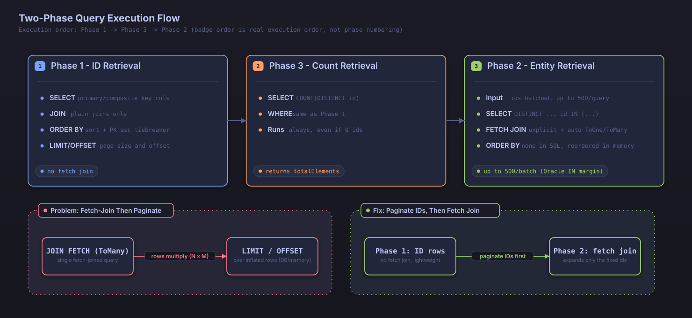

# High-Performance Pagination

Searchable JPA applies **two-phase query optimization** by default, delivering consistent high performance even on large datasets. Searches involving complex joins run without the performance degradation that single-query approaches suffer.

## What Is Two-Phase Query Optimization?

### Problems with the Traditional Single-Query Approach

```sql
-- Single query with complex joins (performance problem)
SELECT DISTINCT p.*, u.*, c.*
FROM posts p
LEFT JOIN users u ON p.author_id = u.id
LEFT JOIN comments c ON p.id = c.post_id
WHERE u.name LIKE '%John%' 
  AND p.status = 'PUBLISHED'
ORDER BY p.created_at DESC
LIMIT 10 OFFSET 100;
```

**Problems:**
- Performance degrades due to the complex joins
- DISTINCT processing adds extra overhead
- OFFSET performance suffers on large datasets
- Fetch-joining a ToMany relationship multiplies the row count, so LIMIT/OFFSET applies to the inflated row set; hitting the intended page size then requires re-paging the results in memory
- Unnecessary data gets retrieved along with the rest

### Advantages of the Two-Phase Query

```sql
-- Phase 1: a fast query that retrieves IDs only
SELECT p.id
FROM posts p
JOIN users u ON p.author_id = u.id
WHERE u.name LIKE '%John%' 
  AND p.status = 'PUBLISHED'
ORDER BY p.created_at DESC
LIMIT 10 OFFSET 100;

-- Phase 2: retrieve full entities for the IDs from phase 1 (batched IN query, fetch-joining only the necessary relations)
-- Sorting was already decided in phase 1, so this query has no ORDER BY; the application reorders the results by ID afterward
SELECT DISTINCT p.*, u.*
FROM posts p
LEFT JOIN users u ON p.author_id = u.id
WHERE p.id IN (1, 5, 12, 23, 34, 45, 56, 67, 78, 89);
```

**Advantages:**
- Phase 1 retrieves only IDs, so pagination never has to operate on the row count inflated by joins
- Phase 2 efficiently retrieves only the data it needs, in a single batch
- Only as many entities as the page size are loaded, even with complex joins
- The N+1 problem is resolved automatically

## Automatic Optimization System

Searchable JPA applies two-phase query optimization unconditionally to every search and pagination query, regardless of the search conditions involved. There is no setting or conditional branch that falls back to a single query.

### Where the Effect Is Most Pronounced

The performance gap over a single query widens the most in these situations:

1. Searches involving complex joins
2. Searches on composite-key entities
3. Searches involving ToMany relationships
4. Searches over large datasets

### Composite Key Support

#### The @IdClass Approach

```java
@Entity
@IdClass(CompositeKey.class)
public class TestIdClassEntity {
    @Id
    private String tenantId;
    
    @Id
    private Long entityId;
    
    private String name;
    
    public static class CompositeKey implements Serializable {
        private String tenantId;
        private Long entityId;
        // equals, hashCode, constructors
    }
}
```

#### The @EmbeddedId Approach

```java
@Entity
public class TestCompositeKeyEntity {
    @EmbeddedId
    private CompositeKey id;
    
    private String name;
    
    @Embeddable
    public static class CompositeKey implements Serializable {
        private Long entityId;
        private String tenantId;
        // equals, hashCode, constructors
    }
}
```

#### Two-Phase Queries for Composite Keys

```sql
-- @IdClass phase 1 query
SELECT t.tenant_id, t.entity_id FROM test_idclass_entity t
WHERE t.tenant_id = 'tenant1' AND t.name LIKE '%test%'
GROUP BY t.tenant_id, t.entity_id
ORDER BY t.tenant_id, t.entity_id
LIMIT 10;

-- @IdClass phase 2 query (composite key expressed as OR-of-AND conditions)
SELECT * FROM test_idclass_entity t
WHERE (t.tenant_id = 'tenant1' AND t.entity_id = 1) 
   OR (t.tenant_id = 'tenant1' AND t.entity_id = 2)
   OR (t.tenant_id = 'tenant1' AND t.entity_id = 3);

-- @EmbeddedId phase 2 query (same OR-of-AND shape, only the field paths differ)
SELECT * FROM test_composite_key_entity t
WHERE (t.entity_id = 1 AND t.tenant_id = 'tenant1')
   OR (t.entity_id = 2 AND t.tenant_id = 'tenant1')
   OR (t.entity_id = 3 AND t.tenant_id = 'tenant1');
```

`@IdClass` and `@EmbeddedId` produce query conditions of the same shape. The only difference is that `@EmbeddedId` references fields through the properties of an embedded identifier class, while `@IdClass` references entity fields directly.

## Usage

### Basic Usage

Using the library the way you normally would triggers the optimization automatically:

```java
@Service
public class PostService extends DefaultSearchableService<Post, Long> {
    
    public PostService(PostRepository repository, EntityManager entityManager) {
        super(repository, entityManager);
    }
    
    // Executes the query with two-phase optimization applied automatically
    public Page<Post> findPosts(SearchCondition<PostSearchDTO> condition) {
        return findAllWithSearch(condition);
    }
}

@GetMapping("/search")
public Page<Post> searchPosts(
    @RequestParam @SearchableParams(PostSearchDTO.class) Map<String, String> params
) {
    SearchCondition<PostSearchDTO> condition = 
        new SearchableParamsParser<>(PostSearchDTO.class).convert(params);
    
    // Two-phase query optimization is always applied
    return postService.findAllWithSearch(condition);
}
```

### Searching Composite-Key Entities

```java
@Service
public class CompositeKeyService extends DefaultSearchableService<TestIdClassEntity, TestIdClassEntity.CompositeKey> {
    
    public CompositeKeyService(CompositeKeyRepository repository, EntityManager entityManager) {
        super(repository, entityManager);
    }
}

@GetMapping("/composite/search")
public Page<TestIdClassEntity> searchCompositeKey(
    @RequestParam @SearchableParams(CompositeKeySearchDTO.class) Map<String, String> params
) {
    SearchCondition<CompositeKeySearchDTO> condition = 
        new SearchableParamsParser<>(CompositeKeySearchDTO.class).convert(params);
    
    // The same two-phase query applies equally to composite keys
    return compositeKeyService.findAllWithSearch(condition);
}
```

## Pagination Response Structure

The response uses the standard Spring Data `Page` object:

```java
public interface Page<T> {
    List<T> getContent();           // Data for the current page
    int getNumber();                // Current page number (zero-based)
    int getSize();                  // Page size
    int getTotalPages();            // Total number of pages
    long getTotalElements();        // Total number of elements
    boolean hasNext();              // Whether a next page exists
    boolean hasPrevious();          // Whether a previous page exists
    boolean isFirst();              // Whether this is the first page
    boolean isLast();               // Whether this is the last page
    int getNumberOfElements();      // Number of elements on the current page
}
```

### Sample Response

```json
{
  "content": [
    {
      "id": 100,
      "title": "Spring Boot Tutorial",
      "createdAt": "2024-01-15T10:30:00",
      "viewCount": 1500
    },
    {
      "id": 99,
      "title": "JPA Best Practices", 
      "createdAt": "2024-01-14T15:20:00",
      "viewCount": 1200
    }
  ],
  "pageable": {
    "sort": {
      "sorted": true,
      "orders": [
        {
          "property": "createdAt",
          "direction": "DESC"
        }
      ]
    },
    "pageNumber": 0,
    "pageSize": 20
  },
  "totalElements": 1000,
  "totalPages": 50,
  "number": 0,
  "size": 20,
  "numberOfElements": 2,
  "first": true,
  "last": false,
  "hasNext": true,
  "hasPrevious": false
}
```

## Pagination Usage Patterns

### 1. Basic Pagination

```bash
# First page
GET /api/posts/search?page=0&size=10&sort=createdAt.desc

# Next page
GET /api/posts/search?page=1&size=10&sort=createdAt.desc

# Jump to a specific page
GET /api/posts/search?page=5&size=10&sort=createdAt.desc
```

### 2. Pagination with Search

```bash
# Title search + pagination
GET /api/posts/search?title.contains=Spring&page=0&size=10&sort=createdAt.desc

# Combined conditions + pagination
GET /api/posts/search?title.contains=Spring&status.equals=PUBLISHED&page=0&size=10
```

### 3. Pagination with Sorting

```bash
# Single-field sort
GET /api/posts/search?sort=createdAt.desc&page=0&size=10

# Multi-field sort
GET /api/posts/search?sort=status.asc,createdAt.desc&page=0&size=10
```

## Performance Optimization Features

### Automatic Join Optimization

The search conditions are analyzed so that only the necessary joins get applied:

```java
// A JOIN on author is applied automatically when the search condition references it
public class PostSearchDTO {
    @SearchableField(entityField = "author.name")
    private String authorName;  // Automatically joined with the User table
    
    @SearchableField
    private String title;  // No join required
}
```

### Automatic N+1 Resolution

ToOne relationships declared with `@ManyToOne` or `@OneToOne` are always fetch-joined in every query except the count query, regardless of whether they appear in the search condition. The JPA metamodel is scanned to discover the ToOne relationships declared on the target entity, and the result is cached and reused within the same execution.

```java
// author is always fetch-joined, even when it does not appear in the search condition, preventing N+1 queries
@Entity
public class Post {
    @ManyToOne(fetch = FetchType.LAZY)
    private User author;
}

// Even a search on title alone still fetch-joins author
GET /api/posts/search?title.contains=Spring
```

## Performance Comparison

### Single Query vs. Two-Phase Query

| Aspect | Single Query | Two-Phase Query |
|------|-----------|------------|
| Simple search | Fast | Fast |
| Complex joins | Slow | Fast |
| Large datasets | Very slow | Fast |
| Memory usage | High | Low |
| N+1 problem | Can occur | Resolved automatically |
| Composite key support | Limited | Supported without restriction |

### Performance Characteristics

When a search with several joins runs against a large dataset, the cost of OFFSET processing in a single query grows as the page position moves further back. A two-phase query locates the page position with an index scan during ID retrieval, so its performance varies little across page positions. The exact figures depend on data distribution, index design, and the number of joins, so the most reliable way to measure them is to run `TwoPhaseQueryPerformanceTest` and `PaginationPerformanceTest` directly in your project environment with `./gradlew performanceTest`.

## Configuration and Tuning

### Automatic Optimization Settings

```yaml
searchable:
  hibernate:
    auto-optimization: true  # Enable Hibernate batch optimization
    default-batch-fetch-size: 100  # Batch fetch size
    jdbc-batch-size: 1000  # JDBC batch size
```

This setting controls only batch-processing tuning, such as Hibernate's batch fetch size and JDBC batch size. Two-phase query optimization itself is always on, and no setting turns it off.

### Index Optimization

Getting the most out of two-phase queries requires appropriate indexes:

```sql
-- Index for the phase 1 query (search + sort)
CREATE INDEX idx_posts_status_created_at ON posts(status, created_at DESC);

-- Index for the phase 2 query (ID-based lookup)
CREATE INDEX idx_posts_id ON posts(id);

-- Composite key index
CREATE INDEX idx_composite_tenant_entity ON test_idclass_entity(tenant_id, entity_id);

-- Index for searching a nested field
CREATE INDEX idx_posts_author_name ON posts(author_id);
CREATE INDEX idx_users_name ON users(name);
```

## Monitoring and Debugging

### Checking Query Logs

```yaml
logging:
  level:
    dev.simplecore.searchable.core.service.specification.SearchableSpecificationBuilder: TRACE
    dev.simplecore.searchable.core.service.specification.TwoPhaseQueryExecutor: TRACE
    org.hibernate.SQL: DEBUG
    org.hibernate.type.descriptor.sql.BasicBinder: TRACE
```

### Checking Join and Fetch Field Logs

TRACE-level logs show how the join target paths and fetch fields are determined:

```
TRACE SearchableSpecificationBuilder - Applying joins - condition paths: [author], query type: class java.lang.Long, isCountQuery: true
TRACE SearchableSpecificationBuilder - Adding common ToOne fields for non-count query: [author]
TRACE SearchableSpecificationBuilder - All fetch fields for two-phase query: [author]
```

## Programmatic Usage

### Using SearchConditionBuilder

```java
@Service
public class PostService extends DefaultSearchableService<Post, Long> {
    
    public Page<Post> findRecentPosts(int page, int size) {
        SearchCondition<PostSearchDTO> condition = SearchConditionBuilder
            .create(PostSearchDTO.class)
            .where(group -> group
                .equals("status", PostStatus.PUBLISHED)
            )
            .sort(sort -> sort
                .desc("createdAt")
                .desc("id")
            )
            .page(page)
            .size(size)
            .build();
            
        // Two-phase query optimization is always applied
        return findAllWithSearch(condition);
    }
}
```

### Combining Conditions Dynamically

```java
public Page<Post> searchPosts(String title, 
                             PostStatus status, 
                             int page,
                             int size) {
    SearchConditionBuilder<PostSearchDTO> builder = SearchConditionBuilder
        .create(PostSearchDTO.class);
        
    if (title != null && !title.isEmpty()) {
        builder = builder.where(group -> group.contains("title", title));
    }
    
    if (status != null) {
        builder = builder.and(group -> group.equals("status", status));
    }
    
    SearchCondition<PostSearchDTO> condition = builder
        .sort(sort -> sort.desc("createdAt").desc("id"))
        .page(page)
        .size(size)
        .build();
        
    // No matter how the conditions are combined, two-phase query optimization is always applied
    return findAllWithSearch(condition);
}
```

## Internal Implementation

### Execution Flow

`SearchableSpecificationBuilder.buildAndExecuteWithTwoPhaseOptimization()` is the execution entry point for every search request. It merges the explicitly specified fetch fields (`fetchFields` on `SearchCondition`) with the automatically detected common ToOne fields, calls `TwoPhaseQueryExecutor.executeWithTwoPhaseOptimization(pageRequest, fetchFields)`, and runs queries internally in the following order.

1. **Phase 1 (ID retrieval)** — Applies only the plain joins the search condition requires and retrieves just the primary key (or composite key) values. It applies the sort conditions and the page offset and size as given, and performs no fetch join.
2. **Phase 3 (count retrieval)** — Retrieves the total element count independently of phase 1. It always runs, even when phase 1 returns no results, so `totalElements` stays accurate even for a page request that is out of range.
3. **Phase 2 (entity retrieval)** — Splits the IDs obtained from phase 1 into batches of up to 500 and issues multiple `IN`-clause queries, fetch-joining every ToOne and ToMany relationship that is either explicitly specified or automatically detected. Each batch applies `DISTINCT` to prevent duplicate rows introduced by ToMany fetch joins. This phase issues no `ORDER BY`; the application reorders the results according to the ID order established in phase 1.

This ordering lets the lightweight phase 1 query, which deals only with IDs, handle sorting and pagination, while the expensive fetch joins apply only to the page-sized set of IDs already fixed by that point. A single query that paginates directly over join results would have to apply LIMIT/OFFSET to the entire row set inflated by a ToMany relationship; the two-phase query avoids that cost.



*Figure: two-phase query execution flow, from Phase 1 (ID retrieval) through Phase 3 (count retrieval) to Phase 2 (batched IN retrieval with fetch joins)*

### Batching for IN Clauses

Phase 2 splits the ID list into batches of up to 500 and runs them as multiple `IN`-clause queries. This batch size is a fixed value chosen with a safety margin below Oracle's 1,000-item limit on IN-clause entries, and no configuration setting changes it.

### Guaranteeing Sort Stability (Primary Key Tiebreaker)

If the caller's sort condition does not include the primary key, an ascending primary-key sort is appended to it automatically; the same ascending primary-key sort applies even when no sort condition is specified at all. This safeguard keeps rows that share a sort value from being duplicated or skipped across page boundaries. The `.desc("id")` call in the earlier examples merely makes this already-guaranteed behavior explicit — it is not code you are required to add.

## Limitations and Considerations

### Current Limitations

1. **More queries**: Splitting the work into ID retrieval, count retrieval, and entity retrieval increases the number of queries compared to a single query (overall performance still improves)
2. **Memory usage**: The ID list retrieved in phase 1 stays in memory until phase 2 finishes
3. **Transaction scope**: The caller must ensure that all three phases of queries run within the same transaction and persistence context

### Considerations for Use

1. **Index design**: A composite index matching the search and sort conditions of the phase 1 query is required
2. **Page size**: A larger page size also increases memory usage
3. **Sort fields**: Fields used for sorting should generally have an index

## Differences from Regular Pagination

| Characteristic | Regular Pagination | Two-Phase Query Pagination |
|------|-------------|------------------|
| Number of queries | 1 | 2-3 (ID query + count query, plus an entity query when results exist) |
| Complex join performance | Slow | Fast |
| Memory usage | Low | Medium |
| N+1 problem | Can occur | Resolved automatically |
| Composite key support | Limited | Supported without restriction |
| Implementation complexity | Simple | Automated |
