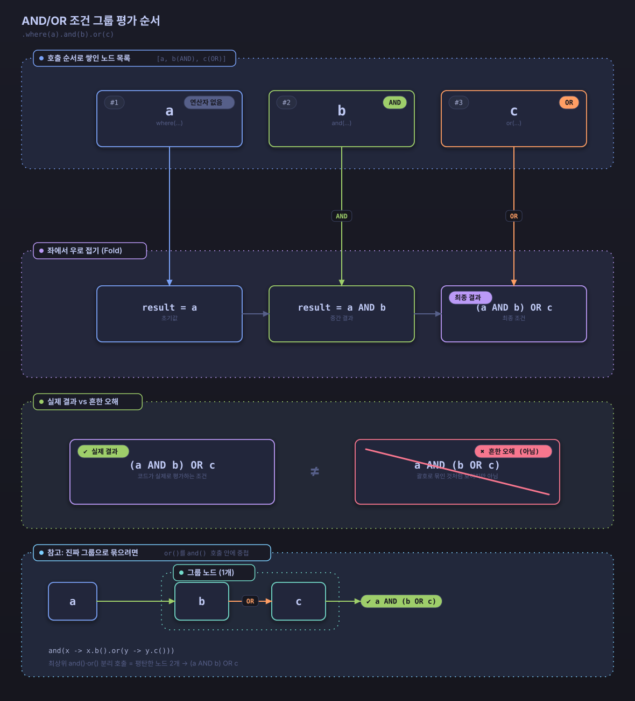

# 고급 기능

이 문서는 Searchable JPA의 고급 기능을 설명합니다.

## 다른 베이스 클래스를 상속해야 하는 경우

이 문서와 기본 사용법 문서의 서비스 예제는 모두 `DefaultSearchableService`를 상속하는 방식을 사용합니다. 그런데 서비스 클래스가 이미 다른 베이스 클래스를 상속하고 있어 `DefaultSearchableService`를 상속할 수 없는 경우가 있습니다. 이때는 `SearchableServiceSupport` 인터페이스와 `SearchableServiceDelegate`를 조합해 동일한 검색 기능을 컴포지션 방식으로 구현합니다.

`SearchableServiceDelegate`는 `SearchableService`의 모든 메서드 구현을 캡슐화한 독립 클래스이고, `SearchableServiceSupport`는 이 델리게이트에 위임하는 기본 메서드를 제공하는 믹스인 인터페이스입니다. `DefaultSearchableService` 자체도 내부적으로 `SearchableServiceDelegate`에 위임하는 `SearchableServiceSupport` 구현체입니다.

```java
@Service
public class PostService extends SomeOtherBaseClass
        implements SearchableServiceSupport<Post, Long> {

    private final SearchableServiceDelegate<Post, Long> searchableDelegate;

    public PostService(PostRepository repository, EntityManager entityManager) {
        this.searchableDelegate = new SearchableServiceDelegate<>(repository, entityManager, Post.class);
    }

    @Override
    public SearchableServiceDelegate<Post, Long> getSearchableDelegate() {
        return searchableDelegate;
    }
}
```

`repository`는 `JpaRepository`와 `JpaSpecificationExecutor`를 함께 구현해야 합니다. 이 조건을 만족하지 않으면 `SearchableServiceDelegate` 생성 시점에 예외가 발생합니다.

`PostService`는 `DefaultSearchableService`를 상속한 서비스와 동일한 방식으로 호출합니다.

```java
Page<Post> result = postService.findAllWithSearch(condition);
long updatedCount = postService.updateWithSearch(condition, updateData);
```

인터페이스 구현 없이 `SearchableServiceDelegate` 인스턴스를 직접 생성해 메서드를 호출하는 방식도 지원합니다.

## 프로젝션(Projection) 지원

엔티티 필드 일부만 조회하려면 인터페이스 기반 프로젝션을 사용합니다.

### 인터페이스 기반 프로젝션

```java
public interface PostSummary {
    String getTitle();
    String getAuthorName();
    LocalDateTime getCreatedAt();

    // 계산된 필드 (SpEL 표현식 지원)
    @Value("#{target.title + ' by ' + target.authorName}")
    String getDisplayName();
}
```

### 프로젝션 사용

```java
@GetMapping("/summaries")
public Page<PostSummary> getPostSummaries(
    @RequestParam @SearchableParams(PostSearchDTO.class) Map<String, String> params
) {
    SearchCondition<PostSearchDTO> condition =
        new SearchableParamsParser<>(PostSearchDTO.class).convert(params);
    return postService.findAllWithSearch(condition, PostSummary.class);
}
```

### 동적 프로젝션

```java
@GetMapping("/dynamic-summaries")
public Page<?> getDynamicSummaries(
    @RequestParam @SearchableParams(PostSearchDTO.class) Map<String, String> params,
    @RequestParam(defaultValue = "summary") String projection
) {
    SearchCondition<PostSearchDTO> condition =
        new SearchableParamsParser<>(PostSearchDTO.class).convert(params);

    switch (projection) {
        case "summary":
            return postService.findAllWithSearch(condition, PostSummary.class);
        case "detail":
            return postService.findAllWithSearch(condition, PostDetailProjection.class);
        default:
            return postService.findAllWithSearch(condition);
    }
}
```

### 제한사항

- **인터페이스만 지원**: 현재 구현에서는 인터페이스 기반 프로젝션만 지원됩니다
- **클래스 기반 프로젝션**: DTO 클래스를 사용한 프로젝션은 아직 지원되지 않습니다
- **계산된 필드**: `@Value` 어노테이션을 사용한 SpEL 표현식을 지원합니다

## 배치 업데이트

검색 조건에 맞는 여러 엔티티를 한 번에 업데이트합니다.

### 업데이트 DTO

```java
public class PostUpdateDTO {
    private PostStatus status;
    private String title;
    private Integer viewCount;
    private LocalDateTime lastModified;
    
    // getters and setters
}
```

### 배치 업데이트 실행

Spring MVC는 요청 본문을 한 번만 읽으므로, 검색 조건과 수정할 값을 각각 별도의 `@RequestBody` 파라미터로는 받을 수 없습니다. 두 값을 하나의 요청 DTO로 감쌉니다.

```java
public class BatchUpdateRequest {
    private SearchCondition<PostSearchDTO> searchCondition;
    private PostUpdateDTO updateData;
    // getters and setters
}
```

```java
@PutMapping("/batch-update")
public ResponseEntity<Long> batchUpdate(@RequestBody BatchUpdateRequest request) {
    long updatedCount = postService.updateWithSearch(request.getSearchCondition(), request.getUpdateData());
    return ResponseEntity.ok(updatedCount);
}
```

### 조건부 배치 업데이트

```java
@Service
public class PostService extends DefaultSearchableService<Post, Long> {
    
    @Transactional
    public long updatePostStatus(PostStatus fromStatus, PostStatus toStatus) {
        SearchCondition<PostSearchDTO> condition = SearchConditionBuilder
            .create(PostSearchDTO.class)
            .where(group -> group.equals("status", fromStatus))
            .build();
            
        PostUpdateDTO updateData = new PostUpdateDTO();
        updateData.setStatus(toStatus);
        updateData.setLastModified(LocalDateTime.now());
        
        return updateWithSearch(condition, updateData);
    }
}
```

### 사용 예제

```bash
# 특정 조건의 게시글 상태를 일괄 변경
PUT /api/posts/batch-update
Content-Type: application/json

{
  "searchCondition": {
    "conditions": [
      {
        "operator": "and",
        "field": "status",
        "searchOperator": "equals",
        "value": "DRAFT"
      },
      {
        "operator": "and",
        "field": "createdAt",
        "searchOperator": "lessThan",
        "value": "2024-01-01T00:00:00"
      }
    ]
  },
  "updateData": {
    "status": "ARCHIVED",
    "lastModified": "2024-01-15T10:30:00"
  }
}
```

## 배치 삭제

검색 조건에 맞는 여러 엔티티를 한 번에 삭제합니다.

### 기본 배치 삭제

```java
@DeleteMapping("/batch-delete")
public ResponseEntity<Long> batchDelete(
    @RequestBody SearchCondition<PostSearchDTO> searchCondition
) {
    long deletedCount = postService.deleteWithSearch(searchCondition);
    return ResponseEntity.ok(deletedCount);
}
```

### 안전한 배치 삭제

```java
@Service
public class PostService extends DefaultSearchableService<Post, Long> {
    
    @Transactional
    public long safeDeleteOldDrafts(int daysOld) {
        LocalDateTime cutoffDate = LocalDateTime.now().minusDays(daysOld);
        
        SearchCondition<PostSearchDTO> condition = SearchConditionBuilder
            .create(PostSearchDTO.class)
            .where(group -> group
                .equals("status", PostStatus.DRAFT)
                .and(a -> a.lessThan("createdAt", cutoffDate))
            )
            .build();
            
        // 삭제 전 개수 확인
        Page<Post> toDelete = findAllWithSearch(condition);
        log.info("Deleting {} old draft posts", toDelete.getTotalElements());
        
        return deleteWithSearch(condition);
    }
}
```

## 동적 정렬

검색 조건과 함께 정렬 조건을 동적으로 지정합니다.

### 다중 필드 정렬

```bash
# 상태 오름차순, 생성일 내림차순, ID 오름차순
GET /api/posts/search?sort=status.asc,createdAt.desc,id.asc
```

### JSON 방식 동적 정렬

```json
{
  "conditions": [
    {
      "operator": "and",
      "field": "status",
      "searchOperator": "equals",
      "value": "PUBLISHED"
    }
  ],
  "sort": {
    "orders": [
      {
        "field": "priority",
        "direction": "desc"
      },
      {
        "field": "createdAt",
        "direction": "asc"
      },
      {
        "field": "id",
        "direction": "asc"
      }
    ]
  }
}
```

### 프로그래매틱 정렬

```java
@Service
public class PostService extends DefaultSearchableService<Post, Long> {
    
    public Page<Post> findPostsWithDynamicSort(String status, String sortField, String sortDirection) {
        SearchConditionBuilder<PostSearchDTO> builder = SearchConditionBuilder
            .create(PostSearchDTO.class);
            
        if (status != null) {
            builder = builder.where(group -> group.equals("status", PostStatus.valueOf(status)));
        }
        
        // 동적 정렬 추가
        if (sortField != null && sortDirection != null) {
            builder = builder.sort(sort -> {
                if ("ASC".equalsIgnoreCase(sortDirection)) {
                    sort.asc(sortField);
                } else {
                    sort.desc(sortField);
                }
            });
        }
        
        SearchCondition<PostSearchDTO> condition = builder.build();
        return findAllWithSearch(condition);
    }
}
```

## 중첩 필드 검색

연관 엔티티의 필드로 검색합니다.

### 깊은 중첩 필드 검색

```java
public class PostSearchDTO {
    // 2단계 중첩
    @SearchableField(entityField = "author.profile.department", operators = {EQUALS, CONTAINS})
    private String authorDepartment;
    
    // 3단계 중첩
    @SearchableField(entityField = "author.profile.company.name", operators = {CONTAINS})
    private String companyName;
    
    // 컬렉션 중첩
    @SearchableField(entityField = "comments.author.name", operators = {CONTAINS})
    private String commentAuthorName;
}
```

### 중첩 필드 조건부 검색

```java
@GetMapping("/advanced-search")
public Page<Post> advancedSearch(
    @RequestParam(required = false) String authorDepartment,
    @RequestParam(required = false) String companyName,
    @RequestParam(required = false) String commentAuthorName
) {
    SearchConditionBuilder<PostSearchDTO> builder = SearchConditionBuilder
        .create(PostSearchDTO.class);
        
    if (authorDepartment != null) {
        builder = builder.where(group -> group.contains("authorDepartment", authorDepartment));
    }
    
    if (companyName != null) {
        builder = builder.and(group -> group.contains("companyName", companyName));
    }
    
    if (commentAuthorName != null) {
        builder = builder.and(group -> group.contains("commentAuthorName", commentAuthorName));
    }
    
    SearchCondition<PostSearchDTO> condition = builder.build();
    return postService.findAllWithSearch(condition);
}
```

## 기존 검색 조건 확장

기존 `SearchCondition` 객체를 기반으로 새 조건을 추가합니다. 원본 객체는 그대로 두고 검색 조건을 재사용하거나 확장할 때 사용합니다.

### from() 팩토리 메서드

`SearchConditionBuilder.from()` 메서드는 기존 검색 조건을 복사하고 새 조건을 추가합니다.

```java
// 기본 검색 조건 생성
SearchCondition<PostSearchDTO> baseCondition = SearchConditionBuilder
    .create(PostSearchDTO.class)
    .where(w -> w.equals("status", PostStatus.PUBLISHED))
    .sort(s -> s.desc("createdAt"))
    .page(0)
    .size(10)
    .build();

// 기존 조건 기반으로 새 조건 추가
SearchCondition<PostSearchDTO> extendedCondition = SearchConditionBuilder
    .from(baseCondition, PostSearchDTO.class)
    .and(a -> a.greaterThan("viewCount", 100))
    .build();

// baseCondition은 변경되지 않음 (불변성 유지)
```

### AND/OR 조건 결합 순서

`SearchConditionBuilder`의 `where()`, `and()`, `or()`는 호출한 순서대로 조건 노드를 쌓습니다. 최종 `Predicate`는 이 노드 목록을 왼쪽에서 오른쪽으로 접어가며(fold) 만들고, 각 노드는 자신에게 지정된 연산자(AND/OR)로 그때까지 누적된 결과와 결합됩니다. 목록의 첫 노드에는 연산자가 없습니다.

```java
SearchCondition<PostSearchDTO> condition = SearchConditionBuilder
    .create(PostSearchDTO.class)
    .where(w -> w.equals("status", "PUBLISHED"))     // a
    .and(a -> a.equals("authorId", currentUserId))    // b (AND)
    .or(o -> o.equals("visibility", "PUBLIC"))         // c (OR)
    .build();
```

이 호출은 노드 목록 `[a, b(AND), c(OR)]`를 만들고, 다음 순서로 접습니다.

```
result = a
result = result AND b
result = result OR c
```

최종 조건은 `(a AND b) OR c`이며, `a AND (b OR c)`가 아닙니다. `b`와 `c`를 하나로 묶어 `a AND (b OR c)`를 표현하려면 `or()`를 최상위에 별도로 두지 말고, 하나의 `and()` 호출 안에 중첩합니다.

```java
SearchCondition<PostSearchDTO> condition = SearchConditionBuilder
    .create(PostSearchDTO.class)
    .where(w -> w.equals("status", "PUBLISHED"))              // a
    .and(a -> a
        .equals("authorId", currentUserId)                     // b
        .or(o -> o.equals("visibility", "PUBLIC"))              // c, and() 안에 중첩
    )
    .build();
```

이렇게 중첩하면 `b`와 `c`가 하나의 그룹으로 묶여 `a AND (b OR c)`가 됩니다.



*그림. `.where(a).and(b).or(c)` 호출이 노드 목록 `[a, b(AND), c(OR)]`로 쌓이고 좌에서 우로 접혀 `(a AND b) OR c`가 되는 과정*

### 실용적인 활용 사례

#### 1. 테넌트별 필터 추가

멀티테넌트 환경에서 기본 검색 조건에 테넌트 필터를 추가합니다.

```java
@Service
public class PostService extends DefaultSearchableService<Post, Long> {

    public Page<Post> searchWithTenantFilter(
            SearchCondition<PostSearchDTO> baseCondition,
            Long tenantId
    ) {
        SearchCondition<PostSearchDTO> tenantCondition = SearchConditionBuilder
            .from(baseCondition, PostSearchDTO.class)
            .and(a -> a.equals("tenantId", tenantId))
            .build();

        return findAllWithSearch(tenantCondition);
    }
}
```

#### 2. 권한 기반 필터 추가

사용자 권한에 따라 검색 조건을 동적으로 확장합니다.

```java
@Service
public class PostService extends DefaultSearchableService<Post, Long> {

    public Page<Post> searchWithSecurityFilter(
            SearchCondition<PostSearchDTO> baseCondition,
            User currentUser
    ) {
        SearchConditionBuilder<PostSearchDTO> builder = SearchConditionBuilder
            .from(baseCondition, PostSearchDTO.class);

        // 관리자가 아니면 다른 사용자의 비공개 게시글은 제외 (본인 게시글은 공개 여부와 무관하게 조회)
        if (!currentUser.isAdmin()) {
            builder = builder.and(a -> a
                .notEquals("visibility", "PRIVATE")
                .or(o -> o.equals("authorId", currentUser.getId()))
            );
        }

        return findAllWithSearch(builder.build());
    }
}
```

#### 3. 컨트롤러에서 조건 확장

클라이언트 요청에 서버 측 조건을 추가합니다.

```java
@RestController
@RequestMapping("/api/posts")
public class PostController {

    private final PostService postService;

    @PostMapping("/search")
    public Page<Post> search(
            @RequestBody SearchCondition<PostSearchDTO> clientCondition,
            @AuthenticationPrincipal User currentUser
    ) {
        // 클라이언트 조건에 서버 측 필터 추가
        SearchCondition<PostSearchDTO> serverCondition = SearchConditionBuilder
            .from(clientCondition, PostSearchDTO.class)
            .and(a -> a.notEquals("status", PostStatus.DELETED))
            .and(a -> a.in("departmentId", currentUser.getAccessibleDepartments()))
            .build();

        return postService.findAllWithSearch(serverCondition);
    }
}
```

### 정렬 및 페이징 오버라이드

기존 조건의 정렬이나 페이징을 변경합니다.

```java
// 기존 조건
SearchCondition<PostSearchDTO> original = SearchConditionBuilder
    .create(PostSearchDTO.class)
    .where(w -> w.equals("status", PostStatus.PUBLISHED))
    .sort(s -> s.asc("title"))
    .page(0)
    .size(10)
    .build();

// 정렬 변경
SearchCondition<PostSearchDTO> withNewSort = SearchConditionBuilder
    .from(original, PostSearchDTO.class)
    .sort(s -> s.desc("createdAt"))  // 정렬 오버라이드
    .build();

// 페이징 변경
SearchCondition<PostSearchDTO> withNewPage = SearchConditionBuilder
    .from(original, PostSearchDTO.class)
    .page(5)   // 페이지 오버라이드
    .size(20)  // 사이즈 오버라이드
    .build();
```

### 주의사항

- **불변성**: `from()` 메서드는 항상 새로운 `SearchCondition` 객체를 생성합니다. 원본 객체는 변경되지 않습니다.
- **DTO 클래스 필수**: `from()` 메서드에 DTO 클래스를 명시적으로 전달해야 합니다. 이는 `build()` 시점에 검증을 수행하기 위함입니다.
- **검증 시점**: 모든 조건(기존 + 새로 추가된 조건)은 `build()` 호출 시 함께 검증됩니다.

## 다국어 지원

라이브러리 내부 검증 오류 메시지는 `MessageUtils`가 조회합니다. 기본 제공 번들(`messages/message.properties`, `messages/message_ko.properties`)에 로케일별 문구가 들어 있고, 요청 로케일은 `LocaleContextHolder`에서 가져옵니다.

### 라이브러리 내장 메시지 조회

```java
import dev.simplecore.searchable.core.i18n.MessageUtils;

String message = MessageUtils.getMessage("validator.field.not.found", new Object[]{"title", "PostSearchDTO"});
// locale=ko: "필드 title를 PostSearchDTO에서 찾을 수 없습니다"
// locale=en(기본값): "Field title not found in PostSearchDTO"
```

### 커스텀 메시지 등록

`MessageUtils`는 Spring Boot 자동 구성으로 초기화되지 않습니다. `init()`을 호출하기 전에 `getMessage()`가 먼저 실행되면 라이브러리 내장 번들만 바라보는 기본 `MessageSource`로 고정되므로, 애플리케이션 메시지를 추가하려면 시작 시점에 `MessageUtils.init(...)`을 직접 호출해 `MessageSource`를 등록합니다.

```java
@Configuration
public class MessageConfig {

    @PostConstruct
    public void initMessageUtils() {
        ResourceBundleMessageSource messageSource = new ResourceBundleMessageSource();
        messageSource.setBasenames("messages/message", "messages/custom-message");
        messageSource.setDefaultEncoding("UTF-8");
        messageSource.setFallbackToSystemLocale(false);
        MessageUtils.init(messageSource);
    }
}
```

`messages/message`는 라이브러리가 제공하는 기본 번들이고, `messages/custom-message`는 애플리케이션이 추가하는 번들입니다. 두 번들을 함께 등록하면 라이브러리 내장 키와 커스텀 키를 모두 `MessageUtils.getMessage(...)`로 조회할 수 있습니다.

```properties
# messages/custom-message_ko.properties
post.validation.title.required=제목은 필수입니다

# messages/custom-message_en.properties
post.validation.title.required=Title is required
```

```java
@Service
public class PostService extends DefaultSearchableService<Post, Long> {

    public void validateAndSave(Post post) {
        if (post.getTitle() == null || post.getTitle().trim().isEmpty()) {
            throw new IllegalArgumentException(
                MessageUtils.getMessage("post.validation.title.required")
            );
        }

        save(post);
    }
}
```

## 복합 키 지원

복합 키 엔티티에 대한 자세한 내용은 다음 문서를 참조하세요:

- [2단계 쿼리 최적화 - 복합 키 지원](two-phase-query-optimization.md#복합-키-지원)
- [설치 가이드 - 복합 키 엔티티 설정](installation.md#복합-키-엔티티-설정)

### 간단한 사용 예제

```java
// @IdClass 방식
@Service
public class IdClassService extends DefaultSearchableService<TestIdClassEntity, TestIdClassEntity.CompositeKey> {
    // 자동으로 복합 키 최적화 적용
}

// @EmbeddedId 방식  
@Service
public class EmbeddedIdService extends DefaultSearchableService<TestCompositeKeyEntity, TestCompositeKeyEntity.CompositeKey> {
    // 자동으로 복합 키 최적화 적용
}
```

## 시간 구간별 건수 집계

목록 화면 옆에 기간별 건수 그래프를 함께 그릴 때, 그래프가 목록과 다른 조건으로 집계되면 두 결과가 어긋납니다. `TimeBucketCounter`는 목록 조회에 쓰는 `SearchCondition`을 그대로 받아 같은 조건으로 집계하므로, 검색 조건을 좁히면 그래프도 함께 좁아집니다.

집계는 데이터베이스에서 수행합니다. 기간에 속한 행을 애플리케이션으로 가져와 나누지 않으므로 대상 행이 많아도 전송량이 늘지 않습니다.

### 시간 축 필드 요구 사항

집계 기준이 되는 필드는 `Instant` 타입이어야 합니다.

```java
@Entity
@Table(name = "access_logs")
public class AccessLog {

    @Id
    @GeneratedValue(strategy = GenerationType.IDENTITY)
    private Long id;

    // The field the period is measured on
    @Column(name = "occurred_at")
    private Instant occurredAt;

    @Enumerated(EnumType.STRING)
    private AccessResult result;

    @ManyToOne(fetch = FetchType.LAZY)
    @JoinColumn(name = "account_id")
    private Account account;

    // getters, setters...
}
```

Repository는 다른 검색 기능과 마찬가지로 `JpaSpecificationExecutor`를 상속해야 합니다.

```java
@Repository
public interface AccessLogRepository extends JpaRepository<AccessLog, Long>, JpaSpecificationExecutor<AccessLog> {
}
```

### 사용 예제

스타터를 사용하면 `timeBucketCounter` 빈이 자동 등록되므로 주입해서 바로 사용합니다. 자세한 등록 조건은 [자동 설정 가이드](auto-configuration.md#시간-구간-집계)를 참조하세요.

```java
@Service
public class AccessLogStatsService {

    private final AccessLogRepository repository;
    private final TimeBucketCounter timeBucketCounter;

    public AccessLogStatsService(AccessLogRepository repository, TimeBucketCounter timeBucketCounter) {
        this.repository = repository;
        this.timeBucketCounter = timeBucketCounter;
    }

    // Divides the last 24 hours into 24 one-hour buckets
    public List<Long> hourlyCounts(SearchCondition<AccessLogSearchDTO> condition, Instant now) {
        Instant to = now.truncatedTo(ChronoUnit.HOURS).plus(1, ChronoUnit.HOURS);
        Instant from = to.minus(24, ChronoUnit.HOURS);

        return timeBucketCounter.count(
                AccessLog.class,
                repository,
                condition,
                "occurredAt",
                from,
                to,
                24);
    }
}
```

목록과 그래프를 같은 컨트롤러에서 함께 내려줄 때는 파싱한 검색 조건 하나를 양쪽에 넘깁니다.

```java
@GetMapping("/api/access-logs")
public AccessLogPageResponse search(@SearchableParams(AccessLogSearchDTO.class) SearchCondition<AccessLogSearchDTO> condition,
                                    @RequestParam Instant from,
                                    @RequestParam Instant to) {
    Page<AccessLog> page = accessLogService.findAllWithSearch(condition);
    List<Long> counts = timeBucketCounter.count(
            AccessLog.class, repository, condition, "occurredAt", from, to, 48);

    return new AccessLogPageResponse(page, counts);
}
```

### 집계 규칙

- **기간은 시작을 포함하고 끝을 제외합니다.** `to`에 정확히 걸린 행은 다음 기간에 속하므로, 기간을 이어 붙여 조회해도 같은 행이 두 번 세어지지 않습니다.
- **각 구간도 같은 방식으로 나뉩니다.** 구간 경계에 걸린 행은 뒤쪽 구간 하나에만 포함됩니다.
- **구간 폭은 기간 전체에서 계산합니다.** 기간이 구간 수로 나누어떨어지지 않아도 나머지가 마지막 구간에 몰리지 않고 고르게 분산됩니다.
- **반환값은 항상 요청한 구간 수만큼의 길이**이며, 오래된 구간부터 순서대로 담깁니다. 해당 구간에 행이 없으면 `0`입니다.
- **구간 수는 1~512개**입니다. 범위를 벗어나거나 `from`이 `to`보다 뒤이면 `IllegalArgumentException`이 발생합니다.

### 인덱스

집계 쿼리는 시간 축 필드로 기간을 잘라내므로, 해당 컬럼에 인덱스가 없으면 매번 테이블 전체를 읽습니다. 검색 조건과 함께 쓰는 복합 인덱스를 두면 더 유리합니다.

```sql
CREATE INDEX idx_access_logs_occurred_at ON access_logs (occurred_at);
```

집계 쿼리의 형태는 데이터베이스에 따라 달라집니다. 자세한 내용은 [자동 설정 가이드 - 시간 구간 집계](auto-configuration.md#시간-구간-집계)에서 다룹니다.
