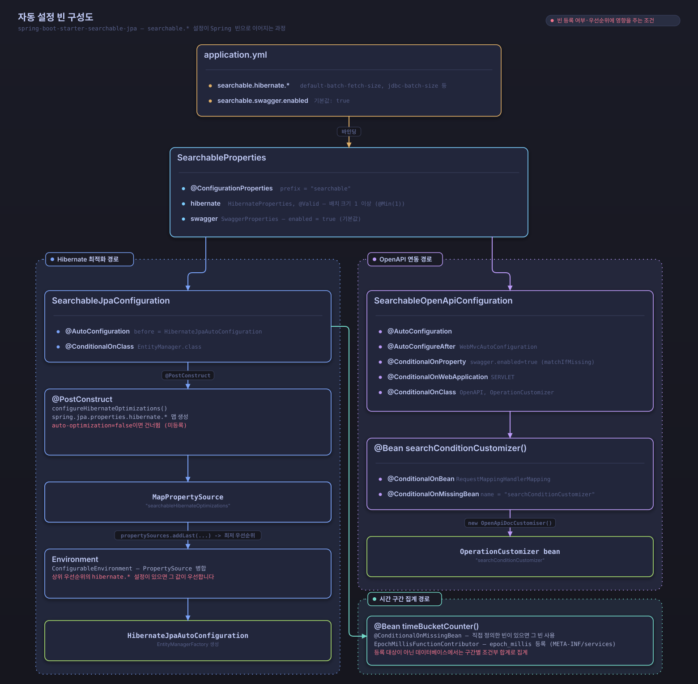

# Searchable JPA 자동 설정 가이드

## **자동 Hibernate 최적화**

searchable-jpa 라이브러리는 **자동으로 Hibernate 최적화 설정을 구성**하여 N+1 문제를 방지하고 성능을 향상시킵니다.

### **자동 적용되는 최적화 설정**

라이브러리를 의존성으로 추가하기만 하면 다음 설정이 **자동으로 적용**됩니다:

```yaml
spring:
  jpa:
    properties:
      hibernate:
        # N+1 문제 방지
        default_batch_fetch_size: 100
        
        # 배치 처리 최적화
        jdbc:
          batch_size: 1000
          batch_versioned_data: true
        
        # 삽입/업데이트 순서 최적화
        order_inserts: true
        order_updates: true
        
        # 쿼리 최적화
        query:
          in_clause_parameter_padding: true

        # 연결 최적화
        connection:
          provider_disables_autocommit: true
```

### **설정 커스터마이징**

필요에 따라 기본값을 변경할 수 있습니다:

```yaml
searchable:
  hibernate:
    # 자동 최적화 활성화/비활성화 (기본값: true)
    auto-optimization: true

    # 배치 fetch 크기 (기본값: 100)
    default-batch-fetch-size: 150

    # JDBC 배치 크기 (기본값: 1000)
    jdbc-batch-size: 500

    # 버전 데이터 배치 처리 (기본값: true)
    batch-versioned-data: true

    # 삽입 순서 최적화 (기본값: true)
    order-inserts: true

    # 업데이트 순서 최적화 (기본값: true)
    order-updates: true

    # IN 절 파라미터 패딩 (기본값: true)
    in-clause-parameter-padding: true
```

### **자동 최적화 비활성화**

자동 최적화를 비활성화하려면:

```yaml
searchable:
  hibernate:
    auto-optimization: false
```

또는 특정 설정만 직접 지정하려면:

```yaml
# 수동 설정이 자동 설정보다 우선합니다
spring:
  jpa:
    properties:
      hibernate:
        default_batch_fetch_size: 200  # 자동 설정 대신 이 값 사용
```

### **성능 향상 효과**

#### **Before (자동 설정 없음)**
```sql
-- N+1 문제 발생
SELECT * FROM user_account WHERE id = ?  -- 1번
SELECT * FROM position WHERE id = ?      -- N번 (각 사용자마다)
SELECT * FROM organization WHERE id = ?  -- N번 (각 사용자마다)
```

#### **After (자동 설정 적용)**
```sql
-- 배치 로딩으로 최적화
SELECT * FROM user_account WHERE id IN (?, ?, ?, ...)     -- 1번
SELECT * FROM position WHERE id IN (?, ?, ?, ...)         -- 1번 (배치)
SELECT * FROM organization WHERE id IN (?, ?, ?, ...)     -- 1번 (배치)
```

### **주요 이점**

#### 1. **개발자 편의성**
- 별도 설정 불필요
- 최적화 설정 자동 적용
- 실수로 인한 성능 문제 방지

#### 2. **즉시 적용되는 성능 향상**
- N+1 문제 자동 방지
- 배치 처리 최적화
- 쿼리 플랜 캐싱 개선

#### 3. **유연한 커스터마이징**
- 필요시 개별 설정 가능
- 프로젝트별 최적화 가능
- 단계적 비활성화 지원

### **사용 예시**

#### **기본 사용 (자동 최적화)**
```java
// 의존성만 추가하면 자동으로 최적화됨
@Service
public class UserService extends DefaultSearchableService<User, Long> {

    public UserService(UserRepository repository, EntityManager entityManager) {
        super(repository, entityManager);
    }

    public Page<User> searchUsers(SearchCondition<UserSearchDTO> condition) {
        // 자동으로 배치 로딩 적용됨
        return findAllWithSearch(condition);
    }
}
```

#### **커스텀 설정 사용**
```yaml
# application.yml
searchable:
  hibernate:
    auto-optimization: true
    default-batch-fetch-size: 200  # 더 큰 배치 크기
    jdbc-batch-size: 2000          # 더 큰 JDBC 배치
```

### **설정 확인 방법**

자동 최적화가 적용되는 과정은 TRACE 레벨로 기록됩니다. 확인하려면 `logging.level.dev.simplecore.searchable=TRACE`를 설정하세요.

```
TRACE SearchableJpaConfiguration - Configuring automatic Hibernate optimizations for searchable-jpa...
TRACE SearchableJpaConfiguration - Applied Hibernate optimizations:
TRACE SearchableJpaConfiguration -   - default_batch_fetch_size: 100
TRACE SearchableJpaConfiguration -   - jdbc.batch_size: 1000
TRACE SearchableJpaConfiguration -   - order_inserts: true
TRACE SearchableJpaConfiguration -   - order_updates: true
TRACE SearchableJpaConfiguration -   - in_clause_parameter_padding: true
TRACE SearchableJpaConfiguration - These settings help prevent N+1 problems and improve performance automatically.
```

자동 최적화를 비활성화하면(`searchable.hibernate.auto-optimization=false`) 다음 로그가 INFO 레벨로 남습니다.

```
INFO  SearchableJpaConfiguration - Searchable Hibernate auto-optimization is disabled
```

### **주의사항**

1. **기존 설정과의 충돌**
   - 기존에 `spring.jpa.properties.hibernate.*` 설정이 있으면 그 설정이 우선합니다
   - 자동 설정은 설정되지 않은 항목에만 적용됩니다

2. **메모리 사용량**
   - `default_batch_fetch_size`가 클수록 메모리 사용량이 증가할 수 있습니다
   - 애플리케이션 특성에 맞게 조정하세요

3. **데이터베이스 호환성**
   - 일부 설정은 특정 데이터베이스에서만 효과적일 수 있습니다
   - 성능 테스트로 검증하세요

## 기본 자동 설정

### 자동으로 설정되는 항목

1. **Hibernate 최적화 설정**
   - N+1 문제 방지를 위한 배치 페치 크기 설정
   - JDBC 배치 크기 최적화
   - 쿼리 플랜 캐싱 최적화

2. **OpenAPI/Swagger 통합**
   - SearchableParams 어노테이션 자동 인식
   - API 문서 자동 생성



*application.yml의 `searchable.*` 설정이 SearchableProperties로 바인딩되고, SearchableJpaConfiguration과 SearchableOpenApiConfiguration이 이를 읽어 조건에 따라 빈을 등록하는 과정*

## 설정 속성

### application.yml 설정

```yaml
searchable:
  # Swagger/OpenAPI 설정
  swagger:
    enabled: true  # 기본값: true, OpenAPI/Swagger 통합 활성화

  # Hibernate 최적화 설정
  hibernate:
    auto-optimization: true  # 기본값: true, 자동 Hibernate 최적화 활성화
    default-batch-fetch-size: 100  # 기본값: 100, 배치 fetch 크기
    jdbc-batch-size: 1000  # 기본값: 1000, JDBC 배치 크기
    batch-versioned-data: true  # 기본값: true, 버전 데이터 배치 처리
    order-inserts: true  # 기본값: true, 삽입 순서 최적화
    order-updates: true  # 기본값: true, 업데이트 순서 최적화
    in-clause-parameter-padding: true  # 기본값: true, IN 절 파라미터 패딩
```

### application.properties 설정

```properties
# Swagger/OpenAPI 설정
searchable.swagger.enabled=true

# Hibernate 최적화 설정
searchable.hibernate.auto-optimization=true
searchable.hibernate.default-batch-fetch-size=100
searchable.hibernate.jdbc-batch-size=1000
searchable.hibernate.batch-versioned-data=true
searchable.hibernate.order-inserts=true
searchable.hibernate.order-updates=true
searchable.hibernate.in-clause-parameter-padding=true
```

## 상세 설정 설명

### Hibernate 최적화 설정

#### auto-optimization
- **기본값**: `true`
- **설명**: 자동 Hibernate 최적화 설정 활성화
- **효과**: N+1 문제 방지를 위한 다양한 최적화 설정이 자동으로 적용됩니다.

#### default-batch-fetch-size
- **기본값**: `100`
- **설명**: 지연 로딩 시 배치 페치 크기
- **효과**: 연관 엔티티를 배치로 가져와 N+1 문제를 방지합니다.
- **제약**: 1 이상의 값만 허용합니다. 1보다 작은 값을 지정하면 애플리케이션 기동이 실패합니다.

#### jdbc-batch-size
- **기본값**: `1000`
- **설명**: 대량 작업을 위한 JDBC 배치 크기
- **효과**: 대량 INSERT/UPDATE 작업의 성능을 향상시킵니다.
- **제약**: 1 이상의 값만 허용합니다. 1보다 작은 값을 지정하면 애플리케이션 기동이 실패합니다.

#### batch-versioned-data
- **기본값**: `true`
- **설명**: 낙관적 락을 위한 배치 버전 데이터 활성화
- **효과**: 버전 관리가 있는 엔티티의 배치 작업 성능을 향상시킵니다.

#### order-inserts
- **기본값**: `true`
- **설명**: INSERT 문 순서 최적화
- **효과**: 외래 키 제약 조건 위반을 방지하고 성능을 향상시킵니다.

#### order-updates
- **기본값**: `true`
- **설명**: UPDATE 문 순서 최적화
- **효과**: 데드락 가능성을 줄이고 성능을 향상시킵니다.

#### in-clause-parameter-padding
- **기본값**: `true`
- **설명**: IN 절 파라미터 패딩 활성화
- **효과**: 쿼리 플랜 캐싱을 개선하여 성능을 향상시킵니다.

### Swagger 설정

#### swagger.enabled
- **기본값**: `true`
- **설명**: OpenAPI/Swagger 통합 기능 활성화
- **효과**: `@SearchableParams` 어노테이션이 적용된 API의 문서가 자동으로 생성됩니다.
- **조건**:
  - 웹 애플리케이션 타입이 SERVLET입니다.
  - OpenAPI와 OperationCustomizer 클래스가 클래스패스에 있습니다.
  - `RequestMappingHandlerMapping` 빈이 등록된 뒤에만 `searchConditionCustomizer` 빈이 생성됩니다(WebMvcAutoConfiguration 이후 순서로 동작합니다).

## 자동 설정 비활성화

특정 자동 설정을 비활성화하려면 다음과 같이 설정할 수 있습니다:

### Hibernate 최적화 자동 설정 비활성화

`SearchableJpaConfiguration`만 제외하면 Hibernate 최적화 자동 설정이 꺼집니다. OpenAPI 연동을 담당하는 `SearchableOpenApiConfiguration`은 별도의 자동 설정 클래스라 그대로 유지됩니다.

```java
@SpringBootApplication(exclude = SearchableJpaConfiguration.class)
public class Application {
    public static void main(String[] args) {
        SpringApplication.run(Application.class, args);
    }
}
```

두 자동 설정을 모두 끄려면 `exclude` 목록에 함께 지정합니다.

```java
@SpringBootApplication(exclude = {SearchableJpaConfiguration.class, SearchableOpenApiConfiguration.class})
public class Application {
    public static void main(String[] args) {
        SpringApplication.run(Application.class, args);
    }
}
```

### 특정 기능만 비활성화

```yaml
searchable:
  swagger:
    enabled: false  # Swagger 통합 비활성화
  hibernate:
    auto-optimization: false  # Hibernate 최적화 비활성화
```

## 커스텀 설정

자동 등록되는 OpenAPI 커스터마이저를 교체하려면 같은 이름(`searchConditionCustomizer`)의 빈을 직접 정의합니다. `SearchableOpenApiConfiguration`은 `@ConditionalOnMissingBean(name = "searchConditionCustomizer")`로 동작하므로, 사용자가 정의한 빈이 있으면 기본 `OpenApiDocCustomiser` 대신 그 빈이 등록됩니다.

```java
@Configuration
public class SearchableCustomConfiguration {

    @Bean(name = "searchConditionCustomizer")
    public OperationCustomizer searchConditionCustomizer() {
        return new CustomSearchConditionCustomizer();
    }
}
```

`CustomSearchConditionCustomizer`는 `OperationCustomizer`를 직접 구현하거나, `OpenApiDocCustomiser`를 감싸서 필요한 부분만 재정의하는 방식으로 작성합니다.

## 설정 검증

애플리케이션 시작 시 설정이 올바르게 적용되었는지 확인하려면 로그를 확인하세요. 아래 로그는 TRACE 레벨이므로 `logging.level.dev.simplecore.searchable=TRACE`를 설정해야 보입니다.

```
TRACE d.s.s.a.SearchableJpaConfiguration - SearchableJpaConfiguration is being initialized
TRACE d.s.s.a.SearchableJpaConfiguration - Configuring automatic Hibernate optimizations for searchable-jpa...
TRACE d.s.s.a.SearchableJpaConfiguration - Applied Hibernate optimizations:
TRACE d.s.s.a.SearchableJpaConfiguration -   - default_batch_fetch_size: 100
TRACE d.s.s.a.SearchableJpaConfiguration -   - jdbc.batch_size: 1000
TRACE d.s.s.a.SearchableJpaConfiguration -   - order_inserts: true
TRACE d.s.s.a.SearchableJpaConfiguration -   - order_updates: true
TRACE d.s.s.a.SearchableJpaConfiguration -   - in_clause_parameter_padding: true
TRACE d.s.s.a.SearchableJpaConfiguration - These settings help prevent N+1 problems and improve performance automatically.
TRACE d.s.s.a.SearchableJpaConfiguration - To disable auto-optimization, set: searchable.hibernate.auto-optimization=false
```

## 문제 해결

### 자동 설정이 적용되지 않는 경우

1. **의존성 확인**: `spring-boot-starter-searchable-jpa`가 올바르게 추가되었는지 확인합니다.
2. **자동 설정 등록 확인**: Spring Boot 3.x는 컴포넌트 스캔이 아니라 `META-INF/spring/org.springframework.boot.autoconfigure.AutoConfiguration.imports`에 등록된 자동 설정을 SPI 방식으로 로드합니다. `spring-boot-starter-searchable-jpa`가 클래스패스에 있으면 `@SpringBootApplication`의 패키지 위치와 무관하게 자동 등록됩니다.
3. **설정 파일 확인**: `application.yml` 또는 `application.properties`의 설정이 올바른지 확인합니다.

### 성능 문제가 있는 경우

1. **배치 크기 조정**: `default-batch-fetch-size`와 `jdbc-batch-size`를 환경에 맞게 조정합니다.
2. **최적화 설정 확인**: `auto-optimization`이 활성화되어 있는지 확인합니다.
3. **데이터베이스별 최적화**: 사용하는 데이터베이스에 특화된 설정을 적용합니다.

관련 내용은 [2단계 쿼리 최적화](./two-phase-query-optimization.md)와 [OpenAPI 통합](./openapi-integration.md) 문서에서 다룹니다.
