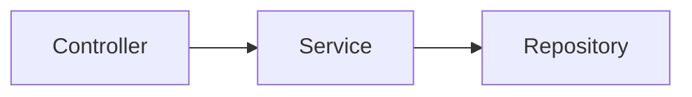

# Documentation Guide

Searchable JPA 문서 시스템에 대한 가이드입니다. 문서 빌드, 로컬 미리보기, 기여 방법을 설명합니다.

## 문서 구조

Searchable JPA 문서는 `docs/ko/` 폴더에 집중되어 있습니다.

```
searchable-jpa/
├── docs/
│   ├── index.html          # Docsify 설정
│   ├── .nojekyll           # GitHub Pages Jekyll 비활성화
│   ├── _coverpage.md       # 커버 페이지
│   ├── _navbar.md          # 상단 네비게이션
│   └── ko/
│       ├── _sidebar.md     # 사이드바 네비게이션
│       ├── README.md       # 메인 페이지
│       ├── installation.md # 설치 가이드
│       ├── basic-usage.md  # 기본 사용법
│       └── ...             # 기타 문서
├── scripts/
│   └── build-docs.sh       # 문서 빌드 스크립트
└── build-docs/             # 빌드 출력 (gitignore)
```

## 로컬 빌드 및 미리보기

### 1. 빌드 스크립트 실행

```bash
# 프로젝트 루트에서 실행
./scripts/build-docs.sh
```

빌드 스크립트는 다음 작업을 수행합니다:
- 모든 문서를 `build-docs/` 폴더로 복사
- 상대 경로 링크를 Docsify 절대 경로로 변환
- 커버 페이지의 버전 플레이스홀더(`{{VERSION}}`) 치환
- Docsify 설정 파일 복사

### 2. 로컬 서버 실행

**방법 1: Python 간이 서버**

```bash
cd build-docs
python -m http.server 3000
```

**방법 2: docsify-cli (Node.js 필요)**

```bash
npm install -g docsify-cli
docsify serve build-docs
```

### 3. 브라우저에서 확인

```
http://localhost:3000
```

## 문서 작성 가이드

### 새 문서 추가

1. `docs/ko/` 폴더에 마크다운 파일 생성
2. `docs/ko/_sidebar.md`에 네비게이션 링크 추가

```markdown
* **카테고리명**
  * [새 문서](/ko/new-doc.md)
```

### 문서 간 링크

같은 폴더 내 문서를 참조할 때:

```markdown
자세한 내용은 [기본 사용법](./basic-usage.md)을 참조하세요.
```

### 지원되는 마크다운 기능

**코드 블록 (구문 강조)**

```java
@Service
public class PostService extends DefaultSearchableService<Post, Long> {
    public PostService(PostRepository repository, EntityManager entityManager) {
        super(repository, entityManager);
    }
}
```

지원 언어: `java`, `kotlin`, `yaml`, `bash`, `groovy`, `json`, `properties`, `sql`

**표**

| 열1 | 열2 |
|-----|-----|
| 값1 | 값2 |

**알림 박스 (GitHub 스타일)**

```markdown
> [!TIP]
> 유용한 팁 내용

> [!WARNING]
> 주의사항 내용

> [!IMPORTANT]
> 중요한 내용

> [!NOTE]
> 참고 내용
```

**Mermaid 다이어그램**

```markdown

```

## GitHub Pages 배포

### 자동 배포

`master` 브랜치에 문서 변경사항이 push되면 GitHub Actions가 자동으로 배포합니다.

트리거 조건:
- `docs/**` 파일 변경
- `scripts/build-docs.sh` 변경
- `.github/workflows/docs.yml` 변경

### 수동 배포

GitHub Actions 탭에서 "Deploy Documentation" 워크플로우를 수동 실행할 수 있습니다.

**특정 릴리스 버전 배포:**
1. GitHub > Actions > Deploy Documentation
2. "Run workflow" 클릭
3. version 입력란에 버전 번호 입력 (예: `1.0.3`)
4. "Run workflow" 버튼 클릭

### 버전 관리

배포 시 버전별로 문서가 관리됩니다:
- SNAPSHOT 버전: 매 배포마다 덮어씀 (최신 개발 버전)
- 릴리스 버전: 영구 보존 (이전 버전 문서 유지)

### 배포 URL

```
https://simplecore-inc.github.io/searchable-jpa/
```

### GitHub Pages 초기 설정

처음 배포하려면 GitHub 저장소 설정이 필요합니다:

1. GitHub 저장소 > Settings > Pages
2. Source: `Deploy from a branch`
3. Branch: `gh-pages` / `/ (root)`
4. Save

## 문서 기여

### 오타/오류 수정

1. 해당 문서 페이지에서 "GitHub에서 편집" 링크 클릭
2. GitHub에서 직접 수정 후 PR 생성

### 새 문서 추가

1. 저장소 fork
2. `docs/ko/` 폴더에 문서 작성
3. `docs/ko/_sidebar.md`에 링크 추가
4. 로컬에서 빌드 및 확인
5. PR 생성

### 작성 규칙

- 파일명: kebab-case 사용 (예: `two-phase-query.md`)
- 제목: 각 문서는 `# 제목`으로 시작
- 언어: 한국어 문서는 `docs/ko/`, 영어 문서는 `docs/en/`

## 트러블슈팅

### 빌드 스크립트 실행 오류

```bash
# 실행 권한 부여
chmod +x scripts/build-docs.sh
```

### 링크가 작동하지 않음

- 빌드 후 `build-docs/` 폴더에서 확인해야 합니다
- 원본 `docs/` 폴더에서 직접 열면 일부 링크가 작동하지 않을 수 있습니다

### 검색이 작동하지 않음

- 검색 인덱스는 페이지 첫 로드 시 생성됩니다
- 브라우저 캐시를 비우고 새로고침해보세요
- 로컬 서버로 실행해야 검색이 작동합니다 (file:// 프로토콜 불가)

### 버전 선택기가 보이지 않음

- 버전 선택기는 GitHub Pages에 배포된 후에만 작동합니다
- 로컬 미리보기에서는 `versions.json`이 없어 표시되지 않습니다

## Docsify 주요 설정

`docs/index.html`에서 주요 설정을 변경할 수 있습니다:

| 설정 | 설명 | 기본값 |
|------|------|--------|
| `themeColor` | 테마 색상 | `#6366f1` |
| `maxLevel` | 사이드바 최대 헤딩 레벨 | `4` |
| `subMaxLevel` | 본문 내 헤딩 표시 레벨 | `3` |
| `search.maxAge` | 검색 캐시 유효 시간 (ms) | `86400000` (1일) |

## 관련 링크

- [Docsify 공식 문서](https://docsify.js.org/)
- [GitHub Pages 문서](https://docs.github.com/en/pages)
- [Mermaid 다이어그램 문법](https://mermaid.js.org/)
