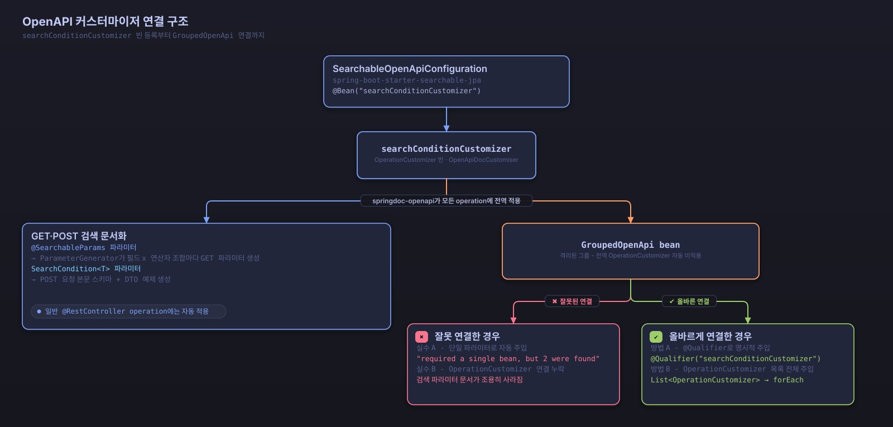

# OpenAPI 통합

Searchable JPA는 OpenAPI 3.0과 Swagger UI를 지원합니다. 검색 API 문서를 자동으로 생성하고, 대화형 API 테스트 환경을 제공합니다.

## 설정

### 1. 의존성 추가

```gradle
dependencies {
    // Searchable JPA 스타터 (OpenAPI 기능 포함)
    implementation 'dev.simplecore.searchable:spring-boot-starter-searchable-jpa:${version}'

    // SpringDoc OpenAPI (Spring Boot 3.x 버전)
    implementation 'org.springdoc:springdoc-openapi-starter-webmvc-ui:2.5.0'
}
```

### 2. OpenAPI 설정

```java
@Configuration
public class OpenApiConfig {
    
    @Bean
    public OpenAPI customOpenAPI() {
        return new OpenAPI()
            .info(new Info()
                .title("Post Search API")
                .version("1.0")
                .description("Searchable JPA를 사용한 게시글 검색 API")
            )
            .servers(List.of(
                new Server().url("http://localhost:8080").description("개발 서버"),
                new Server().url("https://api.example.com").description("운영 서버")
            ));
    }
}
```

### 3. 자동 설정 활성화

```yaml
# application.yml
springdoc:
  api-docs:
    enabled: true
    path: /api-docs
  swagger-ui:
    enabled: true
    path: /swagger-ui.html
    try-it-out-enabled: true
    operations-sorter: method
    tags-sorter: alpha
    
# Searchable JPA Swagger 설정
searchable:
  swagger:
    enabled: true
```

## @SearchableParams 어노테이션

`@SearchableParams` 어노테이션을 사용하면 GET 방식 검색 파라미터의 OpenAPI 문서를 자동으로 생성합니다.

### 기본 사용법

```java
@RestController
@RequestMapping("/api/posts")
public class PostController {
    
    @Operation(summary = "게시글 검색", description = "다양한 조건으로 게시글을 검색합니다")
    @GetMapping("/search")
    public Page<Post> searchPosts(
        @RequestParam @SearchableParams(PostSearchDTO.class) Map<String, String> params
    ) {
        SearchCondition<PostSearchDTO> condition = 
            new SearchableParamsParser<>(PostSearchDTO.class).convert(params);
        return postService.findAllWithSearch(condition);
    }
}
```

### 생성되는 문서

위 코드는 다음과 같은 OpenAPI 문서를 자동으로 생성합니다:

```yaml
/api/posts/search:
  get:
    summary: 게시글 검색
    description: 다양한 조건으로 게시글을 검색합니다
    parameters:
      - name: id.equals
        in: query
        description: Post id - equals
        required: false
        schema:
          type: integer
          format: int64
      - name: searchTitle.equals
        in: query
        description: Post title to search - equals
        required: false
        schema:
          type: string
      - name: searchTitle.contains
        in: query
        description: Post title to search - contains
        required: false
        schema:
          type: string
      - name: status.equals
        in: query
        description: Post status - equals
        required: false
        schema:
          $ref: '#/components/schemas/PostStatus'
      - name: status.in
        in: query
        description: Post status - in
        required: false
        schema:
          type: string
          description: Enter multiple values separated by comma
          enum: [PUBLISHED, DRAFT, DELETED]
      - name: viewCount.greaterThan
        in: query
        description: Number of views - greaterThan
        required: false
        schema:
          type: integer
          format: int64
      - name: createdAt.between
        in: query
        description: Post creation date and time - between
        required: false
        schema:
          type: string
          description: Enter two values separated by comma
      - name: sort
        in: query
        description: >-
          Sort fields (e.g., field.asc or field.desc).
          Available fields: searchTitle, viewCount, createdAt
        required: false
        explode: true
        schema:
          type: array
          items:
            type: string
      - name: page
        in: query
        description: Page number (0-based)
        required: false
        example: 0
        schema:
          type: integer
          format: int32
          minimum: 0
      - name: size
        in: query
        description: Items per page
        required: false
        example: 20
        schema:
          type: integer
          format: int32
          minimum: 1
components:
  schemas:
    PostStatus:
      type: string
      enum: [PUBLISHED, DRAFT, DELETED]
```

파라미터 설명은 필드 설명과 연산자 이름을 `-`로 이어 붙인 형식입니다(예: `Post id - equals`). Enum 타입 필드(`status`)는 별도 스키마로 등록되고, 파라미터는 그 스키마를 `$ref`로 참조합니다. `sort` 파라미터는 `explode: true`로 각 정렬 값을 개별 파라미터로 전달합니다. `page`와 `size`에만 파라미터 자체에 `example`이 붙고, 나머지 검색 필드 파라미터에는 예제 값이 없습니다.

날짜/시간 필드의 단일 값 연산자 파라미터에는 타입에 맞는 OpenAPI `format`이 부여됩니다: `LocalDate`는 `date`, `LocalTime`은 `partial-time`, `LocalDateTime`·`Instant`·`OffsetDateTime`·`ZonedDateTime`은 `date-time`(RFC 3339)입니다. 이 `format`은 프론트엔드 코드 생성 도구가 알맞은 날짜/시간 선택기를 고르도록 돕습니다. IN, BETWEEN처럼 여러 값을 받는 연산자는 콤마로 구분한 문자열로 표현됩니다.

## 고급 문서화

### 1. 상세한 필드 문서화

```java
public class PostSearchDTO {

    @Schema(description = "게시글 ID")
    @SearchableField(operators = {EQUALS})
    private Long id;

    @Schema(description = "검색할 게시글 제목")
    @Size(max = 100, message = "제목은 100자를 초과할 수 없습니다")
    @SearchableField(operators = {EQUALS, CONTAINS, STARTS_WITH}, sortable = true)
    private String title;

    @Schema(description = "게시글 상태")
    @SearchableField(operators = {EQUALS, NOT_EQUALS, IN, NOT_IN})
    private PostStatus status;

    @Schema(description = "조회수 범위")
    @SearchableField(operators = {GREATER_THAN, LESS_THAN, BETWEEN})
    private Long viewCount;
}
```

> [!NOTE]
> 필드마다 GET 검색 파라미터 스키마를 새로 만들고, `@Schema`의 `description`만 그대로 반영합니다. `minimum`, `maxLength`, `example`은 GET 파라미터 스키마에 나타나지 않습니다 — `title`의 `@Size(max = 100)`도 런타임 검증에는 적용되지만 생성된 파라미터 스키마에는 나타나지 않습니다.
>
> `@Schema(allowableValues = ...)`와 `implementation`은 필드 타입이 `String`일 때만 읽습니다. `status`처럼 실제 Enum 타입 필드는 이 속성 없이도 Enum 상수를 그대로 읽어 값 목록을 만들므로, `PostStatus`의 허용 값은 `PUBLISHED`, `DRAFT`, `DELETED`로 표시됩니다.

### 2. 커스텀 예제 생성

```java
@Configuration
public class CustomOpenApiConfig {

    @Bean
    public OpenAPI customOpenAPI() {
        return new OpenAPI()
            .info(new Info()
                .title("Searchable JPA API")
                .version("1.0.0")
                .description("Searchable JPA를 사용한 검색 API"))
            .addServersItem(new Server().url("http://localhost:8080"));
    }

    // 추가적인 커스터마이징이 필요한 경우
    @Bean
    public OperationCustomizer customOperationCustomizer() {
        return (operation, handlerMethod) -> {
            // 커스텀 작업 추가 로직
            return operation;
        };
    }
}
```

> [!WARNING]
> 이 설정을 `GroupedOpenApi`와 함께 사용하면 `OperationCustomizer` 빈이 `searchConditionCustomizer`와 `customOperationCustomizer` 두 개가 됩니다. `GroupedOpenApi` 빈이 단일 `OperationCustomizer`를 자동 주입받도록 작성돼 있으면 "required a single bean, but 2 were found" 오류가 발생합니다. 해결 방법은 아래 "GroupedOpenApi 사용 시 주의사항"을 참고하세요.

### 3. GroupedOpenApi 사용 시 주의사항

`GroupedOpenApi`는 격리된 API 그룹을 만들기 때문에 전역으로 등록된 `OperationCustomizer` 빈을 자동으로 적용받지 않습니다. `SearchableOpenApiConfiguration`이 등록하는 `searchConditionCustomizer` 빈도 마찬가지이므로, `GroupedOpenApi`에 명시적으로 연결하지 않으면 검색 파라미터 문서가 조용히 사라집니다.

1. **`@Qualifier`로 지정**

```java
@Bean
public GroupedOpenApi postApi(
        @Qualifier("searchConditionCustomizer") OperationCustomizer searchConditionCustomizer) {
    return GroupedOpenApi.builder()
            .group("post-api")
            .pathsToMatch("/api/posts/**")
            .addOperationCustomizer(searchConditionCustomizer)
            .build();
}
```

2. **`List<OperationCustomizer>` 전체 주입**

```java
@Bean
public GroupedOpenApi postApi(List<OperationCustomizer> customizers) {
    GroupedOpenApi.Builder builder = GroupedOpenApi.builder()
            .group("post-api")
            .pathsToMatch("/api/posts/**");

    customizers.forEach(builder::addOperationCustomizer);

    return builder.build();
}
```

> [!WARNING]
> `OperationCustomizer` 빈이 여러 개 등록된 상태에서 `GroupedOpenApi` 빈이 `@Qualifier` 없이 단일 `OperationCustomizer` 파라미터로 자동 주입받으면, springdoc은 "required a single bean, but 2 were found" 오류를 던집니다. `@Qualifier("searchConditionCustomizer")`로 원하는 빈을 지정하거나 `List<OperationCustomizer>`로 전체를 주입해 해결합니다.



*searchConditionCustomizer 빈이 등록되어 springdoc 전역 OperationCustomizer로 적용되는 과정과, GroupedOpenApi에서 별도로 주입해야 하는 이유*

## POST 방식 검색 문서화

### SearchCondition 스키마

```java
@RestController
public class PostController {
    
    @Operation(
        summary = "게시글 검색 (POST)",
        description = "JSON 형태의 복잡한 검색 조건으로 게시글을 검색합니다"
    )
    @io.swagger.v3.oas.annotations.parameters.RequestBody(
        description = "검색 조건",
        required = true,
        content = @Content(
            mediaType = "application/json",
            schema = @Schema(implementation = SearchCondition.class),
            examples = {
                @ExampleObject(
                    name = "기본 검색",
                    summary = "제목과 상태로 검색",
                    value = """
                        {
                          "conditions": [
                            {
                              "operator": "and",
                              "field": "title",
                              "searchOperator": "contains",
                              "value": "Spring"
                            },
                            {
                              "operator": "and",
                              "field": "status",
                              "searchOperator": "equals",
                              "value": "PUBLISHED"
                            }
                          ],
                          "sort": {
                            "orders": [
                              {
                                "field": "createdAt",
                                "direction": "desc"
                              }
                            ]
                          },
                          "page": 0,
                          "size": 10
                        }
                        """
                ),
                @ExampleObject(
                    name = "복합 조건 검색",
                    summary = "OR 조건을 포함한 복합 검색",
                    value = """
                        {
                          "conditions": [
                            {
                              "operator": "and",
                              "conditions": [
                                {
                                  "field": "title",
                                  "searchOperator": "contains",
                                  "value": "Spring"
                                },
                                {
                                  "operator": "or",
                                  "field": "title",
                                  "searchOperator": "contains",
                                  "value": "Java"
                                }
                              ]
                            },
                            {
                              "operator": "and",
                              "field": "viewCount",
                              "searchOperator": "greaterThan",
                              "value": 100
                            }
                          ],
                          "sort": {
                            "orders": [
                              {
                                "field": "viewCount",
                                "direction": "desc"
                              },
                              {
                                "field": "createdAt",
                                "direction": "desc"
                              }
                            ]
                          },
                          "page": 0,
                          "size": 20
                        }
                        """
                )
            }
        )
    )
    @PostMapping("/search")
    public Page<Post> searchPosts(
        @RequestBody @Validated SearchCondition<PostSearchDTO> searchCondition
    ) {
        return postService.findAllWithSearch(searchCondition);
    }
}
```

## 응답 스키마 문서화

### 페이징 응답

```java
@Schema(description = "페이징된 게시글 검색 결과")
public class PostPageResponse {
    
    @Schema(description = "게시글 목록")
    private List<Post> content;
    
    @Schema(description = "페이지 정보")
    private PageInfo pageable;
    
    @Schema(description = "전체 요소 수")
    private long totalElements;
    
    @Schema(description = "전체 페이지 수")
    private int totalPages;
    
    @Schema(description = "현재 페이지가 마지막 페이지인지 여부")
    private boolean last;
    
    @Schema(description = "현재 페이지 요소 수")
    private int numberOfElements;
}
```

2단계 쿼리 최적화는 내부 실행 방식이므로 응답 구조는 위 표준 페이징 응답과 동일합니다. 별도의 응답 스키마가 필요하지 않습니다.

## 에러 응답 문서화

```java
@Schema(description = "API 에러 응답")
public class ErrorResponse {
    
    @Schema(description = "에러 코드", example = "VALIDATION_ERROR")
    private String code;
    
    @Schema(description = "에러 메시지", example = "검색 조건이 올바르지 않습니다")
    private String message;
    
    @Schema(description = "상세 에러 정보")
    private List<FieldError> errors;
    
    @Schema(description = "요청 시각")
    private LocalDateTime timestamp;
}

@ApiResponses({
    @ApiResponse(
        responseCode = "200",
        description = "검색 성공",
        content = @Content(schema = @Schema(implementation = PostPageResponse.class))
    ),
    @ApiResponse(
        responseCode = "400",
        description = "잘못된 요청",
        content = @Content(schema = @Schema(implementation = ErrorResponse.class))
    ),
    @ApiResponse(
        responseCode = "500",
        description = "서버 오류",
        content = @Content(schema = @Schema(implementation = ErrorResponse.class))
    )
})
@PostMapping("/search")
public Page<Post> searchPosts(@RequestBody SearchCondition<PostSearchDTO> condition) {
    return postService.findAllWithSearch(condition);
}
```

## 태그와 그룹화

```java
@RestController
@RequestMapping("/api/posts")
@Tag(name = "게시글 검색", description = "게시글 검색 관련 API")
public class PostController {
    
    @Operation(
        summary = "게시글 검색 (GET)",
        description = "쿼리 파라미터를 사용한 게시글 검색",
        tags = {"게시글 검색", "GET 방식"}
    )
    @GetMapping("/search")
    public Page<Post> searchPostsGet(/* ... */) {
        // ...
    }
    
    @Operation(
        summary = "게시글 검색 (POST)",
        description = "JSON 바디를 사용한 게시글 검색",
        tags = {"게시글 검색", "POST 방식"}
    )
    @PostMapping("/search")
    public Page<Post> searchPostsPost(/* ... */) {
        // ...
    }
}
```

2단계 쿼리 최적화는 모든 검색 쿼리에 자동으로 적용되므로 별도의 엔드포인트가 필요하지 않습니다.

## 보안 문서화

```java
@SecurityRequirement(name = "bearerAuth")
@Operation(
    summary = "관리자 게시글 검색",
    description = "관리자 권한이 필요한 게시글 검색"
)
@PreAuthorize("hasRole('ADMIN')")
@GetMapping("/admin/search")
public Page<Post> adminSearch(/* ... */) {
    // ...
}

// OpenAPI 설정에서 보안 스키마 정의
@Bean
public OpenAPI secureOpenAPI() {
    return new OpenAPI()
        .components(new Components()
            .addSecuritySchemes("bearerAuth", 
                new SecurityScheme()
                    .type(SecurityScheme.Type.HTTP)
                    .scheme("bearer")
                    .bearerFormat("JWT")
            )
        );
}
```

## 실제 사용 예제

### Swagger UI에서 테스트

1. **기본 검색 테스트**
   ```
   GET /api/posts/search?title.contains=Spring&status.equals=PUBLISHED&page=0&size=10
   ```

2. **복합 조건 검색 테스트**
   ```json
   POST /api/posts/search
   {
     "conditions": [
       {
         "operator": "and",
         "field": "title",
         "searchOperator": "contains",
         "value": "Spring"
       },
       {
         "operator": "and",
         "field": "viewCount",
         "searchOperator": "greaterThan",
         "value": 100
       }
     ],
     "sort": {
       "orders": [
         {
           "field": "createdAt",
           "direction": "desc"
         }
       ]
     },
     "page": 0,
     "size": 10
   }
   ```

## 문서 접근

- **Swagger UI**: `http://localhost:8080/swagger-ui.html`
- **OpenAPI JSON**: `http://localhost:8080/api-docs`
- **OpenAPI YAML**: `http://localhost:8080/api-docs.yaml`

## 프로덕션 고려사항

### 1. 보안 설정

```yaml
# application-prod.yml
springdoc:
  api-docs:
    enabled: false  # 프로덕션에서는 비활성화
  swagger-ui:
    enabled: false  # 프로덕션에서는 비활성화
```

### 2. 문서 최적화

```java
@Profile("!prod")
@Configuration
public class OpenApiConfig {
    // 개발/테스트 환경에서만 활성화
}
```

## 다음 단계

- [API 레퍼런스](api-reference.md) - 전체 API 문서
- [FAQ](faq.md) - 자주 묻는 질문
