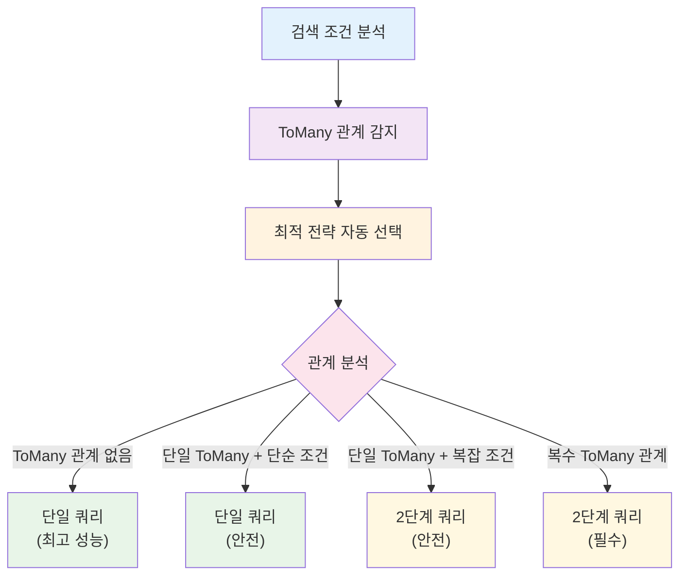

# JPA 관계형 매핑과 커서 기반 페이징

## 🚀 자동화된 최적화 전략

**searchable-jpa는 개발자가 성능 문제를 겪지 않도록 자동으로 최적화된 전략을 선택합니다.**

### 개발자 경험 우선

```java
@RestController
public class PostController {
    
    @Autowired
    private SearchableService<Post> postService;
    
    @GetMapping("/posts")
    public Page<Post> getPosts(@RequestParam String search) {
        SearchCondition condition = SearchCondition.of(search);
        
        // 자동으로 최적화된 전략 사용 - 복잡한 성능 최적화 고민 불필요
        return postService.findAllWithSearch(condition);
    }
}
```

### 자동화된 기능들

1. ** 자동 Primary Key 정렬**: 동일한 값으로 인한 레코드 누락 방지
2. ** 스마트 쿼리 전략**: ToMany 관계 감지하여 2단계 쿼리 자동 적용
3. ** JOIN 최적화**: ToOne은 Fetch Join, ToMany는 스마트 전략 적용
4. ** 메모리 페이징 방지**: HHH000104 경고 자동 해결

### 내부 자동화 로직

```java
public Page<T> findAllWithSearch(SearchCondition<?> searchCondition) {
    SearchableSpecificationBuilder<T> builder = createSpecificationBuilder(searchCondition);
    return builder.buildAndExecuteWithTwoPhaseOptimization(); // 자동 최적화
}
```

**자동 전략 선택 흐름:**



## 목차
1. [JPA 관계형 매핑 개요](#jpa-관계형-매핑-개요)
2. [N+1 문제와 해결책](#n1-문제와-해결책)
3. [관계형 매핑별 주의사항](#관계형-매핑별-주의사항)
4. [커서 기반 페이징의 필요성](#커서-기반-페이징의-필요성)
5. [자동 Primary Key 정렬의 이유](#자동-primary-key-정렬의-이유)
6. [구현 상세](#구현-상세)
7. [ToMany 관계 제한과 해결책](#tomany-관계-제한과-해결책)
8. [성능 최적화 가이드](#성능-최적화-가이드)
9. [실제 사용 예시](#실제-사용-예시)

## JPA 관계형 매핑 개요

JPA에서 엔티티 간의 관계는 네 가지 유형으로 분류됩니다:

### OneToOne (일대일)
```java
@Entity
public class User {
    @OneToOne(mappedBy = "user", cascade = CascadeType.ALL)
    private UserProfile profile;
}

@Entity
public class UserProfile {
    @OneToOne
    @JoinColumn(name = "user_id")
    private User user;
}
```

### OneToMany (일대다)
```java
@Entity
public class Post {
    @OneToMany(mappedBy = "post", cascade = CascadeType.ALL)
    private List<Comment> comments = new ArrayList<>();
}

@Entity
public class Comment {
    @ManyToOne
    @JoinColumn(name = "post_id")
    private Post post;
}
```

### ManyToOne (다대일)
```java
@Entity
public class Comment {
    @ManyToOne
    @JoinColumn(name = "post_id")
    private Post post;
    
    @ManyToOne
    @JoinColumn(name = "author_id")
    private Author author;
}
```

### ManyToMany (다대다)
```java
@Entity
public class Post {
    @ManyToMany
    @JoinTable(
        name = "post_tag",
        joinColumns = @JoinColumn(name = "post_id"),
        inverseJoinColumns = @JoinColumn(name = "tag_id")
    )
    private Set<Tag> tags = new HashSet<>();
}

@Entity
public class Tag {
    @ManyToMany(mappedBy = "tags")
    private Set<Post> posts = new HashSet<>();
}
```

## N+1 문제와 해결책

### N+1 문제란?
N+1 문제는 연관된 엔티티를 조회할 때 발생하는 성능 문제입니다:

```java
// 1번의 쿼리로 Post 목록 조회
List<Post> posts = postRepository.findAll();

// 각 Post마다 Author를 조회하는 N번의 추가 쿼리 발생
for (Post post : posts) {
    String authorName = post.getAuthor().getName(); // N번의 쿼리!
}
```

### searchable-jpa의 자동 N+1 방지

searchable-jpa는 관계형 필드가 검색 조건이나 정렬에 사용될 때 **자동으로 JOIN을 처리**합니다:

```java
// 이 검색 조건은 자동으로 JOIN을 생성합니다
SearchCondition condition = SearchCondition.builder()
    .filter("author.name", SearchOperator.CONTAINS, "John")
    .sort("author.name", SortDirection.ASC)
    .build();
```

**생성되는 SQL:**
```sql
SELECT DISTINCT p.* 
FROM post p 
LEFT JOIN author a ON p.author_id = a.id 
WHERE LOWER(a.name) LIKE '%john%' 
ORDER BY a.name ASC
```

#### 자동 JOIN 처리 전략

searchable-jpa는 **자동으로 최적화된 JOIN 전략**을 사용합니다:

**핵심 원리:**
```java
public Page<T> findAllWithSearch(SearchCondition<?> searchCondition) {
    // 자동으로 최적화된 전략 사용
    SearchableSpecificationBuilder<T> builder = createSpecificationBuilder(searchCondition);
    return builder.buildAndExecuteWithTwoPhaseOptimization(); // 자동 최적화
}
```

**자동 최적화 로직:**
```java
public Page<T> buildAndExecuteWithTwoPhaseOptimization() {
    Set<String> joinPaths = extractJoinPaths(condition.getNodes());
    Set<String> toManyPaths = joinPaths.stream()
            .filter(path -> isToManyPath(createDummyRoot(), path))
            .collect(Collectors.toSet());
    
    // 자동 전략 선택
    if (shouldUseTwoPhaseQuery(toManyPaths)) {
        return executeTwoPhaseQuery(pageRequest, joinPaths); // 2단계 쿼리
    } else {
        return buildAndExecuteWithCursor(); // 단일 쿼리
    }
}

private boolean shouldUseTwoPhaseQuery(Set<String> toManyPaths) {
    // 복수 ToMany 관계 → 2단계 쿼리 (필수)
    if (toManyPaths.size() >= 2) {
        return true;
    }
    
    // 단일 ToMany + 복잡한 조건 → 2단계 쿼리 (안전)
    if (toManyPaths.size() == 1) {
        return hasComplexConditions();
    }
    
    return false; // ToMany 없음 → 단일 쿼리 (최고 성능)
}
```

## 관계형 매핑별 특징

### OneToOne 관계
**✅ 자동 최적화:**
- N+1 문제 자동 방지 (Fetch Join)
- 성능 최적화 우수

**주의사항:**
- 양방향 관계 시 무한 루프 주의

### OneToMany 관계
**✅ 자동 최적화:**
- 자동 2단계 쿼리로 성능 문제 해결
- 메모리 페이징 문제 자동 방지

**특징:**
- 복수 OneToMany 관계 시 자동으로 2단계 쿼리 적용

### ManyToOne 관계
**✅ 자동 최적화:**
- 가장 안전하고 성능이 좋음
- 자동 Fetch Join으로 N+1 방지

**특징:**
- 특별한 주의사항 없음 (권장)

### ManyToMany 관계
**✅ 자동 최적화:**
- HHH000104 경고 자동 해결
- 2단계 쿼리로 메모리 페이징 방지
- 카티시안 곱 문제 자동 해결

**추가 최적화 옵션:**
1. **DTO 프로젝션 사용** (더 나은 성능):
```java
@SearchableField(entityField = "tags.name")
private String tagNames; // 태그명들을 문자열로 조회
```

2. **배치 크기 설정** (2단계 쿼리와 함께):
```yaml
spring:
  jpa:
    properties:
      hibernate:
        default_batch_fetch_size: 100
```

## 커서 기반 페이징의 필요성

### OFFSET 기반 페이징의 문제점

**1. 성능 저하 (Deep Pagination)**
```sql
-- 100만 번째 페이지 조회 시
SELECT * FROM posts ORDER BY created_at DESC LIMIT 20 OFFSET 20000000;
-- 데이터베이스가 2천만 개 레코드를 스캔해야 함!
```

**2. 데이터 일관성 문제**
```
페이지 1 조회: [A, B, C, D, E]
새 데이터 X 삽입
페이지 2 조회: [C, D, E, F, G] // C, D, E가 중복 조회됨!
```

**3. 실시간 데이터 변경 시 누락**
```
페이지 1 조회 후 데이터 삭제 발생
페이지 2 조회 시 일부 데이터가 누락됨
```

### 커서 기반 페이징의 장점

**1. 일정한 성능**
```sql
-- 항상 인덱스를 효율적으로 사용
SELECT * FROM posts WHERE created_at < '2023-01-01 12:00:00' 
ORDER BY created_at DESC LIMIT 20;
```

**2. 데이터 일관성 보장**
```
커서 기반: WHERE created_at < 'cursor_value'
새 데이터가 삽입되어도 이전 페이지 결과에 영향 없음
```

**3. 실시간 스트리밍에 적합**
```
무한 스크롤, 실시간 피드 등에 최적화
```

## 자동 Primary Key 정렬의 이유

### 문제 상황: 동일한 정렬 값

```java
// 생성일시로만 정렬할 경우
SearchCondition condition = SearchCondition.builder()
    .sort("createdAt", SortDirection.DESC)
    .build();
```

**문제가 되는 데이터:**
```
ID | CREATED_AT          | TITLE
1  | 2023-01-01 10:00:00 | Post A
2  | 2023-01-01 10:00:00 | Post B  // 동일한 시간!
3  | 2023-01-01 10:00:00 | Post C  // 동일한 시간!
4  | 2023-01-01 09:00:00 | Post D
```

**1페이지 결과 (LIMIT 2):**
```
[Post A, Post B] // cursor = '2023-01-01 10:00:00'
```

**2페이지 쿼리:**
```sql
SELECT * FROM posts 
WHERE created_at < '2023-01-01 10:00:00'  -- Post C가 제외됨!
ORDER BY created_at DESC LIMIT 2;
```

**2페이지 결과:**
```
[Post D, ...] // Post C가 누락됨!
```

### 해결책: 자동 Primary Key 정렬

searchable-jpa는 **자동으로 Primary Key를 보조 정렬 기준으로 추가**합니다:

```java
// 사용자 입력
.sort("createdAt", SortDirection.DESC)

// 자동 변환
.sort("createdAt", SortDirection.DESC)
.sort("id", SortDirection.ASC)  // 자동 추가!
```

**생성되는 SQL:**
```sql
-- 1페이지
SELECT * FROM posts 
ORDER BY created_at DESC, id ASC LIMIT 2;
-- 결과: [Post A(id=1), Post B(id=2)]

-- 2페이지  
SELECT * FROM posts 
WHERE (created_at < '2023-01-01 10:00:00') 
   OR (created_at = '2023-01-01 10:00:00' AND id > 2)
ORDER BY created_at DESC, id ASC LIMIT 2;
-- 결과: [Post C(id=3), Post D(id=4)]
```

이렇게 하면 **모든 레코드가 누락 없이 조회**됩니다.

## 구현 상세

### Primary Key 자동 감지

```java
private String getPrimaryKeyFieldName() {
    try {
        // 1. JPA 메타모델에서 ID 속성 찾기
        EntityType<T> entityType = entityManager.getMetamodel().entity(entityClass);
        SingularAttribute<? super T, ?> idAttribute = entityType.getId(entityType.getIdType().getJavaType());
        return idAttribute.getName();
    } catch (Exception e) {
        // 2. 리플렉션으로 @Id 어노테이션 찾기
        for (Field field : entityClass.getDeclaredFields()) {
            if (field.isAnnotationPresent(Id.class)) {
                return field.getName();
            }
        }
        
        // 3. 일반적인 ID 필드명으로 fallback
        String[] commonIdFields = {"id", "pk", entityClass.getSimpleName().toLowerCase() + "Id"};
        for (String fieldName : commonIdFields) {
            try {
                entityClass.getDeclaredField(fieldName);
                return fieldName;
            } catch (NoSuchFieldException ignored) {}
        }
        
        return "id"; // 기본값
    }
}
```

### 자동 정렬 추가 로직

```java
private List<Sort.Order> ensureUniqueSorting(List<Sort.Order> sortOrders) {
    String primaryKeyField = getPrimaryKeyFieldName();
    
    // Primary Key가 이미 포함되어 있는지 확인
    boolean hasPrimaryKey = sortOrders.stream()
        .anyMatch(order -> order.getProperty().equals(primaryKeyField));
    
    if (!hasPrimaryKey) {
        // Primary Key를 ASC 순서로 추가
        List<Sort.Order> result = new ArrayList<>(sortOrders);
        result.add(Sort.Order.asc(primaryKeyField));
        return result;
    }
    
    return sortOrders;
}
```

### 커서 조건 생성

```java
private Predicate createCursorCondition(Root<T> root, CriteriaBuilder cb, 
                                       List<Sort.Order> sortOrders, Map<String, Object> cursorValues) {
    List<Predicate> orConditions = new ArrayList<>();
    
    for (int i = 0; i < sortOrders.size(); i++) {
        List<Predicate> andConditions = new ArrayList<>();
        
        // 이전 필드들은 동등 조건
        for (int j = 0; j < i; j++) {
            Sort.Order order = sortOrders.get(j);
            Object value = cursorValues.get(order.getProperty());
            andConditions.add(cb.equal(root.get(order.getProperty()), value));
        }
        
        // 현재 필드는 부등호 조건
        Sort.Order currentOrder = sortOrders.get(i);
        Object currentValue = cursorValues.get(currentOrder.getProperty());
        
        if (currentOrder.isAscending()) {
            andConditions.add(cb.greaterThan(root.get(currentOrder.getProperty()), 
                                           (Comparable) currentValue));
        } else {
            andConditions.add(cb.lessThan(root.get(currentOrder.getProperty()), 
                                        (Comparable) currentValue));
        }
        
        orConditions.add(cb.and(andConditions.toArray(new Predicate[0])));
    }
    
    return cb.or(orConditions.toArray(new Predicate[0]));
}
```

## ToMany 관계 제한과 해결책

### 문제점 분석

#### 1. MultipleBagFetchException과 HHH000104 경고
```
MultipleBagFetchException: cannot simultaneously fetch multiple bags
HHH000104: firstResult/maxResults specified with collection fetch; applying in memory!
```

**발생 원인**:
- 복수의 ToMany 관계에서 동시 Fetch Join 시도
- 카티시안 곱으로 인한 결과 집합 폭증 (Post 1개 × Tag 5개 × Comment 3개 = 15개 행)
- Hibernate가 메모리에서 페이징 처리

**문제점**:
- 데이터베이스 레벨 LIMIT 무효화
- 메모리 사용량 급증 (수만 건 데이터에서 수십만~수백만 행 생성)
- 성능 저하 및 정확성 문제

#### 2. 실제 성능 문제 시나리오
```
데이터 규모:
- Posts: 100,000건
- 각 Post당 평균 Tag: 5개
- 각 Post당 평균 Comment: 10개

Regular Join 시 생성되는 행:
100,000 × 5 × 10 = 5,000,000 행 (500만 행!)
```

### 해결책들

#### 1. 2단계 쿼리 전략 (권장 - 현재 구현)

**Phase 1: ID 수집 (Regular Join)**
```sql
-- 효율적인 ID 수집 (카티시안 곱 발생하지만 ID만 조회)
SELECT DISTINCT p.post_id 
FROM posts p 
LEFT JOIN post_tags pt ON p.id = pt.post_id
LEFT JOIN tags t ON pt.tag_id = t.id
LEFT JOIN comments c ON p.id = c.post_id
WHERE t.name LIKE '%Java%'
  AND c.content LIKE '%Spring%'
ORDER BY p.created_at DESC, p.id ASC
LIMIT 20; -- 데이터베이스에서 정상 적용
```

**Phase 2: 완전한 데이터 로딩 (Smart Fetch Join)**
```sql
-- 수집된 ID로 완전한 엔티티 조회
SELECT DISTINCT p.*, c.*
FROM posts p 
LEFT JOIN FETCH comments c ON p.id = c.post_id  -- 첫 번째 ToMany만 Fetch
WHERE p.id IN (1, 5, 12, 18, ...) -- Phase 1에서 수집된 ID들
ORDER BY p.created_at DESC, p.id ASC;

-- 나머지 ToMany는 배치로 별도 조회
SELECT pt.post_id, t.*
FROM post_tags pt
LEFT JOIN tags t ON pt.tag_id = t.id  
WHERE pt.post_id IN (1, 5, 12, 18, ...);
```

**실제 구현 코드:**

**Phase 1: ID 수집 쿼리**
```java
private List<Object> executePhaseOneQuery(PageRequest pageRequest) {
    Specification<T> idOnlySpec = (root, query, cb) -> {
        // Regular Join으로 조건만 처리 (Fetch Join 없음)
        Set<String> joinPaths = extractJoinPaths(condition.getNodes());
        applyRegularJoinsOnly(root, joinPaths);
        
        // ID만 선택
        String primaryKeyField = SearchableFieldUtils.getPrimaryKeyFieldName(entityManager, entityClass);
        query.select(root.get(primaryKeyField));
        query.distinct(true);
        
        // 모든 검색 조건 적용
        JoinManager<T> joinManager = new JoinManager<>(entityManager, root);
        PredicateBuilder<T> predicateBuilder = new PredicateBuilder<>(cb, joinManager);
        SpecificationBuilder<T> specBuilder = new SpecificationBuilder<>(predicateBuilder);
        
        return createPredicates(root, query, cb, specBuilder);
    };
    
    // 페이징과 함께 실행
    return specificationExecutor.findAll(idOnlySpec, pageRequest)
            .getContent()
            .stream()
            .map(this::extractIdFromResult)  // ID 값 추출
            .collect(Collectors.toList());
}

private void applyRegularJoinsOnly(Root<T> root, Set<String> paths) {
    Set<Join<T, ?>> joins = (Set<Join<T, ?>>) root.getJoins();
    joins.clear();
    
    // 모든 관계를 Regular Join으로만 처리
    for (String path : paths) {
        root.join(path, JoinType.LEFT);
    }
}
```

**Phase 2: 완전한 엔티티 로딩**
```java
private List<T> executePhaseTwoQuery(List<Object> entityIds, Set<String> allJoinPaths, Sort sort) {
    Specification<T> fullDataSpec = (root, query, cb) -> {
        // 스마트 Fetch Join 적용 (MultipleBagFetchException 방지)
        applySmartFetchJoins(root, allJoinPaths);
        query.distinct(true);
        
        // 수집된 ID로 필터링
        String primaryKeyField = SearchableFieldUtils.getPrimaryKeyFieldName(entityManager, entityClass);
        return root.get(primaryKeyField).in(entityIds);
    };
    
    // 정렬과 함께 실행
    List<T> entities = specificationExecutor.findAll(fullDataSpec, sort);
    
    // 원래 ID 순서대로 재정렬
    return reorderEntitiesByIds(entities, entityIds);
}

/**
 * 가장 중요한 ToMany 관계 선택 (조건에 사용된 것 우선)
 */
private String selectPrimaryToManyForFetch(Set<String> toManyPaths) {
    if (toManyPaths.isEmpty()) {
        return null;
    }
    
    // 검색 조건에 사용된 경로들
    Set<String> conditionPaths = extractConditionPaths(condition.getNodes());
    
    // 조건에 사용된 ToMany 경로 우선
    for (String path : toManyPaths) {
        if (conditionPaths.contains(path)) {
            return path;
        }
    }
    
    // 조건에 없으면 첫 번째 것 선택
    return toManyPaths.stream()
            .sorted()
            .findFirst()
            .orElse(null);
}

/**
 * ID 순서대로 엔티티 재정렬
 */
private List<T> reorderEntitiesByIds(List<T> entities, List<Object> orderedIds) {
    // ID를 키로 하는 Map 생성
    Map<Object, T> entityMap = new HashMap<>();
    String primaryKeyField = SearchableFieldUtils.getPrimaryKeyFieldName(entityManager, entityClass);
    
    for (T entity : entities) {
        try {
            Field idField = entityClass.getDeclaredField(primaryKeyField);
            idField.setAccessible(true);
            Object id = idField.get(entity);
            entityMap.put(id, entity);
        } catch (Exception e) {
            return entities; // 실패 시 원본 순서 반환
        }
    }
    
    // 원래 ID 순서대로 재정렬
    return orderedIds.stream()
            .map(entityMap::get)
            .filter(Objects::nonNull)
            .collect(Collectors.toList());
}
```

#### 2. 자동 전략 선택 로직 (실제 구현)
```java
/**
 * 2단계 쿼리 적용 여부 자동 결정
 */
private boolean shouldUseTwoPhaseQuery(Set<String> toManyPaths) {
    // 복수 ToMany 관계 → 무조건 2단계 쿼리
    if (toManyPaths.size() >= 2) {
        return true; // MultipleBagFetchException 방지
    }
    
    // 단일 ToMany + 복잡한 조건 → 2단계 쿼리
    if (toManyPaths.size() == 1) {
        return hasComplexConditions();
    }
    
    return false; // ToMany 없음 → 단일 쿼리
}

/**
 * 복잡한 조건 여부 판단
 */
private boolean hasComplexConditions() {
    if (condition.getNodes() == null) return false;
    
    // ToMany 관계를 사용하는 조건 개수 계산
    long toManyConditionCount = condition.getNodes().stream()
            .filter(node -> node instanceof SearchCondition.Condition)
            .map(node -> (SearchCondition.Condition) node)
            .filter(cond -> {
                String entityField = cond.getEntityField();
                return entityField != null && entityField.contains(".") && 
                       isToManyPath(createDummyRoot(), getRelationshipPath(entityField));
            })
            .count();
    
    return toManyConditionCount > 0; // ToMany 조건이 있으면 복잡한 것으로 판단
}

/**
 * 관계 경로 추출 (예: "tags.name" → "tags")
 */
private String getRelationshipPath(String entityField) {
    if (entityField == null || !entityField.contains(".")) {
        return entityField;
    }
    
    String[] parts = entityField.split("\\.");
    if (parts.length > 1) {
        return parts[0]; // 관계 부분만 반환
    }
    
    return entityField;
}
```

**전략 선택 흐름도:**
```
검색 조건 분석
    ↓
ToMany 관계 개수 확인
    ↓
┌─────────────────────────────────────┐
│ ToMany 개수 = 0                     │ → 단일 쿼리 (기본 전략)
├─────────────────────────────────────┤
│ ToMany 개수 = 1                     │ → 복잡한 조건 확인
│   ├─ 복잡함 (ToMany 조건 있음)      │ → 2단계 쿼리
│   └─ 단순함 (ToMany 조건 없음)      │ → 단일 쿼리
├─────────────────────────────────────┤
│ ToMany 개수 ≥ 2                     │ → 2단계 쿼리 (무조건)
└─────────────────────────────────────┘
```

#### 3. 배치 크기 최적화 (2단계 쿼리와 함께 사용)
```yaml
# application.yml
spring:
  jpa:
    properties:
      hibernate:
        default_batch_fetch_size: 100  # 2단계에서 나머지 ToMany 배치 로딩
        jdbc:
          batch_size: 50               # JDBC 배치 크기
        order_inserts: true
        order_updates: true
```

**2단계 쿼리 + 배치 크기 조합 효과**:
```sql
-- Phase 1: ID 수집 (효율적)
SELECT DISTINCT p.post_id FROM posts p ... LIMIT 20;

-- Phase 2: 메인 엔티티 + 첫 번째 ToMany
SELECT p.*, c.* FROM posts p LEFT JOIN FETCH comments c ... WHERE p.id IN (...);

-- 배치 로딩: 나머지 ToMany (자동)
SELECT pt.post_id, t.* FROM post_tags pt LEFT JOIN tags t ... WHERE pt.post_id IN (...);
```

#### 4. DTO 프로젝션 활용 (대안)
```java
// 복잡한 ToMany 관계 대신 필요한 데이터만 조회
public class PostSearchDTO {
    @SearchableField(entityField = "author.name")
    private String authorName;  // ToOne 관계는 안전
    
    @SearchableField(entityField = "tags.name")
    private String tagNames;    // ManyToMany를 문자열로 단순화
    
    @SearchableField(entityField = "commentCount")  
    private Long commentCount;  // 개수만 필요한 경우
}
```

## 실제 사용 예시

### 복잡한 검색 조건

```java
SearchCondition condition = SearchCondition.builder()
    // 기본 필드 검색
    .filter("title", SearchOperator.CONTAINS, "Spring")
    .filter("status", SearchOperator.EQUALS, "PUBLISHED")
    
    // 관계형 필드 검색 (자동 JOIN)
    .filter("author.name", SearchOperator.CONTAINS, "John")
    .filter("tags.name", SearchOperator.EQUALS, "Java")
    
    // 복합 정렬 (Primary Key 자동 추가)
    .sort("createdAt", SortDirection.DESC)
    .sort("viewCount", SortDirection.ASC)
    
    // 페이징
    .page(0)
    .size(20)
    .build();

Page<Post> result = searchableService.search(condition);
```

### 생성되는 SQL 분석 (2단계 쿼리)

**Phase 1: ID 수집 쿼리**
```sql
-- 효율적인 ID 수집 (Regular Join으로 HHH000104 방지)
SELECT DISTINCT p.post_id
FROM post p
LEFT JOIN author a ON p.author_id = a.id           -- Regular Join
LEFT JOIN post_tag pt ON p.post_id = pt.post_id    -- Regular Join
LEFT JOIN tag t ON pt.tag_id = t.id                -- Regular Join
WHERE p.title LIKE '%Spring%'
  AND p.status = 'PUBLISHED'
  AND LOWER(a.name) LIKE '%john%'
  AND t.name = 'Java'
ORDER BY p.created_at DESC, p.view_count ASC, p.post_id ASC  -- PK 자동 추가
LIMIT 20;  -- 데이터베이스에서 정상 적용
```

**Phase 2: 완전한 엔티티 로딩**
```sql
-- 메인 엔티티 + 첫 번째 ToMany (MultipleBagFetchException 방지)
SELECT DISTINCT p.post_id, p.title, p.status, p.created_at, p.view_count,
       a.author_id, a.name as author_name,
       c.comment_id, c.content, c.created_at as comment_created_at
FROM post p
LEFT JOIN FETCH author a ON p.author_id = a.id      -- ToOne: 항상 Fetch Join
LEFT JOIN FETCH comment c ON p.post_id = c.post_id  -- 첫 번째 ToMany만 Fetch Join
WHERE p.post_id IN (1, 5, 12, 18, 25, 33, 41, 47, 52, 58, 
                    63, 71, 78, 84, 91, 97, 103, 109, 115, 122)  -- Phase 1 결과
ORDER BY p.created_at DESC, p.view_count ASC, p.post_id ASC;

-- 나머지 ToMany는 배치 로딩으로 자동 처리
SELECT pt.post_id, t.tag_id, t.name
FROM post_tag pt
LEFT JOIN tag t ON pt.tag_id = t.id
WHERE pt.post_id IN (1, 5, 12, 18, 25, 33, 41, 47, 52, 58, 
                     63, 71, 78, 84, 91, 97, 103, 109, 115, 122);
```

**총 개수 쿼리 (필요시)**
```sql
SELECT COUNT(DISTINCT p.post_id)
FROM post p
LEFT JOIN author a ON p.author_id = a.id
LEFT JOIN post_tag pt ON p.post_id = pt.post_id
LEFT JOIN tag t ON pt.tag_id = t.id
WHERE p.title LIKE '%Spring%'
  AND p.status = 'PUBLISHED'
  AND LOWER(a.name) LIKE '%john%'
  AND t.name = 'Java';
```

### 주의사항 요약

1. **복수 ToMany 관계 처리**
   - 기본적으로 Regular Join 사용 (HHH000104 방지)
   - 하지만 **카티시안 곱으로 인한 성능 문제** 발생 가능
   - **대용량 데이터에서는 2단계 쿼리 수동 사용 권장**

2. **2단계 쿼리 최적화 활용 (수동)**
   ```java
   // 수동으로 2단계 쿼리 사용해야 하는 상황들
   - 복수 ToMany 관계 (≥2개) + 대용량 데이터
   - 단일 ToMany + ToMany 조건 사용
   - 카티시안 곱으로 인한 성능 저하 발생 시
   
   // 사용 방법
   SearchableSpecificationBuilder<T> builder = SearchableSpecificationBuilder.of(...);
   Page<T> result = builder.buildAndExecuteWithTwoPhaseOptimization();
   ```

3. **인덱스 설계 필수**
   ```sql
   -- Phase 1 최적화를 위한 복합 인덱스
   CREATE INDEX idx_post_search ON post (title, status, created_at, view_count, post_id);
   CREATE INDEX idx_author_name ON author (name);
   CREATE INDEX idx_tag_name ON tag (name);
   ```

4. **배치 크기 조정**
   ```yaml
   spring:
     jpa:
       properties:
         hibernate:
           default_batch_fetch_size: 100  # 2단계에서 나머지 ToMany 최적화
   ```

5. **성능 모니터링 포인트**
   - **Phase 1 성능**: ID 수집 쿼리의 실행 시간 확인
   - **Phase 2 효율성**: MultipleBagFetchException 발생 여부
   - **배치 로딩**: 나머지 ToMany 관계의 쿼리 개수
   - **전체 처리 시간**: 2단계 합계 vs 기존 단일 쿼리

6. **로그 확인 방법**
   ```yaml
   logging:
     level:
       org.hibernate.SQL: DEBUG
       org.hibernate.orm.jdbc.bind: TRACE
       dev.simplecore.searchable: DEBUG  # 2단계 쿼리 전략 로그
   ```

**성공 지표**:
- `HHH000104` 경고 메시지 사라짐
- `MultipleBagFetchException` 발생하지 않음
- 일정한 응답 시간 (데이터 크기와 무관)
- 메모리 사용량 안정화

이러한 2단계 쿼리 전략을 통해 searchable-jpa는 복잡한 ToMany 관계에서도 효율적이고 안정적인 검색 기능을 제공합니다. 