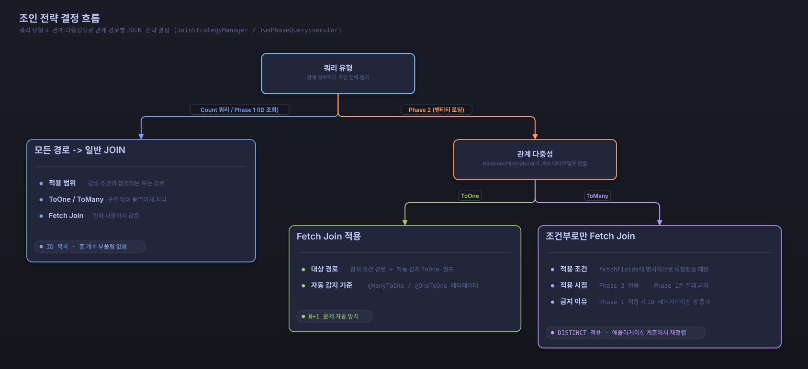

# JPA 관계형 매핑과 2단계 쿼리 최적화

## 목차

1. [JPA 관계형 매핑 개요](#jpa-관계형-매핑-개요)
2. [N+1 문제와 해결책](#n-1-문제와-해결책)
3. [관계형 매핑별 특징](#관계형-매핑별-특징)
4. [ToOne 관계 자동 Fetch Join](#toone-관계-자동-fetch-join)
5. [2단계 쿼리 최적화 시스템](#2단계-쿼리-최적화-시스템)
6. [자동 Primary Key 정렬의 이유](#자동-primary-key-정렬의-이유)
7. [구현 상세](#구현-상세)
8. [명시적 Fetch Join (fetchFields)](#명시적-fetch-join-fetchfields)

## 자동화된 최적화 전략

**searchable-jpa는 개발자가 성능 문제를 겪지 않도록 자동으로 최적화된 전략을 선택합니다.**

### 개발자 경험 우선

```java
@RestController
public class PostController {
    
    @Autowired
    private SearchableService<Post> postService;
    
    @GetMapping("/posts")
    public Page<Post> getPosts(
            @RequestParam(required = false) String title,
            @RequestParam(required = false, defaultValue = "0") int page,
            @RequestParam(required = false, defaultValue = "10") int size) {

        SearchCondition<PostSearchDTO> condition = SearchConditionBuilder
            .create(PostSearchDTO.class)
            .where(w -> w.equals("title", title))
            .page(page)
            .size(size)
            .build();

        // 자동으로 2단계 쿼리 최적화 적용 - 복잡한 성능 최적화 고민 불필요
        return postService.findAllWithSearch(condition);
    }
}
```

### 자동화된 기능

1. **자동 Primary Key 정렬**: 동일한 값으로 인한 레코드 누락 방지
2. **2단계 쿼리 최적화**: 모든 쿼리에 자동 적용으로 일관된 성능 보장
3. **JOIN 최적화**: ToOne은 Fetch Join, ToMany는 2단계 쿼리로 처리
4. **메모리 페이징 방지**: HHH000104 경고 자동 해결

### 내부 자동화 로직

```java
public Page<T> findAllWithSearch(SearchCondition<?> searchCondition) {
    SearchableSpecificationBuilder<T> builder = createSpecificationBuilder(searchCondition);
    return builder.buildAndExecuteWithTwoPhaseOptimization(); // 모든 쿼리에 2단계 최적화 적용
}
```

**2단계 쿼리 최적화 적용:**

```
모든 검색 쿼리
    ↓
2단계 쿼리 최적화 적용
    ↓
┌─────────────────────────────────────┐
│ 1단계: ID만 조회                    │ → 조건 + 정렬 + 페이징으로 ID 목록 조회
├─────────────────────────────────────┤
│ 2단계: 전체 엔티티 조회             │ → 조회된 ID로 IN 쿼리 실행
├─────────────────────────────────────┤
│ 3단계: 카운트 쿼리                  │ → 정확한 총 개수 조회
└─────────────────────────────────────┘
```

---

## JPA 관계형 매핑 개요

JPA에서 엔티티 간의 관계는 네 가지 유형으로 분류됩니다:

### OneToOne (일대일)
```java
@Entity
public class User {
    @OneToOne(mappedBy = "user", cascade = CascadeType.ALL)
    private UserProfile profile;
}

@Entity
public class UserProfile {
    @OneToOne
    @JoinColumn(name = "user_id")
    private User user;
}
```

### OneToMany (일대다)
```java
@Entity
public class Post {
    @OneToMany(mappedBy = "post", cascade = CascadeType.ALL)
    private List<Comment> comments = new ArrayList<>();
}

@Entity
public class Comment {
    @ManyToOne
    @JoinColumn(name = "post_id")
    private Post post;
}
```

### ManyToOne (다대일)
```java
@Entity
public class Comment {
    @ManyToOne
    @JoinColumn(name = "post_id")
    private Post post;
    
    @ManyToOne
    @JoinColumn(name = "author_id")
    private Author author;
}
```

### ManyToMany (다대다)
```java
@Entity
public class Post {
    @ManyToMany
    @JoinTable(
        name = "post_tag",
        joinColumns = @JoinColumn(name = "post_id"),
        inverseJoinColumns = @JoinColumn(name = "tag_id")
    )
    private Set<Tag> tags = new HashSet<>();
}

@Entity
public class Tag {
    @ManyToMany(mappedBy = "tags")
    private Set<Post> posts = new HashSet<>();
}
```

---

## N+1 문제와 해결책

### N+1 문제란?
N+1 문제는 연관된 엔티티를 조회할 때 발생하는 성능 문제입니다:

```java
// 1번의 쿼리로 Post 목록 조회
List<Post> posts = postRepository.findAll();

// 각 Post마다 Author를 조회하는 N번의 추가 쿼리 발생
for (Post post : posts) {
    String authorName = post.getAuthor().getName(); // N번의 쿼리!
}
```

### searchable-jpa의 자동 N+1 방지

searchable-jpa는 관계형 필드가 검색 조건이나 정렬에 사용될 때 **자동으로 JOIN을 처리**합니다:

```java
// 이 검색 조건은 자동으로 JOIN을 생성합니다
SearchCondition<PostSearchDTO> condition = SearchConditionBuilder
    .create(PostSearchDTO.class)
    .where(w -> w.contains("authorName", "John"))
    .sort(s -> s.asc("authorName"))
    .build();
```

**생성되는 SQL:**
```sql
-- 1단계: ID만 조회 (일반 JOIN, PK가 아닌 필드로 정렬하므로 GROUP BY + 집계 함수로 안정화됨)
SELECT p.id, MIN(a.name) AS sort_key
FROM post p
LEFT JOIN author a ON p.author_id = a.id
WHERE LOWER(a.name) LIKE '%john%'
GROUP BY p.id
ORDER BY MIN(a.name) ASC, p.id ASC
LIMIT 10 OFFSET 0;

-- 2단계: 전체 엔티티 조회 (Fetch JOIN, ORDER BY 없이 조회한 뒤 1단계 ID 순서로 애플리케이션 계층에서 재정렬)
SELECT p.*, a.*
FROM post p
LEFT JOIN author a ON p.author_id = a.id
WHERE p.id IN (1, 2, 3, 4, 5, 6, 7, 8, 9, 10);
```

정렬 기준이 되는 필드가 기본 키가 아닐 때는 항상 `GROUP BY <기본 키>`와 결정값 집계 함수(오름차순은 `MIN`/`LEAST`, 내림차순은 `MAX`/`GREATEST`)를 적용합니다. 정렬 경로가 관계를 거치더라도 페이지 경계에서 ID가 중복되거나 누락되지 않도록 하기 위한 장치이며, 자세한 내용은 [2단계 쿼리 최적화 시스템](#2단계-쿼리-최적화-시스템)에서 다룹니다.

#### 자동 JOIN 처리 전략

searchable-jpa는 **자동으로 최적화된 JOIN 전략**을 사용합니다:

**핵심 원리:**
```java
public Page<T> findAllWithSearch(SearchCondition<?> searchCondition) {
    // 모든 쿼리에 2단계 최적화 자동 적용
    SearchableSpecificationBuilder<T> builder = createSpecificationBuilder(searchCondition);
    return builder.buildAndExecuteWithTwoPhaseOptimization();
}
```

**자동 최적화 로직:**
```java
public Page<T> buildAndExecuteWithTwoPhaseOptimization() {
    PageRequest pageRequest = buildPageRequest();

    // Merge explicit fetchFields with auto-detected common ToOne fields
    Set<String> allFetchFields = new HashSet<>();
    allFetchFields.addAll(condition.getFetchFields());
    allFetchFields.addAll(getCachedCommonToOneFields());

    return twoPhaseQueryExecutor.executeWithTwoPhaseOptimization(pageRequest, allFetchFields);
}

public Page<T> executeWithTwoPhaseOptimization(PageRequest pageRequest, Set<String> fetchFields) {
    // Phase 1: get the IDs for the requested page
    List<Object> ids = executePhaseOneQuery(pageRequest);

    // Phase 3: total count is always computed independently of Phase 1,
    // so a page offset past the last page still reports the true total
    long totalCount = executeCountQuery();

    if (ids.isEmpty()) {
        return new PageImpl<>(Collections.emptyList(), pageRequest, totalCount);
    }

    // Phase 2: load full entities for the collected IDs and restore Phase 1 order
    List<T> entities = executePhaseTwoQuery(ids, fetchFields);
    return new PageImpl<>(entities, pageRequest, totalCount);
}
```

---

## 관계형 매핑별 특징

### OneToOne 관계
**자동 최적화:**
- N+1 문제 자동 방지 (Fetch Join)
- 성능 최적화 우수

**주의사항:**
- 양방향 관계 시 무한 루프 주의

### OneToMany 관계
**자동 최적화:**
- 자동 2단계 쿼리로 성능 문제 해결
- 메모리 페이징 문제 자동 방지

**특징:**
- 복수 OneToMany 관계 시에도 2단계 쿼리로 안전하게 처리

### ManyToOne 관계
**자동 최적화:**
- 가장 안전하고 성능이 좋음
- 자동 Fetch Join으로 N+1 방지

**특징:**
- 특별한 주의사항 없음 (권장)

### ManyToMany 관계
**자동 최적화:**
- HHH000104 경고 자동 해결
- 2단계 쿼리로 메모리 페이징 방지
- 카티시안 곱 문제 자동 해결

**추가 최적화 옵션:**
1. **DTO 프로젝션 사용** (더 나은 성능):
```java
@SearchableField(entityField = "tags.name")
private String tagNames; // 태그명을 하나의 문자열로 조회
```

2. **배치 크기 설정** (2단계 쿼리와 함께):
```yaml
spring:
  jpa:
    properties:
      hibernate:
        default_batch_fetch_size: 100
```

---

## ToOne 관계 자동 Fetch Join

### ToOne 관계 자동 감지

`RelationshipAnalyzer`는 JPA 메타모델을 조회해 엔티티의 `@ManyToOne`, `@OneToOne` 필드를 자동으로 찾아냅니다. 검색 조건에서 실제로 참조했는지와 무관하게, 엔티티에 선언된 ToOne 관계는 모두 N+1 방지 대상으로 감지됩니다:

```java
// author, category가 검색 조건에 등장하지 않아도
SearchCondition<PostSearchDTO> condition = SearchConditionBuilder
    .create(PostSearchDTO.class)
    .where(w -> w.contains("title", "Spring"))
    .build();

// @ManyToOne author, @ManyToOne category는 자동으로 감지되어
// 조회 시 Fetch Join 대상에 포함됩니다.
```

`@ManyToMany`, `@OneToMany` 컬렉션을 거쳐야 도달하는 중첩 ToOne 경로(예: `comments.author`)도 함께 감지되지만, 이 경로는 ToMany 관계를 거치므로 아래에서 설명하는 이유로 즉시 Fetch Join하지 않고 2단계 쿼리의 Phase 2에서 처리합니다.

### 쿼리 유형별 JOIN 전략

같은 관계 경로라도 쿼리 목적(개수 산정인지, 엔티티 로딩인지)과 관계의 다중성(ToOne인지 ToMany인지)에 따라 다른 JOIN 방식을 적용합니다. 페이지네이션 없이 단건 조회·삭제·개수 산정을 수행하는 경로는 `JoinStrategyManager.applyJoins()`가 이 전략을 담당하고, 논리는 다음과 같이 요약됩니다(중첩 경로 처리와 예외 시 폴백은 생략한 단순화 예시입니다):

```java
public void applyJoins(Root<T> root, Set<String> paths, boolean isCountQuery) {
    for (String path : paths) {
        boolean isToMany = relationshipAnalyzer.isToManyPath(root, path);

        if (isToMany) {
            // ToMany는 카운트 쿼리든 조회 쿼리든 항상 일반 JOIN만 사용해
            // ID 단위 페이지네이션에서 행이 늘어나는 것을 막는다
            root.join(path, JoinType.LEFT);
        } else if (isCountQuery) {
            root.join(path, JoinType.LEFT);
        } else {
            // ToOne은 조회 쿼리에서 Fetch Join으로 N+1을 방지한다
            root.fetch(path, JoinType.LEFT);
        }
    }

    if (!isCountQuery) {
        // 검색 조건에 등장하지 않아도 자동 감지된 ToOne 필드를 추가로 Fetch Join
        for (String field : relationshipAnalyzer.detectCommonToOneFields()) {
            root.fetch(field, JoinType.LEFT);
        }
    }
}
```

페이지네이션이 적용되는 `findAllWithSearch` 흐름(2단계 쿼리)에서는 같은 정책을 `TwoPhaseQueryExecutor`가 두 단계로 나누어 적용합니다.

- **Phase 1(ID 조회)과 카운트 쿼리**: 검색 조건이 참조한 경로에만 일반 JOIN을 적용합니다(`applyRegularJoinsOnly`). ToOne·ToMany를 구분하지 않고 Fetch Join은 전혀 사용하지 않으므로, ID 목록과 총 개수가 관계로 인해 부풀려지지 않습니다.
- **Phase 2(엔티티 로딩)**: 검색 조건에 명시된 `fetchFields`와 자동 감지된 ToOne 필드를 합친 집합에 Fetch Join을 적용합니다(`SpecificationQuerySupport.applyFetchJoins`). 최상위 ToMany 관계는 `fetchFields`로 명시했을 때만 Fetch Join되며, Phase 1에서는 절대 적용하지 않습니다 — Phase 1에서 ToMany를 Fetch Join하면 페이지네이션 대상인 ID 행 자체가 늘어나기 때문입니다. 다만 `comments.author`처럼 ToMany 관계 너머의 중첩 ToOne 필드가 자동 감지되면, 그 경로의 중간 단계인 ToMany 관계도 Phase 2에서 함께 Fetch Join됩니다.
- Phase 2 조회에는 항상 `query.distinct(true)`를 적용해, Fetch Join된 컬렉션 때문에 같은 부모 엔티티가 여러 행으로 나타나는 문제를 결과 단계에서 한 행으로 되돌립니다.



*쿼리 유형(카운트/Phase 1/Phase 2)과 관계 다중성(ToOne/ToMany)에 따른 JOIN 전략 결정 흐름*

**적용 효과:**
- ✔ ToOne 관계의 N+1 문제 자동 방지
- ✔ Phase 1과 카운트 쿼리는 일반 JOIN만 사용해 HHH000104(메모리 페이징) 경고 없음
- ✔ ToMany 관계로 인한 중복 행은 DISTINCT로 정리되어 한 엔티티당 한 행만 반환

---

## 2단계 쿼리 최적화 시스템

### 2단계 쿼리의 장점

**1. 일정한 성능**
```sql
-- 1단계: 항상 빠른 ID 조회 (필터가 참조하는 관계가 없으므로 JOIN 없이 조회,
-- PK가 아닌 created_at으로 정렬하므로 GROUP BY + 집계 함수로 안정화됨)
SELECT p.id, MAX(p.created_at) AS sort_key
FROM posts p
WHERE p.status = 'PUBLISHED'
GROUP BY p.id
ORDER BY MAX(p.created_at) DESC, p.id ASC
LIMIT 10 OFFSET 100;

-- 2단계: 효율적인 IN 쿼리 (author는 필터에 없어도 자동 감지된 ToOne 관계로 Fetch Join되며,
-- ORDER BY 없이 조회한 뒤 1단계 ID 순서로 애플리케이션 계층에서 재정렬)
SELECT p.*, a.*
FROM posts p
LEFT JOIN author a ON p.author_id = a.id
WHERE p.id IN (101, 102, 103, 104, 105, 106, 107, 108, 109, 110);
```

**2. 메모리 효율성**
- 1단계에서 필요한 ID만 조회
- 2단계에서 실제 필요한 데이터만 로드

**3. 복합 키 지원**

`@IdClass`와 `@EmbeddedId` 모두 동일한 OR-of-AND 조건으로 조회됩니다. 차이는 각 ID 필드를 `@EmbeddedId` 속성 경로를 거쳐 읽는지, 엔티티 필드에서 직접 읽는지뿐이며 생성되는 SQL 형태는 같습니다.

```sql
-- @IdClass 방식
SELECT * FROM test_idclass_entity t
WHERE (t.tenant_id = 'tenant1' AND t.entity_id = 1)
   OR (t.tenant_id = 'tenant1' AND t.entity_id = 2);

-- @EmbeddedId 방식 (같은 형태의 OR-of-AND 조건)
SELECT * FROM test_composite_key_entity t
WHERE (t.tenant_id = 'tenant1' AND t.entity_id = 1)
   OR (t.tenant_id = 'tenant1' AND t.entity_id = 2);
```

### 정렬 안정화: GROUP BY와 집계 함수

기본 키가 아닌 필드로 정렬할 때는 항상 `GROUP BY <기본 키>`와 결정값 집계 함수를 적용합니다. 정렬 필드가 관계를 거치는지와 무관하게, 기본 키 이외의 모든 정렬 조건에 동일하게 적용되는 규칙입니다.

- 오름차순 정렬에는 `LEAST`(구현상 `MIN`과 동일하게 동작), 내림차순 정렬에는 `GREATEST`(`MAX`와 동일)를 사용해 그룹당 정렬 기준값을 하나로 고정합니다.
- 정렬 경로가 다대일 관계나 다대다·일대다 관계를 거치더라도, 이 방식 덕분에 페이지 경계에서 ID가 중복되거나 누락되지 않습니다.
- 단일 기본 키 엔티티는 `TwoPhaseQueryExecutor`가, 복합 키(`@IdClass`, `@EmbeddedId`) 엔티티는 `CompositeKeyQueryExecutor`가 각각 같은 방식으로 처리합니다.

```sql
-- author.name으로 정렬하는 경우 (ToOne 관계를 거치는 정렬)
SELECT p.id, MIN(a.name) AS sort_key
FROM post p
LEFT JOIN author a ON p.author_id = a.id
GROUP BY p.id
ORDER BY MIN(a.name) ASC, p.id ASC;
```

---

## 자동 Primary Key 정렬의 이유

### 문제 상황: 동일한 정렬 값

```java
// 생성일시로만 정렬할 경우
SearchCondition<PostSearchDTO> condition = SearchConditionBuilder
    .create(PostSearchDTO.class)
    .sort(s -> s.desc("createdAt"))
    .build();
```

**문제가 되는 데이터:**
```
ID | CREATED_AT          | TITLE
1  | 2023-01-01 10:00:00 | Post A
2  | 2023-01-01 10:00:00 | Post B  // 동일한 시간!
3  | 2023-01-01 10:00:00 | Post C  // 동일한 시간!
4  | 2023-01-01 09:00:00 | Post D
```

정렬 값이 동일한 행 사이의 순서는 데이터베이스가 보장하지 않으므로, 쿼리를 실행할 때마다 Post A/B/C의 순서가 달라질 수 있습니다.

**1페이지 쿼리 결과 (LIMIT 2 OFFSET 0):**
```
[Post A, Post B]
```

**2페이지 쿼리 (LIMIT 2 OFFSET 2):**
```sql
SELECT * FROM posts
ORDER BY created_at DESC LIMIT 2 OFFSET 2;
-- 동일한 created_at 행들의 순서가 이번 실행에서는 다르게 결정될 수 있음
```

**2페이지 결과:**
```
[Post B, Post D] // Post B가 중복되고 Post C가 누락될 수 있음!
```

### 해결책: 자동 Primary Key 정렬

searchable-jpa는 **자동으로 Primary Key를 보조 정렬 기준으로 추가**합니다:

```java
// 사용자 입력
.sort(s -> s.desc("createdAt"))

// 자동 변환 (내부적으로 처리됨)
.sort(s -> s.desc("createdAt"))
.sort(s -> s.asc("id"))  // 자동 추가!
```

**생성되는 SQL:**
```sql
-- 1단계: ID 조회 (PK가 아닌 created_at으로 정렬하므로 GROUP BY + 집계 함수로 안정화됨)
SELECT p.id, MAX(p.created_at) AS sort_key
FROM posts p
GROUP BY p.id
ORDER BY MAX(p.created_at) DESC, p.id ASC
LIMIT 2 OFFSET 0;
-- 결과: [1, 2]

-- 2단계: 전체 엔티티 조회 (ORDER BY 없이 조회)
SELECT * FROM posts p WHERE p.id IN (1, 2);
-- 1단계 ID 순서([1, 2])대로 애플리케이션 계층에서 재정렬한 결과: [Post A(id=1), Post B(id=2)]
```

이렇게 하면 **모든 레코드가 누락 없이 일관된 순서로 조회**됩니다.

---

## 구현 상세

### Primary Key 자동 감지

```java
/**
 * Ensures unique sorting by adding primary key field if not already present.
 * This is crucial for consistent pagination to work correctly.
 */
private List<Sort.Order> ensureUniqueSorting(List<Sort.Order> sortOrders) {
    try {
        String primaryKeyField = SearchableFieldUtils.getPrimaryKeyFieldName(entityManager, entityClass);

        if (primaryKeyField != null) {
            // Check if primary key field is already in sort orders
            boolean hasPrimaryKey = sortOrders.stream()
                    .anyMatch(order -> primaryKeyField.equals(order.getProperty()));

            if (!hasPrimaryKey) {
                // Add primary key field as the last sort criterion in ascending order
                sortOrders = new ArrayList<>(sortOrders);
                sortOrders.add(Sort.Order.by(primaryKeyField));

                log.trace("Automatically added primary key field '{}' to sort criteria for deterministic pagination ordering",
                        primaryKeyField);
            }
        } else {
            log.warn("Could not determine primary key field for entity {}. Pagination may not work correctly with duplicate sort values.",
                    entityClass.getSimpleName());
        }

        return sortOrders;

    } catch (Exception e) {
        log.warn("Failed to ensure unique sorting for entity {}: {}. Using original sort orders.",
                entityClass.getSimpleName(), e.getMessage());
        return sortOrders;
    }
}
```

### 2단계 쿼리 실행 과정

```java
public Page<T> executeWithTwoPhaseOptimization(PageRequest pageRequest, Set<String> fetchFields) {
    // Phase 1: get the IDs for the requested page
    List<Object> ids = executePhaseOneQuery(pageRequest);

    // Phase 3: total count is always computed independently of Phase 1,
    // so a page offset past the last page still reports the true total
    long totalCount = executeCountQuery();

    if (ids.isEmpty()) {
        return new PageImpl<>(Collections.emptyList(), pageRequest, totalCount);
    }

    // Phase 2: load full entities for the collected IDs and restore Phase 1 order
    List<T> entities = executePhaseTwoQuery(ids, fetchFields);
    return new PageImpl<>(entities, pageRequest, totalCount);
}
```

### 배치 처리 최적화

```java
// Oracle의 IN절 상한(1000)에 여유를 두어 500건 단위로 배치를 나눈다
private static final int MAX_IN_CLAUSE_SIZE = 500;

private List<T> executePhaseTwoQuery(List<Object> ids, Set<String> fetchFields) {
    if (ids.isEmpty()) {
        return Collections.emptyList();
    }

    List<T> loaded = new ArrayList<>();
    for (int i = 0; i < ids.size(); i += MAX_IN_CLAUSE_SIZE) {
        List<Object> batch = ids.subList(i, Math.min(i + MAX_IN_CLAUSE_SIZE, ids.size()));
        loaded.addAll(loadBatch(batch, fetchFields));
    }

    // Phase 2 자체는 정렬하지 않고, 1단계에서 정해진 ID 순서로 재정렬한다
    return reorderEntitiesByIds(loaded, ids);
}

private List<T> loadBatch(List<Object> ids, Set<String> fetchFields) {
    String primaryKeyField = SearchableFieldUtils.getPrimaryKeyFieldName(entityManager, entityClass);
    Specification<T> spec = (root, query, cb) -> {
        query.distinct(true); // ToMany Fetch Join으로 인한 중복 행 방지
        SpecificationQuerySupport.applyFetchJoins(root, query, fetchFields);
        return root.get(primaryKeyField).in(ids);
    };

    return specificationExecutor.findAll(spec, Sort.unsorted());
}
```

---

## 명시적 Fetch Join (fetchFields)

### 문제 상황: Lazy 로딩과 결과 데이터 누락

JPA에서 연관 관계는 기본적으로 **Lazy Loading**으로 설정됩니다. 이는 성능 최적화를 위한 것이지만, 검색 결과를 클라이언트에 반환할 때 문제가 발생합니다.

#### Lazy Loading 문제 예시

```java
@Entity
public class Post {
    @Id
    private Long id;
    private String title;

    @ManyToOne(fetch = FetchType.LAZY)  // 기본값: LAZY
    private Author author;

    @ManyToOne(fetch = FetchType.LAZY)
    private Category category;
}
```

**문제 1: LazyInitializationException**

```java
@GetMapping("/posts")
public List<Post> getPosts() {
    List<Post> posts = postService.findAll();

    // 트랜잭션 종료 후 Lazy 필드 접근 시 예외 발생!
    return posts;  // Jackson이 author.name 접근 시 LazyInitializationException
}
```

**문제 2: JSON 직렬화 시 null 반환**

Hibernate proxy가 초기화되지 않으면 JSON 응답에서 해당 필드가 `null`로 나타납니다:

```json
{
  "id": 1,
  "title": "Spring Boot 가이드",
  "author": null,  // 실제로는 데이터가 있지만 Lazy 로딩 미초기화
  "category": null
}
```

**문제 3: Open Session In View (OSIV) 의존성**

OSIV를 활성화하면 문제가 해결되지만, 성능과 데이터베이스 커넥션 관리 측면에서 권장되지 않습니다:

```yaml
# 권장하지 않음
spring:
  jpa:
    open-in-view: true  # 요청 전체에서 세션 유지 - 리소스 낭비
```

### 해결 방법: fetchFields

searchable-jpa는 **명시적으로 Fetch Join할 필드를 지정**할 수 있는 `fetchFields` 기능을 제공합니다.

#### 핵심 원리

```
검색 쿼리 실행
    ↓
┌─────────────────────────────────────────────────────────────┐
│ 1단계: ID만 조회 (일반 JOIN)                                  │
│   - 조건 필터링, 정렬, 페이징                                  │
├─────────────────────────────────────────────────────────────┤
│ 2단계: 전체 엔티티 조회 (Fetch JOIN)                          │
│   - 명시적 fetchFields에 Fetch Join 적용                     │
│   - 자동 감지된 ToOne 필드도 Fetch Join 적용                  │
│   - Lazy 필드가 즉시 로딩되어 프록시가 초기화됨                  │
└─────────────────────────────────────────────────────────────┘
    ↓
완전히 초기화된 엔티티 반환 (Lazy 필드 포함)
```

### 사용 방법

#### 기본 사용법

```java
@PostMapping("/posts/search")
public Page<Post> search(@RequestBody SearchCondition<PostSearchDTO> clientCondition) {
    // 클라이언트 요청에 서버 측에서 fetchFields 추가
    SearchCondition<PostSearchDTO> condition = SearchConditionBuilder
        .from(clientCondition, PostSearchDTO.class)
        .fetchFields("author", "category")  // 명시적 Fetch Join 지정
        .build();

    return postService.findAllWithSearch(condition);
}
```

#### 중첩 관계 Fetch

```java
// 중첩된 관계도 점(.)으로 연결하여 지정
SearchCondition<PostSearchDTO> condition = SearchConditionBuilder
    .from(clientCondition, PostSearchDTO.class)
    .fetchFields("author", "author.profile", "category")
    .build();

// 생성되는 SQL (2단계 쿼리)
// SELECT p.*, a.*, ap.*, c.*
// FROM post p
// LEFT JOIN author a ON p.author_id = a.id
// LEFT JOIN author_profile ap ON a.profile_id = ap.id
// LEFT JOIN category c ON p.category_id = c.id
// WHERE p.id IN (1, 2, 3, ...)
```

#### Set을 사용한 지정

```java
Set<String> fetchFields = new HashSet<>(Arrays.asList(
    "author",
    "author.department",
    "category"
));

SearchCondition<PostSearchDTO> condition = SearchConditionBuilder
    .from(clientCondition, PostSearchDTO.class)
    .fetchFields(fetchFields)
    .build();
```

### 보안 고려사항

**fetchFields는 서버 측에서만 설정할 수 있습니다.**

클라이언트가 임의로 fetch할 필드를 지정하면 다음과 같은 문제가 발생할 수 있습니다:

1. **성능 공격**: 깊은 중첩 관계를 무분별하게 fetch하여 서버 부하 유발
2. **데이터 노출**: 접근 권한이 없는 관계 데이터 노출
3. **메모리 과부하**: ToMany 관계를 과도하게 fetch하여 메모리 문제 유발

따라서 `fetchFields`는 `@JsonIgnore`로 처리되어 **JSON 역직렬화 시 무시**됩니다:

```java
// SearchCondition.java
@Setter
@Getter
@JsonIgnore  // 클라이언트 요청에서 무시됨
private Set<String> fetchFields = new HashSet<>();
```

**악의적인 클라이언트 요청 예시:**

```json
{
  "conditions": [...],
  "fetchFields": ["author", "comments", "comments.author", "..."],  // 무시됨!
  "page": 0,
  "size": 10
}
```

위 요청에서 `fetchFields`는 완전히 무시되고, 서버 코드에서 명시적으로 설정한 값만 적용됩니다.

### 자동 감지와의 통합

searchable-jpa는 ToOne 관계(`@ManyToOne`, `@OneToOne`)를 **자동으로 감지하여 Fetch Join**합니다. `fetchFields`는 이 자동 감지 기능과 **합집합으로 동작**합니다:

```
최종 Fetch 필드 = 명시적 fetchFields + 자동 감지된 ToOne 필드
```

**예시:**

```java
@Entity
public class Post {
    @ManyToOne(fetch = FetchType.LAZY)
    private Author author;  // 자동 감지됨 (ToOne)

    @ManyToOne(fetch = FetchType.LAZY)
    private Category category;  // 자동 감지됨 (ToOne)

    @OneToMany(mappedBy = "post")
    private List<Comment> comments;  // 자동 감지 안됨 (ToMany)
}
```

```java
// 사용자가 지정한 fetchFields
SearchCondition<PostSearchDTO> condition = SearchConditionBuilder
    .create(PostSearchDTO.class)
    .fetchFields("comments")  // ToMany 관계 명시적 지정
    .build();

// 최종 적용되는 Fetch 필드:
// - author (자동 감지)
// - category (자동 감지)
// - comments (명시적 지정)
```

### 실용적인 활용 예시

#### 1. 권한별 Fetch 전략

```java
@Service
public class PostService extends DefaultSearchableService<Post, Long> {

    public Page<Post> searchWithFetch(
            SearchCondition<PostSearchDTO> clientCondition,
            User currentUser
    ) {
        SearchConditionBuilder<PostSearchDTO> builder = SearchConditionBuilder
            .from(clientCondition, PostSearchDTO.class);

        // 기본 fetch 필드
        builder.fetchFields("author", "category");

        // 관리자는 추가 정보 조회 가능
        if (currentUser.isAdmin()) {
            builder.fetchFields("author", "category", "author.department", "auditLogs");
        }

        return findAllWithSearch(builder.build());
    }
}
```

#### 2. API 엔드포인트별 Fetch 전략

```java
@RestController
@RequestMapping("/api/posts")
public class PostController {

    // 목록 조회 - 기본 정보만
    @PostMapping("/search")
    public Page<Post> search(@RequestBody SearchCondition<PostSearchDTO> condition) {
        return postService.findAllWithSearch(
            SearchConditionBuilder.from(condition, PostSearchDTO.class)
                .fetchFields("author")  // 작성자만 fetch
                .build()
        );
    }

    // 상세 조회 - 전체 정보
    @PostMapping("/search/detail")
    public Page<Post> searchDetail(@RequestBody SearchCondition<PostSearchDTO> condition) {
        return postService.findAllWithSearch(
            SearchConditionBuilder.from(condition, PostSearchDTO.class)
                .fetchFields("author", "author.profile", "category", "tags")
                .build()
        );
    }
}
```

#### 3. 조건부 Fetch

```java
@Service
public class PostService extends DefaultSearchableService<Post, Long> {

    public Page<Post> searchWithConditionalFetch(
            SearchCondition<PostSearchDTO> clientCondition,
            boolean includeAuthorProfile,
            boolean includeComments
    ) {
        Set<String> fetchFields = new HashSet<>();
        fetchFields.add("author");
        fetchFields.add("category");

        if (includeAuthorProfile) {
            fetchFields.add("author.profile");
        }

        if (includeComments) {
            fetchFields.add("comments");
            fetchFields.add("comments.author");
        }

        SearchCondition<PostSearchDTO> condition = SearchConditionBuilder
            .from(clientCondition, PostSearchDTO.class)
            .fetchFields(fetchFields)
            .build();

        return findAllWithSearch(condition);
    }
}
```

### 주의사항

#### ToMany 관계 Fetch 시 주의

ToMany 관계(`@OneToMany`, `@ManyToMany`)를 Fetch Join하면 **카티시안 곱**이 발생합니다. 2단계 쿼리는 Phase 1(ID 조회)에서 ToMany를 절대 Fetch Join하지 않고 Phase 2 결과에 `distinct(true)`를 적용하므로, 카티시안 곱으로 인해 페이지 결과가 부풀려지거나 HHH000104 경고가 발생하는 문제는 발생하지 않습니다.

다만 이는 Hibernate의 **MultipleBagFetchException**과는 별개의 문제입니다. 정렬 순서가 없는 `List` 타입 컬렉션(bag) 두 개 이상을 한 쿼리에서 동시에 Fetch Join하면, 2단계 쿼리 여부와 무관하게 이 예외가 발생합니다:

```java
// 주의: List 타입 ToMany 관계 두 개를 동시에 fetch하면 예외 발생
.fetchFields("comments", "tags")  // MultipleBagFetchException 위험!
```

이 예외는 컬렉션 필드를 `Set`으로 선언하거나, 한 번에 하나의 ToMany 관계만 fetchFields에 포함해 피할 수 있습니다.

#### 권장 사항

1. **ToOne 관계**: 자유롭게 fetchFields에 추가 가능
2. **ToMany 관계**: 하나만 추가하거나, 필요한 경우에만 추가
3. **깊은 중첩**: 3단계 이상의 중첩은 성능 영향 고려

```java
// 권장: ToOne 위주 + 필요한 경우 하나의 ToMany
.fetchFields("author", "author.profile", "category", "tags")

// 주의: 다수의 ToMany 동시 fetch
.fetchFields("comments", "tags", "likes", "shares")  // 성능 저하 가능
```

### 요약

| 구분 | 설명 |
|------|------|
| **문제** | Lazy 로딩된 필드가 검색 결과에서 null로 반환됨 |
| **원인** | 트랜잭션 종료 후 Hibernate 프록시 초기화 실패 |
| **해결책** | `fetchFields`로 명시적 Fetch Join 지정 |
| **보안** | 클라이언트 요청에서 무시됨 (서버 측에서만 설정 가능) |
| **동작** | 자동 감지된 ToOne 필드와 합집합으로 처리 |