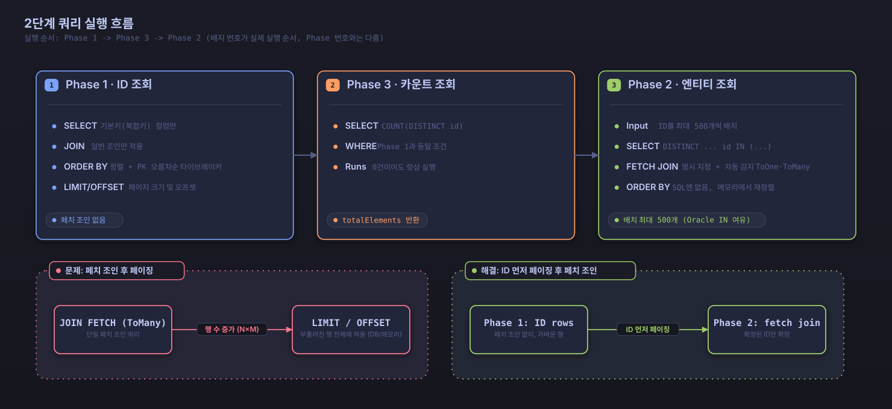

# 고성능 페이징

Searchable JPA는 대용량 데이터에서도 일관된 고성능을 내는 **2단계 쿼리 최적화**를 기본으로 적용합니다. 복잡한 조인이 포함된 검색에서도 단일 쿼리 방식의 성능 저하 없이 안정적으로 동작합니다.

## 2단계 쿼리 최적화란?

### 기존 단일 쿼리의 문제점

```sql
-- 복잡한 조인이 포함된 단일 쿼리 (성능 문제)
SELECT DISTINCT p.*, u.*, c.*
FROM posts p
LEFT JOIN users u ON p.author_id = u.id
LEFT JOIN comments c ON p.id = c.post_id
WHERE u.name LIKE '%John%' 
  AND p.status = 'PUBLISHED'
ORDER BY p.created_at DESC
LIMIT 10 OFFSET 100;
```

**문제점:**
- 복잡한 조인으로 인한 성능 저하
- DISTINCT 처리로 인한 추가 오버헤드
- 대용량 데이터에서 OFFSET 성능 문제
- ToMany 관계를 페치 조인하면 행 수가 늘어나, LIMIT/OFFSET이 늘어난 행 전체에 적용되어 원하는 페이지 크기를 맞추려면 결과를 메모리에서 다시 페이징해야 함
- 불필요한 데이터까지 함께 조회

### 2단계 쿼리의 장점

```sql
-- 1단계: ID만 조회하는 빠른 쿼리
SELECT p.id
FROM posts p
JOIN users u ON p.author_id = u.id
WHERE u.name LIKE '%John%' 
  AND p.status = 'PUBLISHED'
ORDER BY p.created_at DESC
LIMIT 10 OFFSET 100;

-- 2단계: 조회된 ID로 전체 엔티티 조회 (배치 IN 쿼리, 필요한 관계만 페치 조인)
-- 정렬은 1단계에서 이미 정해졌으므로 여기서는 ORDER BY 없이 조회 후 애플리케이션에서 ID 순서대로 재정렬
SELECT DISTINCT p.*, u.*
FROM posts p
LEFT JOIN users u ON p.author_id = u.id
WHERE p.id IN (1, 5, 12, 23, 34, 45, 56, 67, 78, 89);
```

**장점:**
- 1단계에서 ID만 가볍게 조회하므로 조인으로 늘어난 행을 페이징하지 않음
- 2단계에서 필요한 데이터만 배치로 효율적으로 조회
- 복잡한 조인에서도 페이지 크기만큼의 엔티티만 로딩
- N+1 문제 자동 해결

## 자동 최적화 시스템

Searchable JPA는 검색 조건과 무관하게 모든 검색·페이징 쿼리에 2단계 쿼리 최적화를 무조건 적용합니다. 단일 쿼리로 전환하는 설정이나 조건 분기는 존재하지 않습니다.

### 효과가 특히 큰 경우

다음과 같은 상황에서 단일 쿼리 대비 성능 차이가 크게 벌어집니다:

1. 복잡한 조인이 포함된 검색
2. 복합 키 엔티티 검색
3. ToMany 관계가 포함된 검색
4. 대용량 데이터 검색

### 복합 키 지원

#### @IdClass 방식

```java
@Entity
@IdClass(CompositeKey.class)
public class TestIdClassEntity {
    @Id
    private String tenantId;
    
    @Id
    private Long entityId;
    
    private String name;
    
    public static class CompositeKey implements Serializable {
        private String tenantId;
        private Long entityId;
        // equals, hashCode, constructors
    }
}
```

#### @EmbeddedId 방식

```java
@Entity
public class TestCompositeKeyEntity {
    @EmbeddedId
    private CompositeKey id;
    
    private String name;
    
    @Embeddable
    public static class CompositeKey implements Serializable {
        private Long entityId;
        private String tenantId;
        // equals, hashCode, constructors
    }
}
```

#### 복합 키 2단계 쿼리

```sql
-- @IdClass 방식 1단계 쿼리
SELECT t.tenant_id, t.entity_id FROM test_idclass_entity t
WHERE t.tenant_id = 'tenant1' AND t.name LIKE '%test%'
GROUP BY t.tenant_id, t.entity_id
ORDER BY t.tenant_id, t.entity_id
LIMIT 10;

-- @IdClass 방식 2단계 쿼리 (복합 키를 OR-AND 조건으로 조회)
SELECT * FROM test_idclass_entity t
WHERE (t.tenant_id = 'tenant1' AND t.entity_id = 1) 
   OR (t.tenant_id = 'tenant1' AND t.entity_id = 2)
   OR (t.tenant_id = 'tenant1' AND t.entity_id = 3);

-- @EmbeddedId 방식 2단계 쿼리 (필드 경로만 다를 뿐 동일한 OR-AND 조건 형태)
SELECT * FROM test_composite_key_entity t
WHERE (t.entity_id = 1 AND t.tenant_id = 'tenant1')
   OR (t.entity_id = 2 AND t.tenant_id = 'tenant1')
   OR (t.entity_id = 3 AND t.tenant_id = 'tenant1');
```

`@IdClass`와 `@EmbeddedId`는 조회 조건의 형태가 동일합니다. `@EmbeddedId`는 내장 식별자 클래스의 속성을 거쳐 필드를 참조하고, `@IdClass`는 엔티티 필드를 직접 참조한다는 점만 다릅니다.

## 사용 방법

### 기본 사용법

기존 방식과 동일하게 사용하면 자동으로 최적화됩니다:

```java
@Service
public class PostService extends DefaultSearchableService<Post, Long> {
    
    public PostService(PostRepository repository, EntityManager entityManager) {
        super(repository, entityManager);
    }
    
    // 자동으로 최적화된 쿼리 실행
    public Page<Post> findPosts(SearchCondition<PostSearchDTO> condition) {
        return findAllWithSearch(condition);
    }
}

@GetMapping("/search")
public Page<Post> searchPosts(
    @RequestParam @SearchableParams(PostSearchDTO.class) Map<String, String> params
) {
    SearchCondition<PostSearchDTO> condition = 
        new SearchableParamsParser<>(PostSearchDTO.class).convert(params);
    
    // 2단계 쿼리 최적화가 항상 적용됨
    return postService.findAllWithSearch(condition);
}
```

### 복합 키 엔티티 검색

```java
@Service
public class CompositeKeyService extends DefaultSearchableService<TestIdClassEntity, TestIdClassEntity.CompositeKey> {
    
    public CompositeKeyService(CompositeKeyRepository repository, EntityManager entityManager) {
        super(repository, entityManager);
    }
}

@GetMapping("/composite/search")
public Page<TestIdClassEntity> searchCompositeKey(
    @RequestParam @SearchableParams(CompositeKeySearchDTO.class) Map<String, String> params
) {
    SearchCondition<CompositeKeySearchDTO> condition = 
        new SearchableParamsParser<>(CompositeKeySearchDTO.class).convert(params);
    
    // 복합 키에도 동일하게 2단계 쿼리가 적용됨
    return compositeKeyService.findAllWithSearch(condition);
}
```

## 페이징 응답 구조

표준 Spring Data의 `Page` 객체를 사용합니다:

```java
public interface Page<T> {
    List<T> getContent();           // 현재 페이지 데이터
    int getNumber();                // 현재 페이지 번호 (0부터 시작)
    int getSize();                  // 페이지 크기
    int getTotalPages();            // 전체 페이지 수
    long getTotalElements();        // 전체 요소 수
    boolean hasNext();              // 다음 페이지 존재 여부
    boolean hasPrevious();          // 이전 페이지 존재 여부
    boolean isFirst();              // 첫 페이지 여부
    boolean isLast();               // 마지막 페이지 여부
    int getNumberOfElements();      // 현재 페이지 요소 수
}
```

### 응답 예제

```json
{
  "content": [
    {
      "id": 100,
      "title": "Spring Boot Tutorial",
      "createdAt": "2024-01-15T10:30:00",
      "viewCount": 1500
    },
    {
      "id": 99,
      "title": "JPA Best Practices", 
      "createdAt": "2024-01-14T15:20:00",
      "viewCount": 1200
    }
  ],
  "pageable": {
    "sort": {
      "sorted": true,
      "orders": [
        {
          "property": "createdAt",
          "direction": "DESC"
        }
      ]
    },
    "pageNumber": 0,
    "pageSize": 20
  },
  "totalElements": 1000,
  "totalPages": 50,
  "number": 0,
  "size": 20,
  "numberOfElements": 2,
  "first": true,
  "last": false,
  "hasNext": true,
  "hasPrevious": false
}
```

## 페이징 사용 패턴

### 1. 기본 페이징

```bash
# 첫 페이지
GET /api/posts/search?page=0&size=10&sort=createdAt.desc

# 다음 페이지
GET /api/posts/search?page=1&size=10&sort=createdAt.desc

# 특정 페이지로 이동
GET /api/posts/search?page=5&size=10&sort=createdAt.desc
```

### 2. 검색과 함께 페이징

```bash
# 제목 검색 + 페이징
GET /api/posts/search?title.contains=Spring&page=0&size=10&sort=createdAt.desc

# 복합 조건 검색 + 페이징
GET /api/posts/search?title.contains=Spring&status.equals=PUBLISHED&page=0&size=10
```

### 3. 정렬과 함께 페이징

```bash
# 단일 필드 정렬
GET /api/posts/search?sort=createdAt.desc&page=0&size=10

# 다중 필드 정렬
GET /api/posts/search?sort=status.asc,createdAt.desc&page=0&size=10
```

## 성능 최적화 기능

### 자동 조인 최적화

검색 조건을 분석하여 필요한 조인만 적용합니다:

```java
// 검색 조건에 author 필드가 있으면 자동으로 JOIN 적용
public class PostSearchDTO {
    @SearchableField(entityField = "author.name")
    private String authorName;  // 자동으로 User 테이블과 JOIN
    
    @SearchableField
    private String title;  // JOIN 불필요
}
```

### N+1 문제 자동 해결

`@ManyToOne`, `@OneToOne`으로 선언한 ToOne 관계는 검색 조건에 등장했는지와 무관하게, 카운트 쿼리를 제외한 모든 조회에서 항상 페치 조인됩니다. JPA 메타모델을 스캔해 대상 엔티티에 선언된 ToOne 관계를 찾아내고, 이 결과를 캐시해 같은 실행 안에서 재사용합니다.

```java
// author 필드가 검색 조건에 없어도 항상 페치 조인되어 N+1 문제를 방지
@Entity
public class Post {
    @ManyToOne(fetch = FetchType.LAZY)
    private User author;
}

// title만 검색해도 author는 여전히 페치 조인 대상
GET /api/posts/search?title.contains=Spring
```

## 성능 비교

### 단일 쿼리 vs 2단계 쿼리

| 항목 | 단일 쿼리 | 2단계 쿼리 |
|------|-----------|------------|
| 단순 검색 | 빠름 | 빠름 |
| 복잡한 조인 | 느림 | 빠름 |
| 대용량 데이터 | 매우 느림 | 빠름 |
| 메모리 사용량 | 높음 | 낮음 |
| N+1 문제 | 발생 가능 | 자동 해결 |
| 복합 키 지원 | 제한적 | 제약 없이 지원 |

### 성능 경향

대용량 데이터에서 조인이 여러 개 얽힌 검색을 실행하면, 페이지 위치가 뒤로 갈수록 단일 쿼리의 OFFSET 처리 비용이 커집니다. 2단계 쿼리는 ID 조회 단계에서 인덱스 스캔만으로 페이지 위치를 찾으므로, 페이지 위치에 따른 성능 편차가 크지 않습니다. 정확한 수치는 데이터 분포, 인덱스 설계, 조인 개수에 따라 달라지므로, `./gradlew performanceTest`로 `TwoPhaseQueryPerformanceTest`와 `PaginationPerformanceTest`를 프로젝트 환경에서 직접 실행해 측정하는 편이 정확합니다.

## 설정 및 튜닝

### 자동 최적화 설정

```yaml
searchable:
  hibernate:
    auto-optimization: true  # Hibernate 배치 최적화 활성화
    default-batch-fetch-size: 100  # 배치 페치 크기
    jdbc-batch-size: 1000  # JDBC 배치 크기
```

이 설정은 Hibernate의 배치 페치 크기·JDBC 배치 크기 같은 배치 처리 최적화만 제어합니다. 2단계 쿼리 최적화 자체는 항상 켜져 있으며, 이를 끄는 설정 항목은 없습니다.

### 인덱스 최적화

2단계 쿼리의 성능을 극대화하려면 적절한 인덱스가 필요합니다:

```sql
-- 1단계 쿼리용 인덱스 (검색 + 정렬)
CREATE INDEX idx_posts_status_created_at ON posts(status, created_at DESC);

-- 2단계 쿼리용 인덱스 (ID 기반 조회)
CREATE INDEX idx_posts_id ON posts(id);

-- 복합 키 인덱스
CREATE INDEX idx_composite_tenant_entity ON test_idclass_entity(tenant_id, entity_id);

-- 중첩 필드 검색용 인덱스
CREATE INDEX idx_posts_author_name ON posts(author_id);
CREATE INDEX idx_users_name ON users(name);
```

## 모니터링 및 디버깅

### 쿼리 로그 확인

```yaml
logging:
  level:
    dev.simplecore.searchable.core.service.specification.SearchableSpecificationBuilder: TRACE
    dev.simplecore.searchable.core.service.specification.TwoPhaseQueryExecutor: TRACE
    org.hibernate.SQL: DEBUG
    org.hibernate.type.descriptor.sql.BasicBinder: TRACE
```

### 조인·페치 필드 로그 확인

TRACE 레벨 로그에서 조인 대상 경로와 페치 필드가 어떻게 결정되는지 확인할 수 있습니다:

```
TRACE SearchableSpecificationBuilder - Applying joins - condition paths: [author], query type: class java.lang.Long, isCountQuery: true
TRACE SearchableSpecificationBuilder - Adding common ToOne fields for non-count query: [author]
TRACE SearchableSpecificationBuilder - All fetch fields for two-phase query: [author]
```

## 프로그래매틱 사용

### SearchConditionBuilder와 함께 사용

```java
@Service
public class PostService extends DefaultSearchableService<Post, Long> {
    
    public Page<Post> findRecentPosts(int page, int size) {
        SearchCondition<PostSearchDTO> condition = SearchConditionBuilder
            .create(PostSearchDTO.class)
            .where(group -> group
                .equals("status", PostStatus.PUBLISHED)
            )
            .sort(sort -> sort
                .desc("createdAt")
                .desc("id")
            )
            .page(page)
            .size(size)
            .build();
            
        // 2단계 쿼리 최적화가 항상 적용됨
        return findAllWithSearch(condition);
    }
}
```

### 동적 조건 조합

```java
public Page<Post> searchPosts(String title, 
                             PostStatus status, 
                             int page,
                             int size) {
    SearchConditionBuilder<PostSearchDTO> builder = SearchConditionBuilder
        .create(PostSearchDTO.class);
        
    if (title != null && !title.isEmpty()) {
        builder = builder.where(group -> group.contains("title", title));
    }
    
    if (status != null) {
        builder = builder.and(group -> group.equals("status", status));
    }
    
    SearchCondition<PostSearchDTO> condition = builder
        .sort(sort -> sort.desc("createdAt").desc("id"))
        .page(page)
        .size(size)
        .build();
        
    // 조건을 어떻게 조합하든 2단계 쿼리 최적화가 항상 적용됨
    return findAllWithSearch(condition);
}
```

## 내부 구현 방식

### 실행 흐름

`SearchableSpecificationBuilder.buildAndExecuteWithTwoPhaseOptimization()`가 모든 검색 요청의 실행 진입점입니다. 명시적으로 지정한 페치 필드(`SearchCondition`의 `fetchFields`)와 자동 감지된 공통 ToOne 필드를 합쳐 `TwoPhaseQueryExecutor.executeWithTwoPhaseOptimization(pageRequest, fetchFields)`를 호출하고, 내부에서는 다음 순서로 쿼리를 실행합니다.

1. **Phase 1 (ID 조회)** — 검색 조건에 필요한 일반 조인만 적용해 기본 키(또는 복합 키) 값만 조회합니다. 정렬 조건과 페이지 오프셋·크기를 그대로 적용하며, 페치 조인은 적용하지 않습니다.
2. **Phase 3 (카운트 조회)** — Phase 1과 별개로 전체 건수를 조회합니다. Phase 1 결과가 비어 있어도 항상 실행되므로, 범위를 벗어난 페이지를 요청해도 `totalElements`는 정확한 값을 반환합니다.
3. **Phase 2 (엔티티 조회)** — Phase 1에서 얻은 ID를 최대 500개 단위로 나눠 `IN` 절 쿼리를 여러 번 실행하고, 명시적으로 지정했거나 자동 감지된 ToOne·ToMany 관계를 모두 페치 조인합니다. ToMany 페치 조인으로 중복 행이 생기지 않도록 매 배치에 `DISTINCT`를 적용합니다. 이 단계는 `ORDER BY`를 실행하지 않고, Phase 1에서 정한 ID 순서대로 애플리케이션에서 결과를 재정렬합니다.

이 순서 덕분에 정렬·페이징은 ID만 다루는 가벼운 Phase 1 쿼리가 담당하고, 무거운 페치 조인은 이미 확정된 페이지 크기만큼의 ID에만 적용됩니다. 조인 결과를 그대로 페이징하는 단일 쿼리라면 ToMany 관계가 늘린 행 전체를 두고 LIMIT/OFFSET을 적용해야 하지만, 2단계 쿼리는 그 비용을 피합니다.



*그림: Phase 1(ID 조회) → Phase 3(카운트 조회) → Phase 2(배치 IN 조회와 페치 조인)로 이어지는 2단계 쿼리 실행 흐름*

### IN 절 배치 처리

Phase 2는 ID 목록을 최대 500개 단위로 잘라 여러 번의 `IN` 절 쿼리로 나눠 실행합니다. 이 배치 크기는 Oracle의 IN 절 항목 수 제한(1000개)에 안전 여유를 둔 고정값이며, 별도 설정으로 바꿀 수 없습니다.

### 정렬 안정성 보장 (기본 키 타이브레이커)

호출자가 지정한 정렬 조건에 기본 키가 없으면 정렬 조건 끝에 기본 키 오름차순 정렬을 자동으로 추가하며, 정렬 조건을 전혀 지정하지 않은 경우에도 기본 키 오름차순 정렬이 적용됩니다. 같은 정렬 값을 가진 행이 페이지 경계를 넘나들며 중복되거나 누락되는 문제를 막기 위한 장치입니다. 앞의 예제에 있는 `.desc("id")` 호출은 이미 보장되는 동작을 명시적으로 드러낸 것일 뿐, 반드시 넣어야 하는 코드는 아닙니다.

## 제한사항과 고려사항

### 현재 제한사항

1. **쿼리 수 증가**: ID 조회, 카운트 조회, 엔티티 조회로 나뉘어 단일 쿼리보다 쿼리 수가 늘어남 (전체 성능은 향상)
2. **메모리 사용**: Phase 1에서 조회한 ID 목록을 Phase 2가 끝날 때까지 메모리에 보관
3. **트랜잭션 범위**: 세 단계의 쿼리가 같은 트랜잭션·영속성 컨텍스트 안에서 실행되도록 호출부에서 보장해야 함

### 사용 시 고려사항

1. **인덱스 설계**: Phase 1 쿼리의 검색·정렬 조건에 맞는 복합 인덱스 필요
2. **페이지 크기**: 페이지 크기가 크면 메모리 사용량도 늘어남
3. **정렬 필드**: 정렬에 사용하는 필드에 인덱스를 두는 편이 좋음

## 일반 페이징과의 차이점

| 특성 | 일반 페이징 | 2단계 쿼리 페이징 |
|------|-------------|------------------|
| 쿼리 수 | 1개 | 2~3개 (ID 조회 + 카운트 조회, 결과가 있으면 엔티티 조회 추가) |
| 복잡한 조인 성능 | 느림 | 빠름 |
| 메모리 사용량 | 낮음 | 중간 |
| N+1 문제 | 발생 가능 | 자동 해결 |
| 복합 키 지원 | 제한적 | 제약 없이 지원 |
| 구현 복잡도 | 간단 | 자동화됨 |
