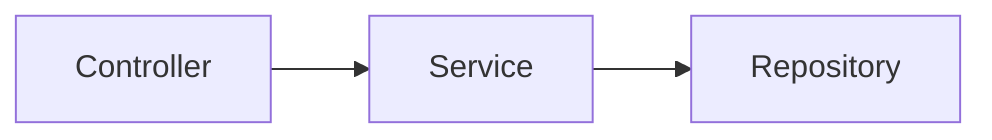

# Documentation Guide

This document explains how to build the Searchable JPA documentation, preview it locally, and contribute to it.

## Documentation Structure

The Searchable JPA documentation is split between the `docs/en/` folder (English, the default language) and the `docs/ko/` folder (Korean translation).

```
searchable-jpa/
├── docs/
│   ├── index.html          # Docsify configuration
│   ├── .nojekyll           # Disables Jekyll processing on GitHub Pages
│   ├── _coverpage.md       # Cover page
│   ├── _navbar.md          # Top navigation
│   ├── en/
│   │   ├── _sidebar.md     # Sidebar navigation
│   │   ├── README.md       # Home page
│   │   └── ...             # Other documents (translation in progress)
│   └── ko/
│       ├── _sidebar.md     # Sidebar navigation
│       ├── README.md       # Home page
│       ├── installation.md # Installation guide
│       ├── basic-usage.md  # Basic usage
│       └── ...             # Other documents
├── scripts/
│   └── build-docs.sh       # Documentation build script
└── build-docs/             # Build output (gitignored)
```

## Building and Previewing Locally

### 1. Run the Build Script

```bash
# Run from the project root
./scripts/build-docs.sh
```

The build script performs the following steps:
- Copies the Docsify configuration files (`index.html`, `.nojekyll`, `_coverpage.md`, `_navbar.md`) into `build-docs/`
- Copies the English sidebar (`en/_sidebar.md`), the default language, into both `build-docs/en/` and the `build-docs/` root; copies the Korean sidebar (`ko/_sidebar.md`) into `build-docs/ko/`
- Substitutes the version placeholder (`{{VERSION}}`) in the cover page
- Copies the documents under `docs/en/` and `docs/ko/` into `build-docs/en/` and `build-docs/ko/` respectively, along with the SVG images in each locale's `_images/` folder, if present
- Converts relative links (`./`) into Docsify absolute paths

### 2. Run a Local Server

**Option 1: Python's built-in server**

```bash
cd build-docs
python -m http.server 3000
```

**Option 2: docsify-cli (requires Node.js)**

```bash
npm install -g docsify-cli
docsify serve build-docs
```

### 3. View It in the Browser

```
http://localhost:3000
```

## Documentation Writing Guide

### Adding a New Document

1. Create the markdown file in both `docs/ko/` (Korean) and `docs/en/` (English)
2. Add a navigation link to both `docs/ko/_sidebar.md` and `docs/en/_sidebar.md`

```markdown
* **Category Name**
  * [New Document](en/new-doc.md)
```

### Linking Between Documents

To reference a document in the same folder:

```markdown
See [Basic Usage](en/basic-usage.md) for details.
```

### Supported Markdown Features

**Code Blocks (Syntax Highlighting)**

```java
@Service
public class PostService extends DefaultSearchableService<Post, Long> {
    public PostService(PostRepository repository, EntityManager entityManager) {
        super(repository, entityManager);
    }
}
```

Supported languages: `java`, `kotlin`, `yaml`, `bash`, `groovy`, `json`, `properties`, `sql`

**Tables**

| Column 1 | Column 2 |
|-----|-----|
| Value 1 | Value 2 |

**Blockquotes (GitHub Style)**

```markdown
> [!TIP]
> Useful tip content

> [!WARNING]
> Warning content

> [!IMPORTANT]
> Important content

> [!NOTE]
> Note content
```

GitHub-style markers such as `[!TIP]`, `[!WARNING]`, `[!IMPORTANT]`, and `[!NOTE]` render as plain blockquotes, since there is no dedicated alert-box plugin. Bold the content you want to emphasize, or put it in its own paragraph instead.

**Mermaid Diagrams**

```markdown

```

## GitHub Pages Deployment

### Automatic Deployment

Pushing documentation changes to the `master` branch triggers automatic deployment through GitHub Actions.

Trigger conditions:
- Changes to files under `docs/**`
- Changes to `scripts/build-docs.sh`
- Changes to `.github/workflows/docs.yml`

### Manual Deployment

You can manually run the "Deploy Documentation" workflow from the GitHub Actions tab.

**Deploying a specific release version:**
1. GitHub > Actions > Deploy Documentation
2. Click "Run workflow"
3. Enter the version number in the version field (e.g., `1.0.3`)
4. Click the "Run workflow" button

### Version Management

Documentation is managed per version at deployment time:
- SNAPSHOT versions: overwritten on every deployment (latest development version)
- Release versions: preserved permanently (older version docs are retained)

### Deployment URL

```
https://simplecore-inc.github.io/searchable-jpa/
```

### Initial GitHub Pages Setup

Deploying for the first time requires configuring the GitHub repository:

1. GitHub repository > Settings > Pages
2. Source: `Deploy from a branch`
3. Branch: `gh-pages` / `/ (root)`
4. Save

## Contributing to the Documentation

### Fixing Typos and Errors

1. Click the "Edit on GitHub" link on the relevant documentation page
2. Edit the file directly on GitHub and open a PR

### Adding a New Document

1. Fork the repository
2. Write the document in both `docs/ko/` (Korean) and `docs/en/` (English)
3. Add links to both `docs/ko/_sidebar.md` and `docs/en/_sidebar.md`
4. Build and verify locally
5. Open a PR

### Writing Conventions

- File names: use kebab-case (e.g., `two-phase-query.md`)
- Titles: each document starts with `# Title`
- Language: place English documents (the default) in `docs/en/`, and Korean translations in `docs/ko/`

## Troubleshooting

### Build Script Execution Errors

```bash
# Grant execute permission
chmod +x scripts/build-docs.sh
```

### Links Don't Work

- Check links from the `build-docs/` folder after building
- Opening files directly from the raw `docs/` folder breaks some links

### Search Doesn't Work

- The search index is generated on the first page load
- Try clearing your browser cache and reloading
- Search only works when served from a local server (the `file://` protocol doesn't support it)

### Version Selector Not Visible

- The version selector only works after deployment to GitHub Pages
- It doesn't appear in local previews because `versions.json` isn't available there

## Key Docsify Settings

You can change the key settings in `docs/index.html`:

| Setting | Description | Default |
|------|------|--------|
| `themeColor` | Theme color | `#ea580c` |
| `maxLevel` | Maximum sidebar heading level | `4` |
| `subMaxLevel` | Heading level displayed in the body | `3` |
| `search.maxAge` | Search cache lifetime (ms) | `86400000` (1 day) |

## Related Links

- [Docsify Official Documentation](https://docsify.js.org/)
- [GitHub Pages Documentation](https://docs.github.com/en/pages)
- [Mermaid Diagram Syntax](https://mermaid.js.org/)
